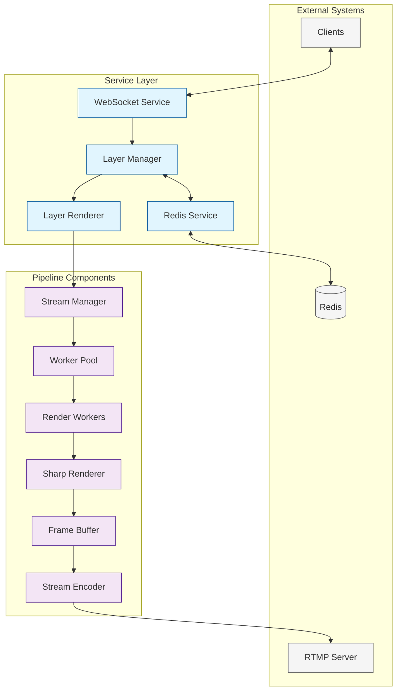

# Stream Manager

A high-performance streaming service that manages real-time video composition and streaming.

## Project Structure

```
src/
├── core/                    # Core domain logic
│   ├── viewport.ts         # Viewport/canvas management
│   ├── layout.ts          # Scene/layout management
│   ├── assets.ts          # Asset management and types
│   └── composition.ts     # Composition engine
│
├── rendering/              # Rendering pipeline
│   ├── renderer.ts        # Main renderer
│   ├── effects.ts         # Visual effects and transitions
│   ├── frame-buffer.ts    # Frame buffer management
│   └── encoder.ts         # Stream encoding
│
├── workers/                # Worker thread implementations
│   ├── pool/              # Worker pool management
│   │   ├── manager.ts     # Pool orchestration
│   │   └── metrics.ts     # Pool performance tracking
│   ├── render/            # Render workers
│   │   ├── worker.ts      # Worker implementation
│   │   └── tasks.ts       # Task definitions
│   └── shared/            # Shared worker code
│       ├── messages.ts    # Worker message types
│       └── state.ts       # Shared state types
│
├── config/                 # Configuration management
│   ├── schema.ts          # Zod schema definitions
│   ├── defaults.ts        # Default configuration
│   ├── env.ts            # Environment loading
│   └── index.ts          # Configuration singleton
│
├── state/                  # State management
│   ├── store/             # State stores
│   │   ├── config.ts     # Dynamic config store
│   │   └── sync.ts       # Redis synchronization
│   ├── persistence.ts     # State persistence
│   └── events.ts          # Event system
│
├── streaming/              # Streaming functionality
│   ├── rtmp/              # RTMP handling
│   │   ├── server.ts     # RTMP server
│   │   └── events.ts     # RTMP event handlers
│   ├── output/            # Stream output
│   │   ├── encoder.ts    # FFmpeg encoding
│   │   └── muxer.ts      # Stream multiplexing
│   └── websocket.ts      # WebSocket communication
│
├── server/                 # HTTP & WebSocket servers
│   ├── api/               # HTTP API endpoints
│   │   ├── stream.ts     # Stream control
│   │   ├── layers.ts     # Layer management
│   │   └── metrics.ts    # Prometheus metrics
│   ├── websocket/         # WebSocket handlers
│   │   ├── stream.ts     # Stream events
│   │   └── layers.ts     # Layer updates
│   └── monitoring/        # Monitoring interfaces
│       ├── dashboard.ts   # Web dashboard
│       └── preview.ts     # Stream preview
│
├── utils/                  # Utilities
│   ├── logger.ts          # Logging utilities
│   ├── metrics.ts         # Metrics collection
│   └── helpers.ts         # Shared helpers
│
└── types/                  # TypeScript types
    ├── viewport.ts        # Viewport types
    ├── layout.ts          # Layout types
    ├── worker.ts          # Worker types
    └── stream.ts          # Stream types
```

## Core Components

### Viewport Management
- Handles canvas dimensions and coordinate systems
- Manages safe areas and grid snapping
- Provides coordinate transformation utilities
- Maintains aspect ratio and scaling

### Layout System
- Scene-based composition
- Asset positioning and transformation
- Z-index ordering
- Transition management

### Asset Management
- Asset loading and caching
- Type-specific asset handling
- Metadata management
- Memory-efficient preloading

### Composition Engine
- High-performance image processing
- Layer compositing
- Effect application
- Cache management

## Rendering Pipeline

### Main Renderer
- Coordinates rendering process
- Manages frame timing
- Handles frame buffering
- Provides performance metrics

### Effects System
- Scene transitions
- Asset animations
- Easing functions
- Visual effects

### Frame Buffer
- Memory management
- Buffer pooling
- Frame synchronization
- Performance optimization

### Stream Encoder
- Video encoding
- Stream format handling
- Quality management
- Performance monitoring

## Features

- Real-time video composition
- Scene-based layout management
- High-performance rendering
- Asset preloading and caching
- Transition effects
- Grid-based positioning
- Safe area constraints
- WebSocket real-time updates
- Performance monitoring
- Memory optimization

## Usage Example

```typescript
import { ViewportManager } from './core/viewport.js';
import { LayoutManager } from './core/layout.js';
import { AssetManager } from './core/assets.js';
import { Renderer } from './rendering/renderer.js';

// Initialize managers
const viewport = ViewportManager.getInstance();
const layout = LayoutManager.getInstance();
const assets = AssetManager.getInstance();
const renderer = Renderer.getInstance();

// Create a scene
const scene = layout.createScene('main');

// Add assets to scene
const asset = assets.createAsset(
  'image',
  '/path/to/image.png',
  { x: 100, y: 100 },
  {
    scale: 1,
    rotation: 0,
    opacity: 1
  }
);

layout.addAsset(scene.id, asset);

// Start rendering
renderer.start();

// Handle frame updates
renderer.on('frame:ready', (frame: Buffer) => {
  // Handle the rendered frame
});
```

## Performance Considerations

- Asset preloading for smooth transitions
- Efficient caching mechanisms
- Memory-aware buffer management
- Frame timing optimization
- Batch processing for performance
- Grid-based positioning for efficiency

## Development

### Prerequisites
- Node.js 18+
- Sharp for image processing
- FFmpeg for video handling

### Setup
1. Install dependencies: `npm install`
2. Build the project: `npm run build`
3. Start the service: `npm start`

### Testing
- Unit tests: `npm test`
- Integration tests: `npm run test:integration`
- Performance tests: `npm run test:perf`

## Configuration

Environment variables:
- `STREAM_RESOLUTION`: Output resolution (default: "1920x1080")
- `TARGET_FPS`: Target frame rate (default: 60)
- `STREAM_BITRATE`: Output bitrate (default: 6000000)
- `STREAM_CODEC`: Video codec (default: "h264")
- `FFMPEG_PRESET`: FFmpeg encoding preset (default: "veryfast")

## Architecture

The service is built around a layered architecture with clear separation of concerns:



### Directory Structure
```
src/
├── pipeline/           # Core streaming components
│   ├── stream-manager.ts   # Pipeline orchestration
│   ├── sharp-renderer.ts   # Image processing
│   ├── frame-buffer.ts     # Memory management
│   └── stream-encoder.ts   # FFmpeg encoding
├── services/          # Supporting services
│   ├── layer-manager.ts   # Layer state management
│   ├── layer-renderer.ts  # Render coordination
│   ├── redis.ts          # State persistence
│   └── websocket.ts      # Real-time updates
├── server/           # HTTP API and assets
│   ├── stream-server.ts  # Server implementation
│   └── default-layers.ts # Default configurations
├── workers/          # Worker thread implementations
│   ├── worker-pool.ts    # Worker management
│   └── render-worker.ts  # Render worker
├── types/            # TypeScript type definitions
├── utils/            # Utility functions
└── config/           # Configuration management
```

## Component Interactions

1. **Client Update Flow**:
   ```
   Client -> WebSocket -> Layer Manager -> Layer Renderer -> Stream Manager -> Pipeline
   ```

2. **State Management Flow**:
   ```
   Layer Manager <-> Redis Service <-> Redis Database
   ```

3. **Render Pipeline Flow**:
   ```
   Layer Renderer -> Worker Pool -> Render Workers -> Sharp Renderer -> Frame Buffer -> Stream Encoder -> RTMP
   ```

## Configuration

Configuration is managed through environment variables and validated using Zod:

```typescript
{
  // Server configuration
  PORT: number;               // HTTP server port (default: 4200)
  WS_PORT: number;           // WebSocket port (default: 4201)
  METRICS_PORT: number;      // Prometheus metrics port (default: 4290)

  // Redis configuration
  REDIS_URL: string;         // Redis connection URL (default: redis://redis:6379)
  REDIS_PASSWORD: string;    // Redis authentication

  // Stream configuration
  STREAM_RESOLUTION: string; // e.g., "1920x1080"
  TARGET_FPS: number;        // Target frames per second (default: 30)
  RENDER_QUALITY: "low" | "medium" | "high";  // default: high
  MAX_LAYERS: number;        // Maximum concurrent layers (default: 50)
  
  // Encoding configuration
  STREAM_BITRATE: number;    // in kbps (default: 4000)
  STREAM_URL: string;        // RTMP URL
  STREAM_CODEC: "h264" | "vp8" | "vp9";  // default: h264
  FFMPEG_PRESET: "ultrafast" | "superfast" | "veryfast" | "faster" | "fast" | "medium";  // default: medium
  FFMPEG_HWACCEL?: string;   // Hardware acceleration (optional)
  
  // Audio configuration
  AUDIO_ENABLED: boolean;    // default: true
  AUDIO_CODEC: "aac" | "opus";  // default: aac
  AUDIO_BITRATE: number;     // default: 128

  // Logging configuration
  LOG_LEVEL: "fatal" | "error" | "warn" | "info" | "debug" | "trace";  // default: info

  // Environment
  NODE_ENV: "development" | "production" | "test";  // default: development
}
```

## Getting Started

1. Install dependencies:
   ```bash
   npm install
   ```

2. Set up environment variables:
   ```bash
   cp .env.example .env
   ```

3. Start the service:
   ```bash
   npm start
   ```

4. For development:
   ```bash
   npm run dev
   ```

## API

The service provides RESTful endpoints and WebSocket communication:

### HTTP Endpoints
- `POST /stream/control` - Control stream state
- `GET /stream/status` - Get stream status
- `POST /stream/layers` - Create layer
- `PUT /stream/layers/:id` - Update layer
- `DELETE /stream/layers/:id` - Delete layer
- `GET /metrics` - Prometheus metrics

### WebSocket Events
- `layerUpdate` - Layer state changes
- `streamEvent` - Stream state updates
- `error` - Error notifications

## Metrics

Prometheus metrics are available at `/metrics` including:
- Frame processing times
- Memory usage per component
- Stream health metrics
- Layer statistics
- Service latencies
- WebSocket connections
- Redis operations
- Worker performance

## Development

### Prerequisites
- Node.js 18+
- Redis
- FFmpeg with required codecs

### Testing
```bash
npm test        # Run all tests
npm run test:e2e # Run end-to-end tests
```

### Contributing

1. Create a feature branch
2. Make changes
3. Add tests
4. Update relevant documentation
5. Submit PR

## License

MIT 

## Performance

The service utilizes several performance optimization strategies:

1. **Worker Pool**
   - Parallel frame processing using worker threads
   - Automatic worker scaling based on CPU cores
   - Task queuing and load balancing
   - Worker health monitoring and recovery

2. **Memory Management**
   - Efficient buffer handling
   - Memory usage monitoring
   - Automatic garbage collection
   - Resource cleanup on worker termination

3. **Caching**
   - Layer composition caching
   - Font caching
   - Animation frame caching
   - Automatic cache invalidation

4. **Error Handling**
   - Worker crash recovery
   - Error isolation
   - Automatic worker replacement
   - Detailed error reporting

## Worker System

### Worker Pool Management
- Dynamic worker scaling based on load
- Task distribution and load balancing
- Worker health monitoring
- Automatic worker recovery
- Performance metrics collection

### Render Workers
- Parallel frame processing
- Asset rendering isolation
- Memory-aware processing
- Error boundary implementation

### Worker Communication
- Typed message passing
- Shared state management
- Task queuing system
- Result aggregation

## Configuration Management

### Static Configuration
- Build-time configuration
- Environment variable handling
- Type-safe schema validation
- Default value management

### Dynamic Configuration
- Runtime configuration updates
- Redis-backed persistence
- Configuration synchronization
- Update event propagation

Example configuration structure:
```typescript
interface StreamConfig {
  // Build-time configuration
  static: {
    nodeEnv: 'development' | 'production' | 'test';
    logLevel: 'debug' | 'info' | 'warn' | 'error';
    metricsEnabled: boolean;
  };

  // Runtime configuration
  dynamic: {
    streamQuality: 'low' | 'medium' | 'high';
    targetFps: number;
    resolution: {
      width: number;
      height: number;
    };
    encoding: {
      codec: 'h264' | 'vp8' | 'vp9';
      bitrate: number;
      preset: string;
    };
  };
}
```

## Server Components

### API Server
- RESTful endpoints for stream control
- Layer management API
- Metrics endpoint
- Configuration management

### WebSocket Server
- Real-time stream events
- Layer update notifications
- Client state synchronization
- Health check system

### Monitoring Interface
- Development preview server
- Performance dashboard
- Real-time metrics
- Debug tooling

## Stream Output

### RTMP Server
- RTMP protocol handling
- Stream key management
- Connection monitoring
- Error recovery

### Output Pipeline
- FFmpeg encoding
- Stream multiplexing
- Quality management
- Performance optimization

## Development Workflow

### Local Development
```bash
# Start development server with monitoring
npm run dev

# Start with specific configuration
NODE_ENV=development STREAM_QUALITY=high npm run dev

# Run tests
npm run test
npm run test:watch    # Watch mode
npm run test:coverage # Coverage report
```

### Monitoring
```bash
# Access development dashboard
open http://localhost:8080/dashboard

# View metrics
open http://localhost:9090/metrics

# Stream preview
open http://localhost:8080/preview
```

### Worker Development
```bash
# Start with specific worker count
WORKER_COUNT=4 npm run dev

# Debug worker
NODE_OPTIONS='--inspect' WORKER_DEBUG=true npm run dev
```

## Performance Monitoring

### Metrics Collection
- Frame processing times
- Worker pool statistics
- Memory usage per component
- Stream health metrics
- Cache hit rates
- Error rates

### Alerting
- Performance degradation
- Worker failures
- Stream interruptions
- Memory pressure
- Error thresholds

## Error Handling

### Worker Errors
- Automatic worker replacement
- Task retry mechanism
- Error isolation
- Detailed error reporting

### Stream Errors
- Stream recovery
- Quality degradation
- Fallback mechanisms
- Client notifications

## Configuration Updates

### Static Configuration
Environment variables or `.env` file:
```env
NODE_ENV=development
LOG_LEVEL=debug
METRICS_ENABLED=true
WORKER_COUNT=4
```

### Dynamic Configuration
Runtime updates through API:
```bash
# Update stream quality
curl -X POST http://localhost:8080/api/config \
  -H "Content-Type: application/json" \
  -d '{"streamQuality": "high"}'

# Update FPS
curl -X POST http://localhost:8080/api/config \
  -H "Content-Type: application/json" \
  -d '{"targetFps": 60}'
```
