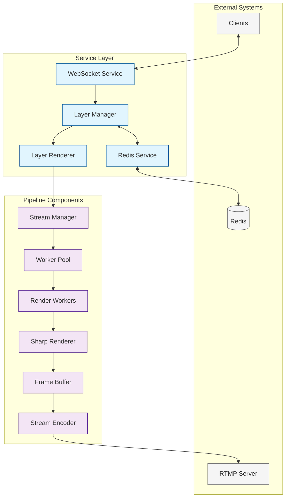

# Stream Manager

A high-performance streaming service that manages real-time video composition and streaming.

## Architecture

The service is built around a layered architecture with clear separation of concerns:



### Directory Structure
```
src/
├── pipeline/           # Core streaming components
│   ├── stream-manager.ts   # Pipeline orchestration
│   ├── sharp-renderer.ts   # Image processing
│   ├── frame-buffer.ts     # Memory management
│   └── stream-encoder.ts   # FFmpeg encoding
├── services/          # Supporting services
│   ├── layer-manager.ts   # Layer state management
│   ├── layer-renderer.ts  # Render coordination
│   ├── redis.ts          # State persistence
│   └── websocket.ts      # Real-time updates
├── server/           # HTTP API and assets
│   ├── stream-server.ts  # Server implementation
│   └── default-layers.ts # Default configurations
├── workers/          # Worker thread implementations
│   ├── worker-pool.ts    # Worker management
│   └── render-worker.ts  # Render worker
├── types/            # TypeScript type definitions
├── utils/            # Utility functions
└── config/           # Configuration management
```

## Features

- Real-time video composition and streaming
- Layer-based rendering system with state management
- High-performance image processing with Sharp
- FFmpeg-based video encoding with multiple codec support
- Redis-backed state persistence
- WebSocket real-time updates
- Prometheus metrics integration
- Multi-threaded rendering with worker pool
  - Parallel frame processing
  - Automatic worker recovery
  - Performance monitoring
  - Memory management
  - Task queuing and load balancing

## Component Interactions

1. **Client Update Flow**:
   ```
   Client -> WebSocket -> Layer Manager -> Layer Renderer -> Stream Manager -> Pipeline
   ```

2. **State Management Flow**:
   ```
   Layer Manager <-> Redis Service <-> Redis Database
   ```

3. **Render Pipeline Flow**:
   ```
   Layer Renderer -> Worker Pool -> Render Workers -> Sharp Renderer -> Frame Buffer -> Stream Encoder -> RTMP
   ```

## Configuration

Configuration is managed through environment variables and validated using Zod:

```typescript
{
  // Server configuration
  PORT: number;               // HTTP server port (default: 4200)
  WS_PORT: number;           // WebSocket port (default: 4201)
  METRICS_PORT: number;      // Prometheus metrics port (default: 4290)

  // Redis configuration
  REDIS_URL: string;         // Redis connection URL (default: redis://redis:6379)
  REDIS_PASSWORD: string;    // Redis authentication

  // Stream configuration
  STREAM_RESOLUTION: string; // e.g., "1920x1080"
  TARGET_FPS: number;        // Target frames per second (default: 30)
  RENDER_QUALITY: "low" | "medium" | "high";  // default: high
  MAX_LAYERS: number;        // Maximum concurrent layers (default: 50)
  
  // Encoding configuration
  STREAM_BITRATE: number;    // in kbps (default: 4000)
  STREAM_URL: string;        // RTMP URL
  STREAM_CODEC: "h264" | "vp8" | "vp9";  // default: h264
  FFMPEG_PRESET: "ultrafast" | "superfast" | "veryfast" | "faster" | "fast" | "medium";  // default: medium
  FFMPEG_HWACCEL?: string;   // Hardware acceleration (optional)
  
  // Audio configuration
  AUDIO_ENABLED: boolean;    // default: true
  AUDIO_CODEC: "aac" | "opus";  // default: aac
  AUDIO_BITRATE: number;     // default: 128

  // Logging configuration
  LOG_LEVEL: "fatal" | "error" | "warn" | "info" | "debug" | "trace";  // default: info

  // Environment
  NODE_ENV: "development" | "production" | "test";  // default: development
}
```

## Getting Started

1. Install dependencies:
   ```bash
   npm install
   ```

2. Set up environment variables:
   ```bash
   cp .env.example .env
   ```

3. Start the service:
   ```bash
   npm start
   ```

4. For development:
   ```bash
   npm run dev
   ```

## API

The service provides RESTful endpoints and WebSocket communication:

### HTTP Endpoints
- `POST /stream/control` - Control stream state
- `GET /stream/status` - Get stream status
- `POST /stream/layers` - Create layer
- `PUT /stream/layers/:id` - Update layer
- `DELETE /stream/layers/:id` - Delete layer
- `GET /metrics` - Prometheus metrics

### WebSocket Events
- `layerUpdate` - Layer state changes
- `streamEvent` - Stream state updates
- `error` - Error notifications

## Metrics

Prometheus metrics are available at `/metrics` including:
- Frame processing times
- Memory usage per component
- Stream health metrics
- Layer statistics
- Service latencies
- WebSocket connections
- Redis operations
- Worker performance

## Development

### Prerequisites
- Node.js 18+
- Redis
- FFmpeg with required codecs

### Testing
```bash
npm test        # Run all tests
npm run test:e2e # Run end-to-end tests
```

### Contributing

1. Create a feature branch
2. Make changes
3. Add tests
4. Update relevant documentation
5. Submit PR

## License

MIT 

## Performance

The service utilizes several performance optimization strategies:

1. **Worker Pool**
   - Parallel frame processing using worker threads
   - Automatic worker scaling based on CPU cores
   - Task queuing and load balancing
   - Worker health monitoring and recovery

2. **Memory Management**
   - Efficient buffer handling
   - Memory usage monitoring
   - Automatic garbage collection
   - Resource cleanup on worker termination

3. **Caching**
   - Layer composition caching
   - Font caching
   - Animation frame caching
   - Automatic cache invalidation

4. **Error Handling**
   - Worker crash recovery
   - Error isolation
   - Automatic worker replacement
   - Detailed error reporting
