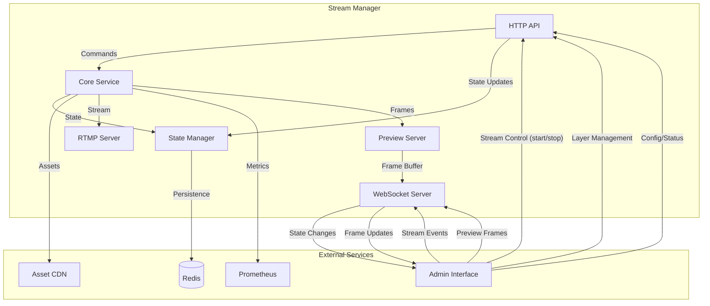

# Stream Manager

A high-performance streaming service that manages real-time video composition and streaming for the Sothebais platform.

## Overview

Stream Manager is a core service in the Sothebais platform that handles:
- Real-time video composition and streaming
- Scene-based layout management
- Asset management and caching
- High-performance rendering pipeline
- RTMP streaming output

## Service Integration



## Quick Start

1. **Prerequisites**
   - Node.js 18+
   - Redis
   - FFmpeg
   - Docker

2. **Environment Setup**
   ```bash
   # Clone the repository
   git clone ...

   # Install dependencies
   npm install

   # Configure environment
   cp .env.example .env

   # Start the service
   docker compose up
   ```

## Configuration

Key environment variables:
```bash
# Core Settings
PORT=3000                    # API port
WS_PORT=3001                # WebSocket port
REDIS_URL=redis://redis:6379 # Redis connection

# Stream Settings
STREAM_RESOLUTION=1920x1080  # Output resolution
TARGET_FPS=60               # Target frame rate
STREAM_BITRATE=6000000      # Output bitrate

# Integration Settings
ADMIN_API_URL=http://...     # Admin service URL
CDN_BASE_URL=http://...      # Asset CDN base URL
```

See `src/README.md` for detailed technical documentation.

## Development

1. **Local Development**
   ```bash
   npm run dev
   ```

2. **Testing**
   ```bash
   npm test                  # Unit tests
   npm run test:integration  # Integration tests
   ```

3. **Docker Build**
   ```bash
   docker compose build
   ```

## Monitoring

- Prometheus metrics at `/metrics`
- Health check at `/health`
- Stream status at `/api/stream/status`

## Related Services

- [Admin Interface](../admin/README.md) - Management UI
- [Asset Service](../asset-service/README.md) - Asset management
- [Auth Service](../auth-service/README.md) - Authentication

## License

Copyright © 2024 Sothebais. All rights reserved.
