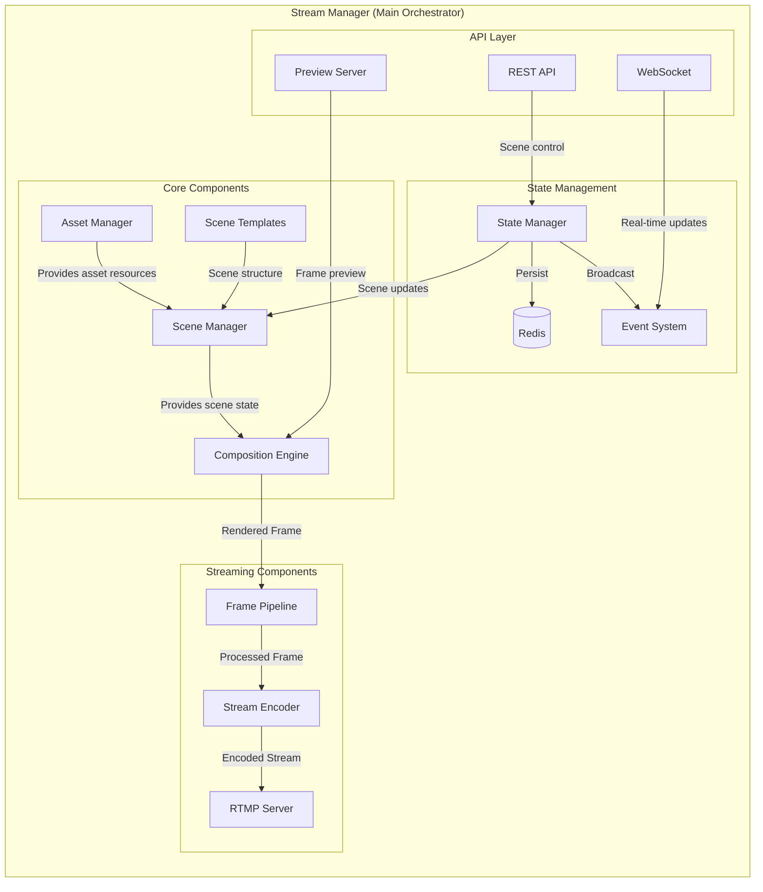
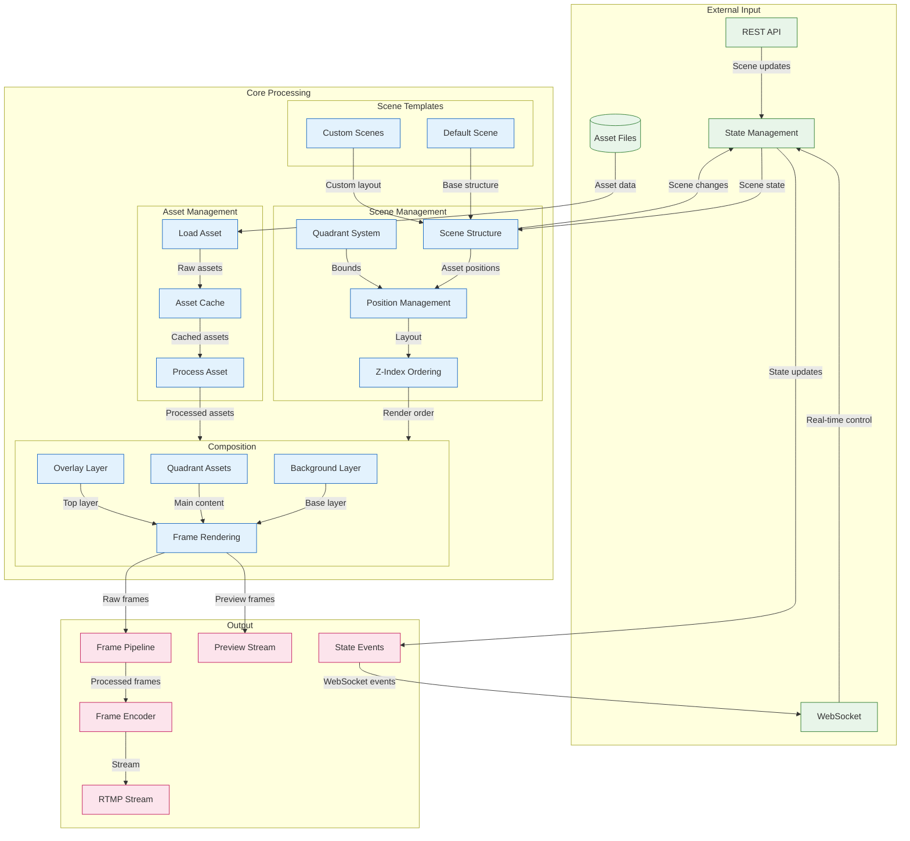

# Stream Manager Implementation

This directory contains the core implementation of the Stream Manager service. This document focuses on technical implementation details, component interactions, and development guidelines.

## Directory Structure

```
src/
├── core/                                 # Core domain logic
│   ├── scene-manager.ts                  # Scene and quadrant management
│   ├── assets.ts                         # Asset management
│   └── composition.ts                    # Composition engine
│               
├── scenes/                              # Scene templates
│   └── default-scene.ts                 # Default quadrant-based scene
│
├── state/                                # State management
│   ├── README.md                         # State system documentation
│   ├── state-manager.ts                  # Core state management
│   ├── event-emitter.ts                  # Event system implementation
│   └── redis-service.ts                  # Redis integration & persistence
│             
├── streaming/                            # Streaming functionality
│   ├── stream-manager.ts                 # Main orchestration service
│   ├── rtmp/                             # RTMP handling
│   │   ├── server.ts                     # RTMP server
│   │   └── events.ts                     # RTMP event handlers
│   ├── output/                           # Stream output
│   │   ├── encoder.ts                    # FFmpeg encoding
│   │   └── pipeline.ts                   # Stream pipeline
│   └── websocket.ts                      # WebSocket communication
│             
├── tools/                                # Development and testing tools
│   └── debug/                            # Debugging utilities
│       ├── generate-test-stream.ts       # Test stream generation
│       ├── frame-debug.ts                # Frame debugging utilities
│       ├── heap-analyzer.ts              # Memory analysis tools
│       └── network-trace.ts              # Network debugging
│
├── types/                                # TypeScript type definitions
│   ├── README.md                         # Types documentation
│   ├── state-manager.ts                  # State management types
│   ├── events.ts                         # Event system types
│   ├── config.ts                         # Configuration types
│   ├── core.ts                           # Core component types
│   └── stream.ts                         # Stream types
│
├── server/                               # HTTP & WebSocket servers
│   ├── api/                              # HTTP API endpoints
│   │   ├── stream.ts                     # Stream control
│   │   └── metrics.ts                    # Prometheus metrics
│   ├── websocket/                        # WebSocket handlers
│   │   └── stream.ts                     # Stream events
│   └── monitoring/                       # Monitoring interfaces
│       ├── dashboard.ts                  # Web dashboard
│       └── preview.ts                    # Stream preview
│               
└── utils/                                # Utilities
    ├── logger.ts                         # Logging utilities
    ├── metrics.ts                        # Metrics collection
    └── helpers.ts                        # Shared helpers

```

## Architecture Overview

The Stream Manager service follows a scene-based architecture with the StreamManager class as the main orchestrator:



### Data Flow



## Component Responsibilities

### 1. Core Components

#### Scene Manager (`core/scene-manager.ts`)
- Central manager for scene organization and state
- Manages scene structure with quadrants
- Controls asset positioning and z-index
- Handles background and overlay layers
- Manages scene transitions
- Manages canvas properties and safe areas

#### Asset Manager (`core/assets.ts`)
- Handles asset loading and caching
- Manages different asset types
- Controls asset metadata
- Implements efficient preloading

#### Composition Engine (`core/composition.ts`)
- Primary rendering responsibility
- Composes scenes into frames
- Handles asset transformations
- Manages render quality and performance
- Implements Sharp-based image processing

### 2. Streaming Components

#### Frame Pipeline (`streaming/output/pipeline.ts`)
- Processes rendered frames
- Manages frame queuing
- Handles frame optimization
- Controls frame timing

#### Stream Encoder (`streaming/output/encoder.ts`)
- Encodes frames for streaming
- Manages encoding quality
- Controls bitrate and format
- Handles hardware acceleration

#### RTMP Server (`streaming/rtmp/server.ts`)
- Manages RTMP connections
- Handles stream keys
- Controls stream output
- Manages viewer connections

### 3. State Management

#### State Manager (`state/state-manager.ts`)
- Centralizes application state
- Manages scene state
- Handles state persistence
- Controls state synchronization

## Scene Structure

```typescript
interface Scene {
  id: string;
  name: string;
  background: Asset[];     // Fixed bottom assets
  quadrants: Map<QuadrantId, Quadrant>;  // Quadrant-positioned assets
  overlay: Asset[];        // Fixed top assets
  metadata?: Record<string, unknown>;
}
```

### Asset Positioning
1. **Background Assets**: Fixed at bottom, absolute positioning
2. **Quadrant Assets**: Positioned relative to quadrant bounds
3. **Overlay Assets**: Fixed at top, absolute positioning

### Quadrant System
- 4 fixed quadrants (1-4)
- Each quadrant has its own bounds and padding
- Assets within quadrants are positioned relative to quadrant bounds
- Z-index ordering within each quadrant

## Stream Flow

1. **Initialization**
   ```typescript
   // StreamManager orchestrates initialization
   await streamManager.initialize(config, {
     assets,
     composition,
     currentScene
   });
   ```

2. **Frame Generation**
   ```typescript
   // StreamManager coordinates frame generation
   streamManager.on('frame:needed', async () => {
     // 1. Get current scene from state
     const scene = stateManager.getStreamState().currentScene;
     
     // 2. Render frame through composition engine
     const frame = await composition.renderScene(scene);
     
     // 3. Process through pipeline
     const processedFrame = await pipeline.processFrame(frame);
     
     // 4. Send to encoder
     await encoder.sendFrame(processedFrame);
   });
   ```

3. **State Updates**
   ```typescript
   // StreamManager handles state changes
   streamManager.on(EventType.STATE_STREAM_UPDATE, async (event) => {
     // 1. Update scene if needed
     if (event.current.currentScene) {
       await composition.renderScene(event.current.currentScene);
     }
     
     // 2. Persist changes
     await stateManager.saveState();
     
     // 3. Broadcast updates
     webSocketService.broadcastStateUpdate(event);
   });
   ```


### Performance Testing
```bash
# Component verification
npm run test:perf:stream    # Test stream pipeline
npm run test:perf:rendering # Test rendering
npm run test:perf:memory   # Test memory usage

# Integration testing
npm run test:integration   # Full pipeline test
```

### Debugging
```bash
# Start with debugging
npm run dev:debug

# Monitor specific components
DEBUG=stream:* npm run dev

# Profile performance
npm run dev:profile
```