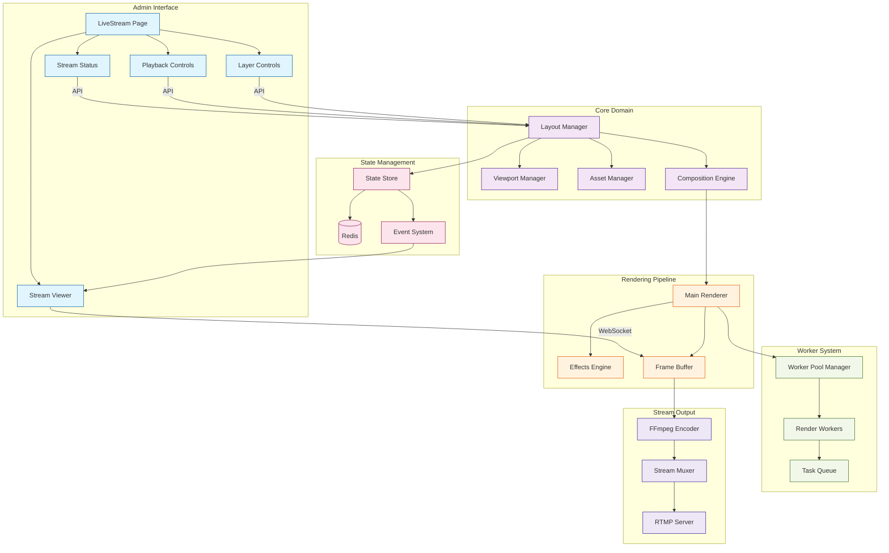
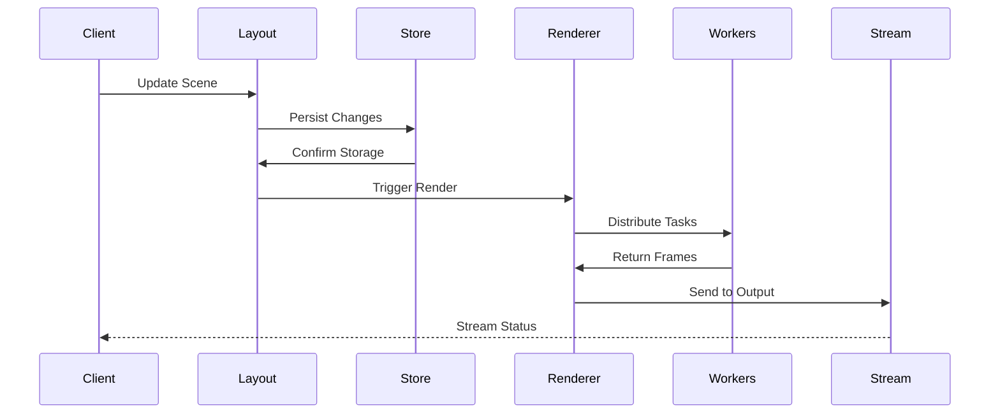
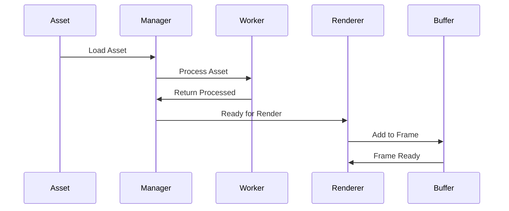
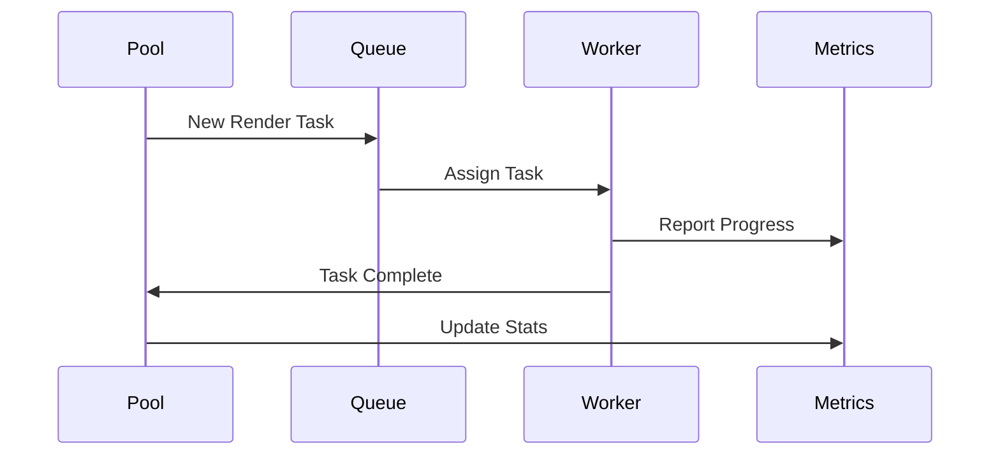

# Stream Manager Implementation

This directory contains the core implementation of the Stream Manager service. This document focuses on the implementation details, component interactions, and current development status.

## Directory Structure

```
src/
├── core/                    # Core domain logic
│   ├── viewport.ts         # Viewport/canvas management
│   ├── layout.ts          # Scene/layout management
│   ├── assets.ts          # Asset management
│   └── composition.ts     # Composition engine
│
├── rendering/              # Rendering pipeline
│   ├── renderer.ts        # Main renderer
│   ├── effects.ts         # Visual effects and transitions
│   ├── frame-buffer.ts    # Memory management
│   └── encoder.ts         # Stream encoding
│
├── workers/                # Worker thread implementations
│   ├── pool/              # Worker pool management
│   │   ├── manager.ts     # Pool orchestration
│   │   └── metrics.ts     # Pool performance tracking
│   ├── render/            # Render workers
│   │   ├── worker.ts      # Worker implementation
│   │   └── tasks.ts       # Task definitions
│   └── shared/            # Shared worker code
│       ├── messages.ts    # Worker message types
│       └── state.ts       # Shared state types
│
├── state/                  # State management
│   ├── store/             # State stores
│   │   ├── config.ts     # Dynamic config store
│   │   └── sync.ts       # Redis synchronization
│   ├── persistence.ts     # State persistence
│   └── events.ts          # Event system
│
├── streaming/              # Streaming functionality
│   ├── rtmp/              # RTMP handling
│   │   ├── server.ts     # RTMP server
│   │   └── events.ts     # RTMP event handlers
│   ├── output/            # Stream output
│   │   ├── encoder.ts    # FFmpeg encoding
│   │   └── muxer.ts      # Stream multiplexing
│   └── websocket.ts      # WebSocket communication
│
├── server/                 # HTTP & WebSocket servers
│   ├── api/               # HTTP API endpoints
│   │   ├── stream.ts     # Stream control
│   │   ├── layers.ts     # Layer management
│   │   └── metrics.ts    # Prometheus metrics
│   ├── websocket/         # WebSocket handlers
│   │   ├── stream.ts     # Stream events
│   │   └── layers.ts     # Layer updates
│   └── monitoring/        # Monitoring interfaces
│       ├── dashboard.ts   # Web dashboard
│       └── preview.ts     # Stream preview
│
├── utils/                  # Utilities
│   ├── logger.ts          # Logging utilities
│   ├── metrics.ts         # Metrics collection
│   └── helpers.ts         # Shared helpers
│
└── types/                  # TypeScript types
    ├── viewport.ts        # Viewport types
    ├── layout.ts          # Layout types
    ├── worker.ts          # Worker types
    └── stream.ts          # Stream types

```

## Component Architecture

The service architecture has been updated to integrate with the admin interface for monitoring and control:



## Monitoring Interface

The monitoring interface is now implemented in the admin interface (`apps/admin/src/app/livestream/page.tsx`) with the following components:

1. **Stream Status**
   - Real-time performance metrics
   - FPS monitoring
   - Layer count
   - Render time statistics

2. **Stream Viewer**
   - Live preview of the stream
   - Frame-by-frame monitoring
   - Quality controls

3. **Playback Controls**
   - Stream start/stop
   - Pause functionality
   - Stream state management

4. **Layer Controls**
   - Layer visibility toggling
   - Layer ordering
   - Batch updates

The backend provides these monitoring capabilities through:

1. **Preview Server** (`monitoring/preview.ts`)
   - WebSocket-based frame distribution
   - Client connection management
   - Stream health monitoring
   - Performance metrics collection

2. **Stream API** (`api/stream.ts`)
   - Status endpoints
   - Frame retrieval
   - Playback control
   - Layer management

## API Endpoints

The monitoring interface uses the following endpoints:

```typescript
// Stream Status
GET /api/stream/status
{
  isLive: boolean
  fps: number
  targetFPS: number
  frameCount: number
  droppedFrames: number
  averageRenderTime: number
  connectedClients: number
}

// Frame Retrieval
GET /api/stream/frame

// Playback Control
POST /api/stream/start
POST /api/stream/stop

// Layer Management
GET /api/stream/layers
POST /api/stream/layers/:id/visibility
```

## Data Flow

1. **Scene Management Flow**


2. **Asset Pipeline Flow**


3. **Worker Distribution Flow**


## Implementation Status

### ✅ Completed (Core)
1. **State Management**
   - Redis-backed persistence
   - Type-safe state updates
   - Event system
   - Preview client tracking
   - WebSocket synchronization

2. **Rendering Pipeline**
   - Frame buffer management
   - Asset composition
   - Layer management
   - Real-time preview
   - Effect system

3. **Streaming Output**
   - FFmpeg integration
   - RTMP server
   - Quality management
   - Performance monitoring
   - Error recovery

4. **API Layer**
   - REST endpoints
   - WebSocket server
   - Layer management
   - Stream control
   - Preview delivery

### 🚧 In Progress
1. **Performance Optimization**
   - Worker pool scaling
   - Memory management
   - Frame caching
   - Asset preloading

2. **Monitoring**
   - Prometheus metrics
   - Resource tracking
   - Error reporting
   - Performance profiling

### 📋 Planned
1. **Advanced Features**
   - Scene transitions
   - Advanced effects
   - Audio support
   - Recording system

## Core Components

### State Management
The state system provides:
- Centralized state management
- Redis persistence
- Real-time updates
- Type-safe operations
- Event broadcasting

### Rendering Pipeline
The rendering system handles:
- Frame composition
- Asset management
- Layer ordering
- Effect application
- Memory optimization

### Streaming Output
The streaming system manages:
- FFmpeg encoding
- RTMP delivery
- Quality control
- Error recovery
- Performance monitoring

## Usage Example

```typescript
import { ViewportManager } from './core/viewport.js';
import { LayoutManager } from './core/layout.js';
import { AssetManager } from './core/assets.js';
import { Renderer } from './rendering/renderer.js';

// Initialize managers
const viewport = ViewportManager.getInstance();
const layout = LayoutManager.getInstance();
const assets = AssetManager.getInstance();
const renderer = Renderer.getInstance();

// Create a scene
const scene = layout.createScene('main');

// Add assets to scene
const asset = assets.createAsset(
  'image',
  '/path/to/image.png',
  { x: 100, y: 100 },
  {
    scale: 1,
    rotation: 0,
    opacity: 1
  }
);

layout.addAsset(scene.id, asset);

// Start rendering
renderer.start();

// Handle frame updates
renderer.on('frame:ready', (frame: Buffer) => {
  // Handle the rendered frame
});
```

## Development

### Prerequisites
- Node.js 18+
- Redis
- FFmpeg
- Docker

### Setup
1. Install dependencies: `npm install`
2. Build the project: `npm run build`
3. Start the service: `npm start`

### Testing
- Unit tests: `npm test`
- Integration tests: `npm run test:integration`
- Performance tests: `npm run test:perf`

## Configuration

Environment variables:
- `STREAM_RESOLUTION`: Output resolution (default: "1920x1080")
- `TARGET_FPS`: Target frame rate (default: 60)
- `STREAM_BITRATE`: Output bitrate (default: 6000000)
- `STREAM_CODEC`: Video codec (default: "h264")
- `FFMPEG_PRESET`: FFmpeg encoding preset (default: "veryfast")

## Next Steps

1. **Performance Optimization**
   - Implement worker pool scaling
   - Optimize memory usage
   - Add frame caching
   - Improve asset loading

2. **Monitoring Enhancement**
   - Add detailed metrics
   - Implement profiling
   - Enhance error tracking
   - Add performance alerts

3. **Feature Additions**
   - Scene transitions
   - Advanced effects
   - Audio support
   - Recording system

## Contributing

When working on this codebase:
1. Follow TypeScript best practices
2. Add tests for new features
3. Update documentation
4. Follow error handling patterns
5. Add appropriate logging 