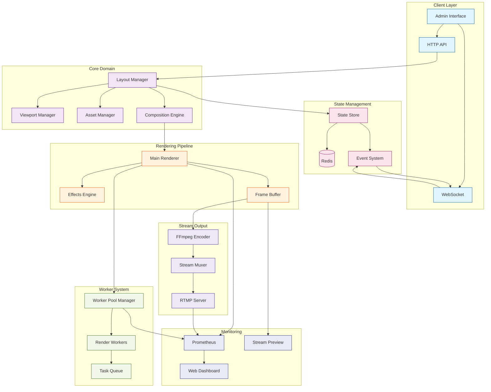
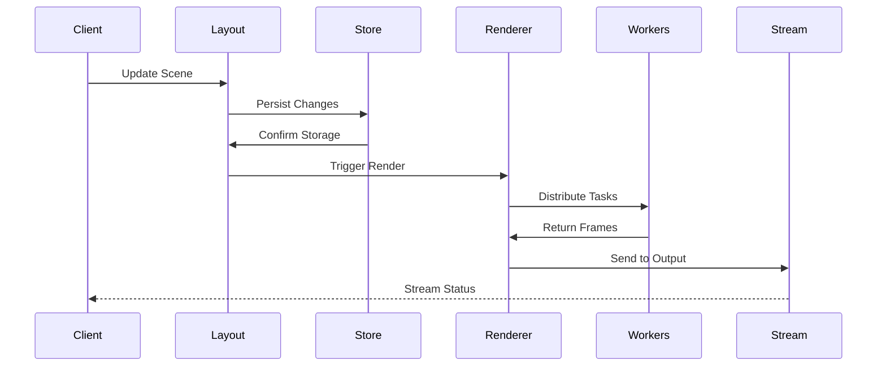
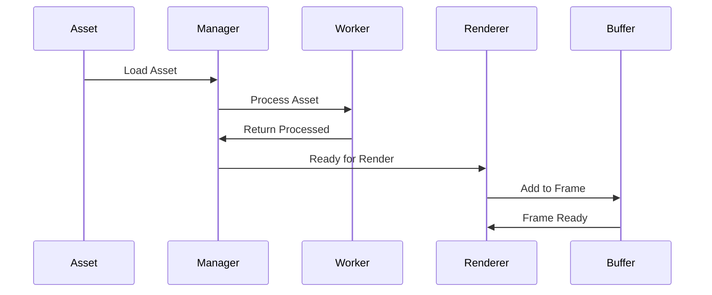
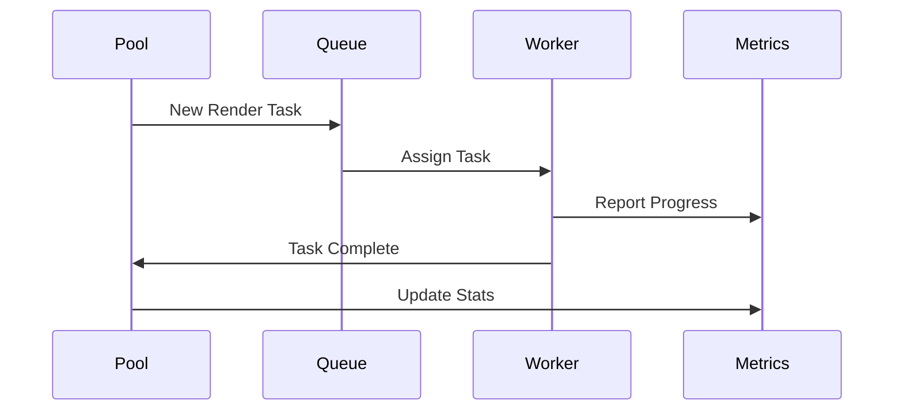

# Stream Manager Implementation

This directory contains the core implementation of the Stream Manager service. This document focuses on the implementation details, component interactions, and current development status.

## Directory Structure

```
src/
├── core/                    # Core domain logic
│   ├── viewport.ts         # Viewport/canvas management
│   ├── layout.ts          # Scene/layout management
│   ├── assets.ts          # Asset management
│   └── composition.ts     # Composition engine
│
├── rendering/              # Rendering pipeline
│   ├── renderer.ts        # Main renderer
│   ├── effects.ts         # Visual effects and transitions
│   ├── frame-buffer.ts    # Memory management
│   └── encoder.ts         # Stream encoding
│
├── workers/                # Worker thread implementations
│   ├── pool/              # Worker pool management
│   │   ├── manager.ts     # Pool orchestration (TODO)
│   │   └── metrics.ts     # Pool performance tracking (TODO)
│   ├── render/            # Render workers
│   │   ├── worker.ts      # Worker implementation (WIP)
│   │   └── tasks.ts       # Task definitions (TODO)
│   └── shared/            # Shared worker code
│       ├── messages.ts    # Worker message types (TODO)
│       └── state.ts       # Shared state types (TODO)
│
├── config/                 # Configuration management
│   ├── schema.ts          # Zod schema definitions
│   ├── defaults.ts        # Default configuration
│   ├── env.ts            # Environment loading
│   └── index.ts          # Configuration singleton
│
├── state/                  # State management
│   ├── store/             # State stores
│   │   ├── config.ts     # Dynamic config store (TODO)
│   │   └── sync.ts       # Redis synchronization (TODO)
│   ├── persistence.ts     # State persistence
│   └── events.ts          # Event system
│
├── streaming/              # Streaming functionality
│   ├── rtmp/              # RTMP handling
│   │   ├── server.ts     # RTMP server (WIP)
│   │   └── events.ts     # RTMP event handlers (TODO)
│   ├── output/            # Stream output
│   │   ├── encoder.ts    # FFmpeg encoding
│   │   └── muxer.ts      # Stream multiplexing (TODO)
│   └── websocket.ts       # WebSocket communication
│
├── server/                 # HTTP & WebSocket servers
│   ├── api/               # HTTP API endpoints
│   │   ├── stream.ts     # Stream control
│   │   ├── layers.ts     # Layer management
│   │   └── metrics.ts    # Prometheus metrics
│   ├── websocket/         # WebSocket handlers
│   │   ├── stream.ts     # Stream events
│   │   └── layers.ts     # Layer updates
│   └── monitoring/        # Monitoring interfaces
│       ├── dashboard.ts   # Web dashboard (TODO)
│       └── preview.ts     # Stream preview (WIP)
│
├── utils/                  # Utilities
│   ├── logger.ts          # Logging utilities
│   ├── metrics.ts         # Metrics collection
│   └── helpers.ts         # Shared helpers
│
└── types/                  # TypeScript types
    ├── viewport.ts        # Viewport types
    ├── layout.ts          # Layout types
    ├── worker.ts          # Worker types (TODO)
    └── stream.ts          # Stream types

```

## Component Architecture



## Data Flow

1. **Scene Management Flow**


2. **Asset Pipeline Flow**


3. **Worker Distribution Flow**


## Implementation Status

### Fully Implemented (✓)
1. **Core Domain Logic**
   - Viewport management system ✓
   - Layout and scene management ✓
   - Asset management and caching ✓
   - Composition engine ✓

2. **Rendering Pipeline**
   - Main renderer ✓
   - Effects system ✓
   - Frame buffer management ✓
   - Basic encoding ✓

3. **Base Infrastructure**
   - Configuration system ✓
   - Basic event system ✓
   - Logging utilities ✓
   - Type definitions (core) ✓

### Work in Progress (WIP)
1. **Worker System**
   - Basic worker setup ✓
   - Worker pool management (TODO)
   - Task distribution system (WIP)
   - Worker metrics collection (TODO)
   - Error recovery system (TODO)

2. **Stream Output**
   - RTMP server implementation (WIP)
   - Stream multiplexing (TODO)
   - Quality adaptation (TODO)
   - Error recovery (TODO)

3. **Monitoring & Development Tools**
   - Basic metrics collection ✓
   - Development dashboard (TODO)
   - Stream preview interface (WIP)
   - Performance profiling (TODO)

### Planned Features (TODO)
1. **Advanced Worker Features**
   - Dynamic worker scaling
   - Load balancing
   - Task prioritization
   - Memory management
   - Worker health monitoring

2. **Enhanced Configuration**
   - Dynamic config updates
   - Redis-backed persistence
   - Config validation
   - Hot reloading

3. **Monitoring Improvements**
   - Real-time metrics
   - Performance alerts
   - Debug tooling
   - Resource monitoring

## Development Priorities

### High Priority
1. Complete worker pool implementation
2. Implement RTMP server
3. Add monitoring dashboard
4. Improve error handling

### Medium Priority
1. Enhance configuration system
2. Add performance profiling
3. Implement stream preview
4. Add worker metrics

### Low Priority
1. Add more transition effects
2. Implement hot reloading
3. Add debug tooling
4. Enhance documentation

## Current Limitations

1. **Worker System**
   - Limited to basic worker setup
   - No parallel processing yet
   - Missing worker pool management
   - Basic error handling only

2. **Stream Output**
   - Basic RTMP implementation
   - No quality adaptation
   - Limited error recovery
   - Missing multiplexing

3. **Development Tools**
   - Basic metrics only
   - No visual monitoring
   - Limited debugging tools
   - Missing profiling

## Next Steps

1. **Immediate Tasks**
   - Implement worker pool manager
   - Complete RTMP server
   - Add monitoring dashboard
   - Enhance error handling

2. **Short-term Goals**
   - Add worker metrics
   - Implement stream preview
   - Enhance configuration
   - Add performance profiling

3. **Long-term Goals**
   - Advanced worker features
   - Enhanced monitoring
   - Debug tooling
   - Documentation improvements

## Contributing

When working on this codebase:

1. **Adding Features**
   - Update implementation status
   - Add type definitions
   - Include tests
   - Update documentation

2. **Fixing Issues**
   - Check component status
   - Maintain patterns
   - Update status sections

3. **Performance Improvements**
   - Measure before/after
   - Document trade-offs
   - Update metrics

## Best Practices

1. **Code Organization**
   - Follow directory structure
   - Maintain clear boundaries
   - Document interfaces
   - Use type definitions

2. **Error Handling**
   - Use typed errors
   - Implement recovery
   - Log appropriately
   - Add monitoring

3. **Performance**
   - Use worker threads
   - Implement caching
   - Monitor memory
   - Profile critical paths 