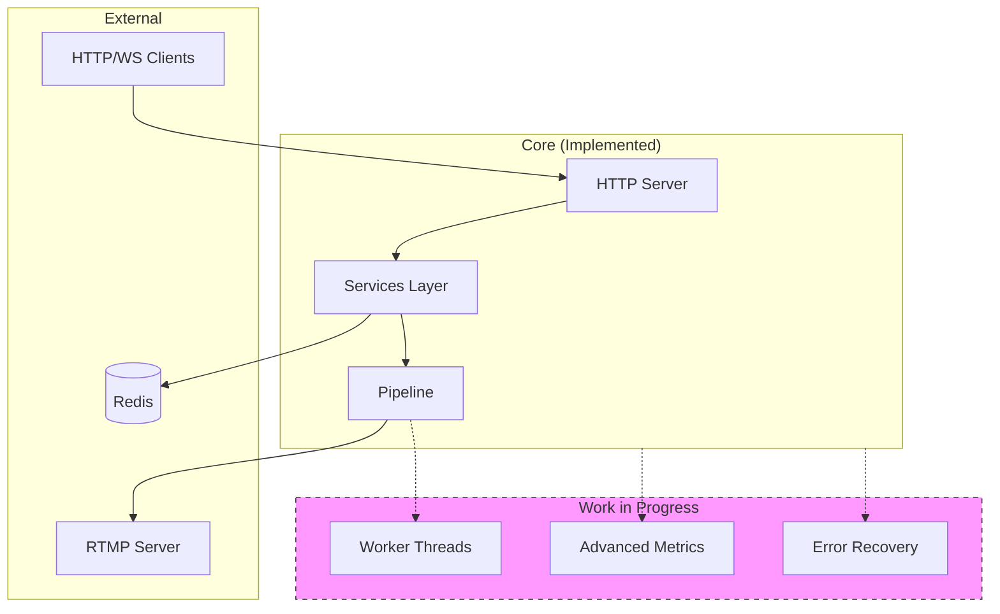
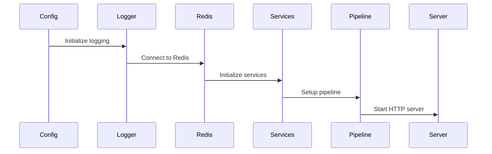

# Stream Manager Implementation

This directory contains the core implementation of the Stream Manager service. This document focuses on the implementation details, component interactions, and current development status.

## Directory Structure

```
src/
├── pipeline/           # Core streaming components
│   ├── stream-manager.ts   # Pipeline orchestration
│   ├── sharp-renderer.ts   # Image processing (1.5k+ lines)
│   ├── frame-buffer.ts     # Memory management
│   ├── stream-encoder.ts   # FFmpeg encoding
│   └── README.md          # Pipeline documentation
├── services/           # State and coordination services
│   ├── layer-manager.ts   # Layer state management (400+ lines)
│   ├── layer-renderer.ts  # Render coordination
│   ├── redis.ts          # State persistence
│   ├── websocket.ts      # Real-time updates
│   └── README.md         # Services documentation
├── server/            # HTTP API and asset handling
│   ├── stream-server.ts  # Main server implementation
│   ├── default-layers.ts # Default layer configs
│   └── README.md        # Server documentation
├── workers/           # Worker thread implementations (WIP)
│   ├── render-worker.ts  # Render worker (basic implementation)
│   └── README.md        # Workers documentation
├── types/             # Type definitions
├── utils/             # Shared utilities
├── config/            # Configuration management
└── index.ts          # Application entry point
```

## Component Architecture



## Implementation Status

### Fully Implemented
1. **Pipeline Components**
   - Stream management
   - Sharp-based rendering
   - Frame buffer handling
   - FFmpeg encoding

2. **Service Layer**
   - Layer state management
   - Redis persistence
   - WebSocket communication
   - Basic event system

3. **HTTP Server**
   - Stream control endpoints
   - Layer management API
   - Asset handling
   - Basic error handling

### Work in Progress
1. **Worker Threads** (Partially Implemented)
   - Basic worker setup ✓
   - Render offloading (TODO)
   - Worker pool management (TODO)
   - Performance monitoring (TODO)

2. **Metrics System** (Partially Implemented)
   - Basic Prometheus integration ✓
   - Advanced performance metrics (TODO)
   - Custom metric collectors (TODO)
   - Grafana dashboards (TODO)

3. **Error Handling** (Needs Improvement)
   - Consistent error patterns (TODO)
   - Recovery mechanisms (TODO)
   - Error reporting (TODO)

## Initialization Flow



## Current Limitations

1. **Worker Implementation**
   - Limited to basic setup
   - No parallel processing yet
   - Missing performance optimizations

2. **Metrics Coverage**
   - Basic metrics only
   - Inconsistent collection
   - Limited visualization

3. **Error Handling**
   - Inconsistent patterns
   - Limited recovery options
   - Basic logging only

## Development Priorities

1. **High Priority**
   - Complete worker thread implementation
   - Implement comprehensive metrics
   - Standardize error handling

2. **Medium Priority**
   - Add performance monitoring
   - Improve state recovery
   - Enhance logging

3. **Low Priority**
   - Add more layer types
   - Optimize memory usage
   - Add more animation options

## Best Practices

1. **Code Organization**
   - Keep component responsibilities clear
   - Use consistent patterns
   - Document public APIs

2. **Error Handling**
   - Use typed errors
   - Implement recovery
   - Log appropriately

3. **Performance**
   - Monitor memory usage
   - Profile critical paths
   - Use worker threads

## Contributing

When working on this codebase:

1. **Adding Features**
   - Update relevant README
   - Add type definitions
   - Include tests
   - Document APIs

2. **Fixing Issues**
   - Check component READMEs
   - Maintain patterns
   - Update documentation

3. **Performance Improvements**
   - Measure before/after
   - Document trade-offs
   - Update metrics

## Next Steps

1. **Immediate Tasks**
   - Complete worker implementation
   - Standardize error handling
   - Implement missing metrics

2. **Future Improvements**
   - Add worker pool management
   - Implement advanced caching
   - Add more layer types

3. **Technical Debt**
   - Consolidate error patterns
   - Improve type coverage
   - Clean up unused code 