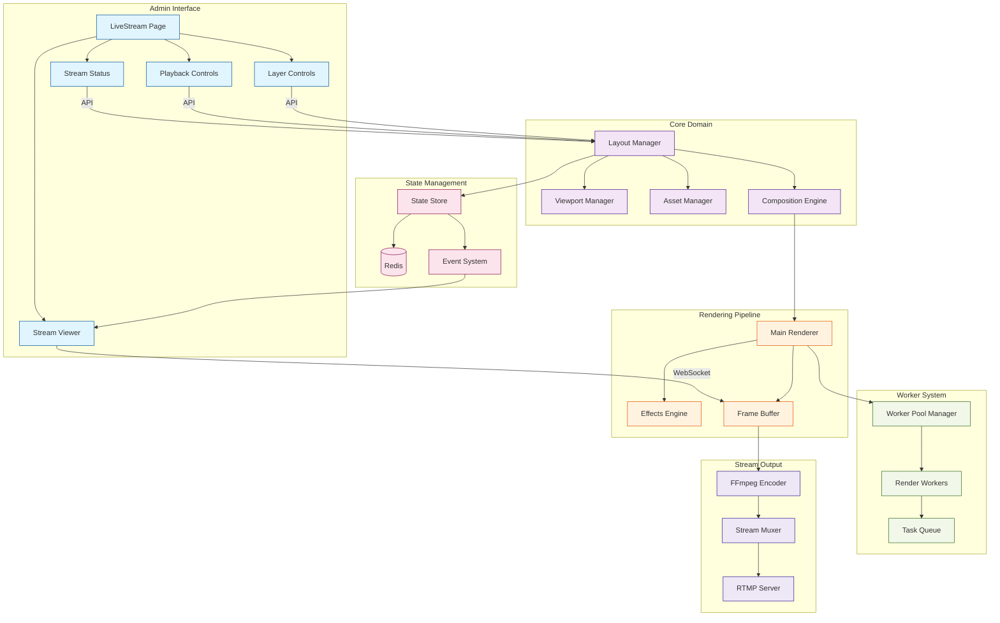
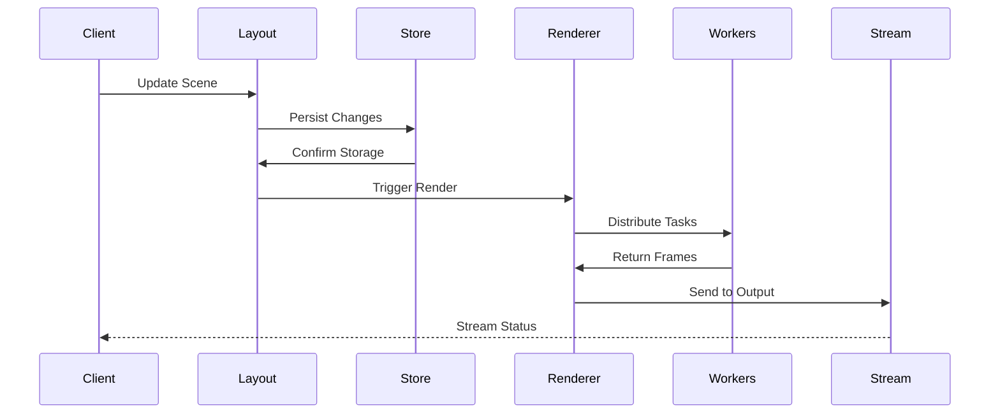
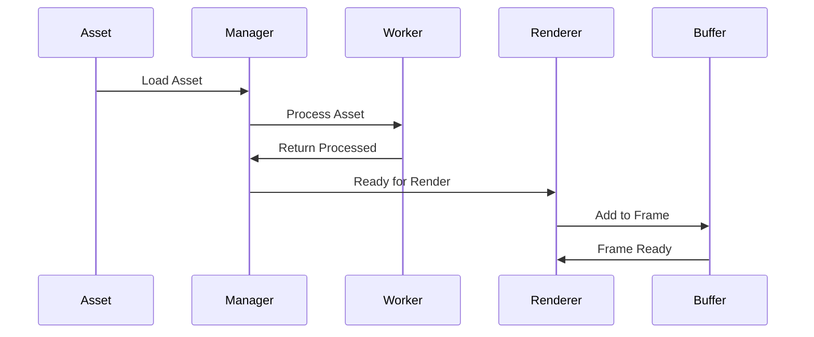
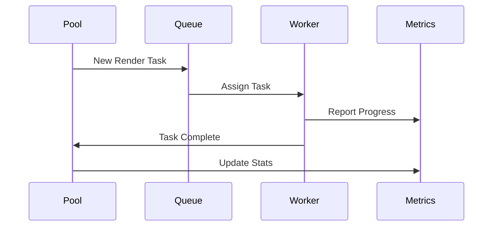

# Stream Manager Implementation

This directory contains the core implementation of the Stream Manager service. This document focuses on the implementation details, component interactions, and current development status.

## Directory Structure

```
src/
├── core/                    # Core domain logic
│   ├── viewport.ts         # Viewport/canvas management
│   ├── layout.ts          # Scene/layout management
│   ├── assets.ts          # Asset management
│   └── composition.ts     # Composition engine
│
├── rendering/              # Rendering pipeline
│   ├── renderer.ts        # Main renderer
│   ├── effects.ts         # Visual effects and transitions
│   ├── frame-buffer.ts    # Memory management
│   └── encoder.ts         # Stream encoding
│
├── workers/                # Worker thread implementations
│   ├── pool/              # Worker pool management
│   │   ├── manager.ts     # Pool orchestration
│   │   └── metrics.ts     # Pool performance tracking
│   ├── render/            # Render workers
│   │   ├── worker.ts      # Worker implementation
│   │   └── tasks.ts       # Task definitions
│   └── shared/            # Shared worker code
│       ├── messages.ts    # Worker message types
│       └── state.ts       # Shared state types
│
├── config/                 # Configuration management
│   ├── schema.ts          # Zod schema definitions
│   ├── defaults.ts        # Default configuration
│   ├── env.ts            # Environment loading
│   └── index.ts          # Configuration singleton
│
├── state/                  # State management
│   ├── store/             # State stores
│   │   ├── config.ts     # Dynamic config store
│   │   └── sync.ts       # Redis synchronization
│   ├── persistence.ts     # State persistence
│   └── events.ts          # Event system
│
├── streaming/              # Streaming functionality
│   ├── rtmp/              # RTMP handling
│   │   ├── server.ts     # RTMP server
│   │   └── events.ts     # RTMP event handlers
│   ├── output/            # Stream output
│   │   ├── encoder.ts    # FFmpeg encoding
│   │   └── muxer.ts      # Stream multiplexing
│   └── websocket.ts      # WebSocket communication
│
├── server/                 # HTTP & WebSocket servers
│   ├── api/               # HTTP API endpoints
│   │   ├── stream.ts     # Stream control and monitoring
│   │   ├── layers.ts     # Layer management
│   │   └── metrics.ts    # Prometheus metrics
│   ├── websocket/         # WebSocket handlers
│   │   ├── stream.ts     # Stream events
│   │   └── layers.ts     # Layer updates
│   └── monitoring/        # Monitoring interfaces
│       └── preview.ts     # Stream preview server
│
├── utils/                  # Utilities
│   ├── logger.ts          # Logging utilities
│   ├── metrics.ts         # Metrics collection
│   └── helpers.ts         # Shared helpers
│
└── types/                  # TypeScript types
    ├── viewport.ts        # Viewport types
    ├── layout.ts          # Layout types
    ├── worker.ts          # Worker types
    └── stream.ts          # Stream types

```

## Component Architecture

The service architecture has been updated to integrate with the admin interface for monitoring and control:



## Monitoring Interface

The monitoring interface is now implemented in the admin interface (`apps/admin/src/app/livestream/page.tsx`) with the following components:

1. **Stream Status**
   - Real-time performance metrics
   - FPS monitoring
   - Layer count
   - Render time statistics

2. **Stream Viewer**
   - Live preview of the stream
   - Frame-by-frame monitoring
   - Quality controls

3. **Playback Controls**
   - Stream start/stop
   - Pause functionality
   - Stream state management

4. **Layer Controls**
   - Layer visibility toggling
   - Layer ordering
   - Batch updates

The backend provides these monitoring capabilities through:

1. **Preview Server** (`monitoring/preview.ts`)
   - WebSocket-based frame distribution
   - Client connection management
   - Stream health monitoring
   - Performance metrics collection

2. **Stream API** (`api/stream.ts`)
   - Status endpoints
   - Frame retrieval
   - Playback control
   - Layer management

## API Endpoints

The monitoring interface uses the following endpoints:

```typescript
// Stream Status
GET /api/stream/status
{
  isLive: boolean
  fps: number
  targetFPS: number
  frameCount: number
  droppedFrames: number
  averageRenderTime: number
  connectedClients: number
}

// Frame Retrieval
GET /api/stream/frame

// Playback Control
POST /api/stream/start
POST /api/stream/stop

// Layer Management
GET /api/stream/layers
POST /api/stream/layers/:id/visibility
```

## Data Flow

1. **Scene Management Flow**


2. **Asset Pipeline Flow**


3. **Worker Distribution Flow**


## Implementation Status

### Fully Implemented (✓)
1. **Core Domain Logic**
   - Viewport management system ✓
   - Layout and scene management ✓
   - Asset management and caching ✓
   - Composition engine ✓

2. **Rendering Pipeline**
   - Main renderer ✓
   - Effects system ✓
   - Frame buffer management ✓
   - Basic encoding ✓

3. **Worker System**
   - Worker pool management ✓
   - Task distribution system ✓
   - Worker metrics collection ✓
   - Basic error recovery ✓
   - Task prioritization ✓
   - Dynamic worker scaling ✓
   - CPU usage monitoring ✓
   - Memory usage monitoring ✓
   - Resource-aware scaling ✓
   - Memory optimization ✓

4. **Base Infrastructure**
   - Configuration system ✓
   - Basic event system ✓
   - Logging utilities ✓
   - Type definitions (core) ✓
   - Metrics collection ✓
   - Resource monitoring ✓

### Work in Progress (WIP)
1. **Worker System**
   - Advanced error recovery (WIP)
   - Worker-specific configuration (TODO)
   - Predictive scaling (TODO)

2. **Stream Output**
   - RTMP server implementation (WIP)
   - Stream multiplexing (TODO)
   - Quality adaptation (TODO)
   - Error recovery (TODO)

3. **Monitoring & Development Tools**
   - Basic metrics collection ✓
   - Resource monitoring ✓
   - Development dashboard (TODO)
   - Stream preview interface (WIP)
   - Performance profiling (WIP)

### Planned Features (TODO)
1. **Advanced Worker Features**
   - Advanced load balancing strategies
   - Cross-worker task sharing
   - Resource usage optimization
   - Advanced health monitoring
   - Predictive resource allocation

2. **Enhanced Configuration**
   - Dynamic config updates
   - Redis-backed persistence
   - Config validation
   - Hot reloading
   - Worker-specific settings

3. **Monitoring Improvements**
   - Advanced performance metrics
   - Predictive alerts
   - Resource optimization
   - Debug tooling
   - Real-time monitoring dashboard

## Development Priorities

### High Priority
1. Implement worker-specific configuration
2. Add advanced error recovery strategies
3. Add predictive scaling
4. Implement RTMP error recovery

### Medium Priority
1. Enhance load balancing strategies
2. Implement cross-worker task sharing
3. Add resource usage optimization
4. Improve monitoring dashboard

### Low Priority
1. Add more transition effects
2. Implement hot reloading
3. Add debug tooling
4. Enhance documentation

## Current Limitations

1. **Worker System**
   - Basic error recovery strategies
   - Limited worker configuration
   - Simple load balancing
   - Basic predictive capabilities

2. **Stream Output**
   - Basic RTMP implementation
   - No quality adaptation
   - Limited error recovery
   - Missing multiplexing

3. **Development Tools**
   - Basic metrics only
   - No visual monitoring
   - Limited debugging tools
   - Basic profiling

## Next Steps

1. **Immediate Tasks**
   - Implement worker-specific configuration
   - Enhance error recovery strategies
   - Add predictive scaling
   - Implement RTMP error recovery

2. **Short-term Goals**
   - Enhance load balancing
   - Implement task sharing
   - Add monitoring dashboard
   - Improve error handling

3. **Long-term Goals**
   - Advanced monitoring
   - Predictive analytics
   - Debug tooling
   - Documentation improvements

## Contributing

When working on this codebase:

1. **Adding Features**
   - Update implementation status
   - Add type definitions
   - Include tests
   - Update documentation

2. **Fixing Issues**
   - Check component status
   - Maintain patterns
   - Update status sections

3. **Performance Improvements**
   - Measure before/after
   - Document trade-offs
   - Update metrics

## Best Practices

1. **Code Organization**
   - Follow directory structure
   - Maintain clear boundaries
   - Document interfaces
   - Use type definitions

2. **Error Handling**
   - Use typed errors
   - Implement recovery
   - Log appropriately
   - Add monitoring

3. **Performance**
   - Use worker threads
   - Implement caching
   - Monitor memory
   - Profile critical paths 