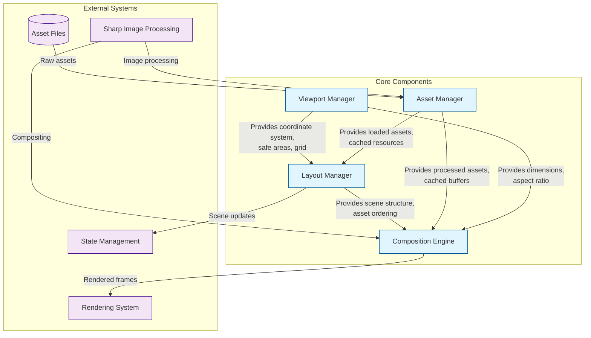
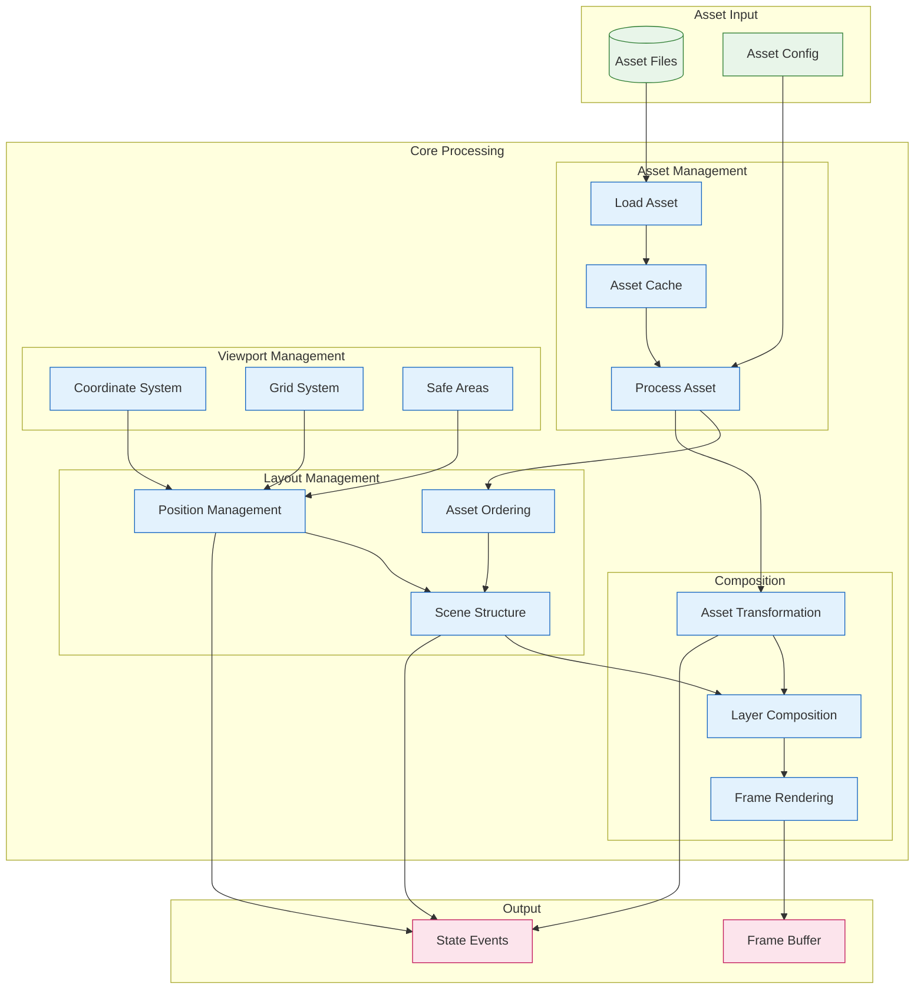
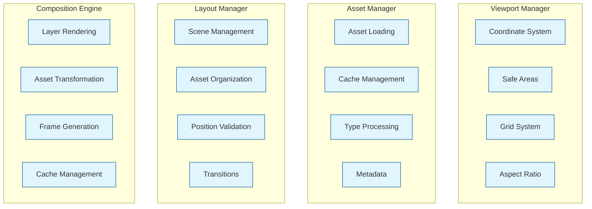

# Stream Manager Core System

The core system provides the fundamental building blocks for the Stream Manager service, handling scene composition, layout management, viewport control, and asset management. This directory contains the core domain logic that powers the streaming experience.

## Architecture

### Component Relationships


### Data Flow


### Component Responsibilities


## Components

### 1. Composition Engine (`composition.ts`)
The heart of the rendering pipeline, responsible for scene composition:
- Scene rendering with Sharp
- Asset composition and layering
- Transition management
- Performance optimization with caching
- Event-based updates

Key features:
- High-performance image processing
- Layer compositing with z-index support
- Asset transformation (scale, rotation, opacity)
- Cache management for rendered assets
- Error handling and logging

### 2. Layout Manager (`layout.ts`)
Manages scenes, assets, and their arrangements:
- Scene creation and management
- Asset positioning and transformation
- Z-index ordering
- Grid snapping
- Scene transitions

Features:
- Scene lifecycle management
- Asset CRUD operations
- Safe area constraints
- Grid-based positioning
- Event emission for state changes

### 3. Viewport Manager (`viewport.ts`)
Controls the viewing area and coordinate systems:
- Viewport dimensions
- Safe area management
- Coordinate transformation
- Grid system
- Position constraints

Capabilities:
- Relative/absolute coordinate conversion
- Grid snapping
- Safe area enforcement
- Aspect ratio management
- Event-based updates

### 4. Asset Manager (`assets.ts`)
Handles all asset-related operations:
- Asset loading and caching
- Type-specific processing
- Metadata management
- Memory optimization
- Preloading system

Features:
- Multi-type asset support (image, video, text, vtuber, overlay)
- Efficient caching system
- Batch preloading
- Memory management
- Sharp integration for image processing

## Integration

### State Integration
```typescript
import { StateManager } from '../state/state-manager';
import { LayoutManager } from './layout';

// State updates
layoutManager.on('scene:updated', (scene) => {
  stateManager.updateScene(scene);
});
```

### Rendering Integration
```typescript
import { CompositionEngine } from './composition';
import { Renderer } from '../rendering/renderer';

// Frame rendering
compositionEngine.on('frame:ready', (frame) => {
  renderer.processFrame(frame);
});
```

## Performance

### Optimizations
1. **Asset Caching**
   - In-memory caching
   - TTL-based invalidation
   - Metadata caching
   - Batch preloading

2. **Composition**
   - Layer-based rendering
   - Cached transformations
   - Efficient Sharp operations
   - Memory pooling

3. **Layout**
   - Grid-based snapping
   - Efficient asset ordering
   - Optimized scene transitions
   - Event batching

## Error Handling

The core system implements comprehensive error handling:
- Asset loading errors
- Composition failures
- Layout constraints
- Type validation
- Resource management

## Development

### Prerequisites
- Node.js 18+
- Sharp for image processing
- Redis for state management
- TypeScript 5+

### Best Practices
1. Use singleton pattern for managers
2. Implement proper error handling
3. Emit events for state changes
4. Validate input parameters
5. Maintain type safety
6. Document public APIs

## Related Components

- **Rendering System**: Processes composed frames
- **State Manager**: Handles state persistence
- **Streaming System**: Manages output delivery
- **Worker System**: Handles CPU-intensive tasks

## Future Improvements

1. **Asset Management**
   - Video frame extraction
   - Text rendering system
   - VTuber model support
   - Advanced caching

2. **Composition**
   - Hardware acceleration
   - WebGL integration
   - Custom shaders
   - Advanced effects

3. **Layout**
   - Advanced constraints
   - Animation system
   - Template support
   - Layout presets