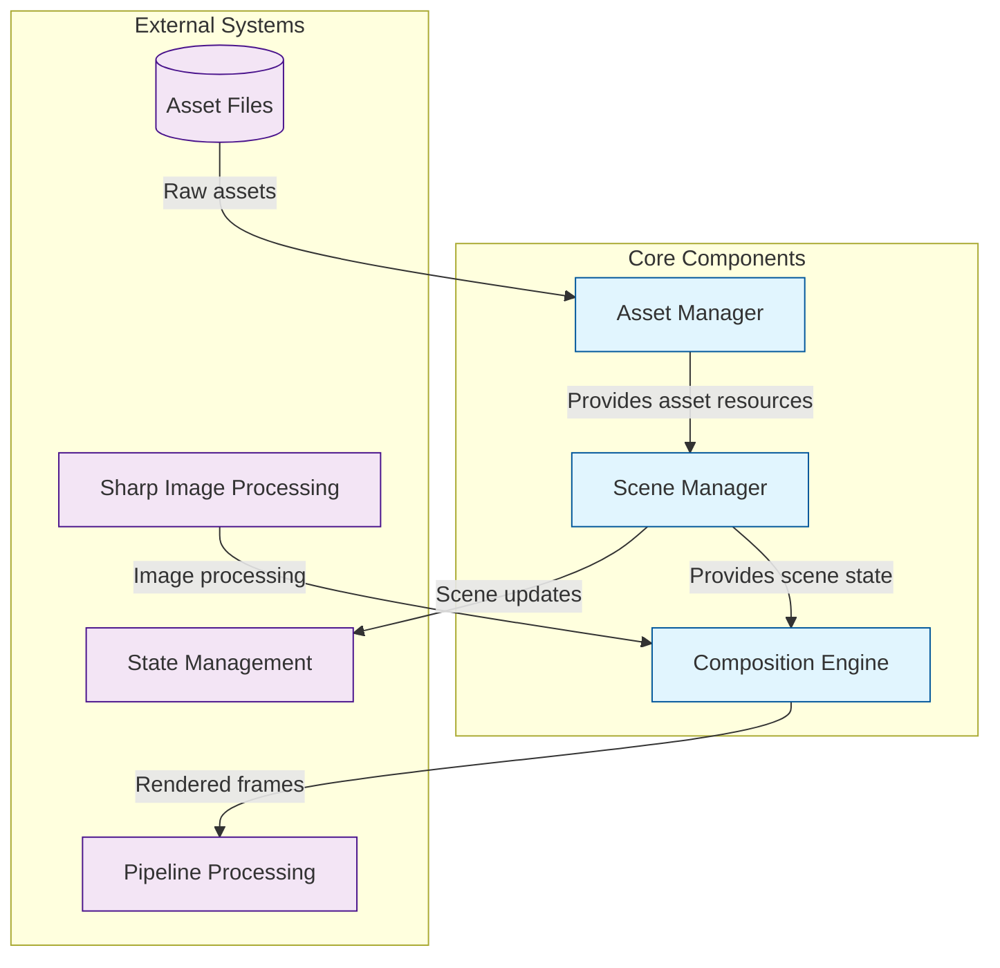
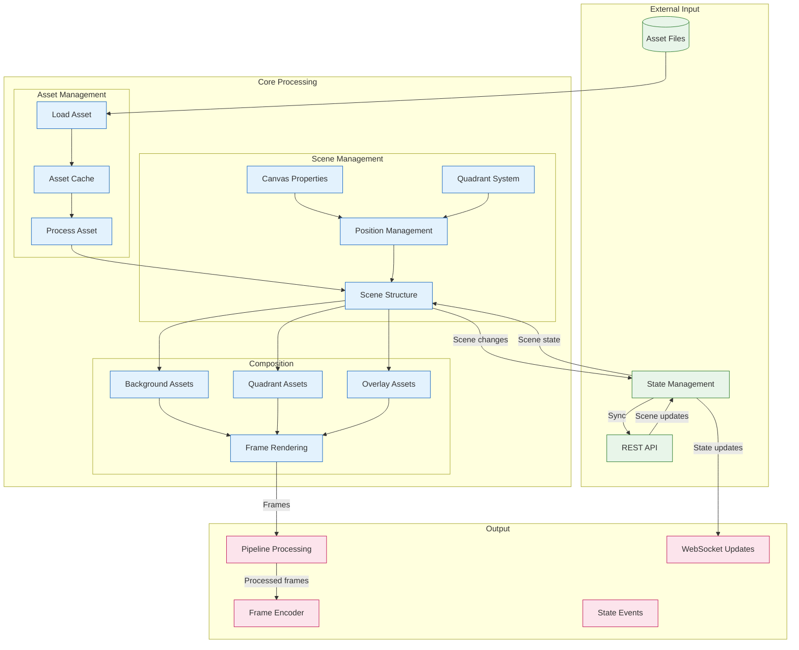

# Stream Manager Core System

The core system provides the fundamental building blocks for the Stream Manager service, handling scene composition and asset management. This directory contains the core domain logic that powers the streaming experience.

## Architecture

### Component Relationships


### Data Flow


## Components

### 1. Scene Manager (`scene-manager.ts`)
The central manager for scene organization and state:
- Scene creation and management
- Asset positioning in quadrants
- Background and overlay management
- Scene transitions
- Canvas properties and safe areas

Features:
- Scene state management
- Quadrant-based positioning
- Z-index ordering within containers
- Scene transitions
- Asset organization (background, quadrants, overlay)

### 2. Composition Engine (`composition.ts`)
Pure rendering engine that takes scenes and produces frames:
- Direct scene rendering
- Asset composition in correct order
- Background, quadrant, and overlay rendering
- Frame caching and optimization

Key features:
- High-performance Sharp-based rendering
- Z-index based compositing
- Render caching
- Asset transformations

### 3. Asset Manager (`assets.ts`)
Resource provider for the scene system:
- Asset loading and processing
- Resource caching
- Asset type management
- Memory optimization

Features:
- Multi-type asset support
- Resource caching
- Memory management
- Asset preprocessing

## Scene Structure

```typescript
interface Scene {
  id: string;
  name: string;
  background: Asset[];     // Fixed bottom assets
  quadrants: Map<QuadrantId, Quadrant>;  // Quadrant-positioned assets
  overlay: Asset[];        // Fixed top assets
  metadata?: Record<string, unknown>;
}
```

### Asset Positioning
1. **Background Assets**: Fixed at bottom, absolute positioning
2. **Quadrant Assets**: Positioned relative to quadrant bounds
3. **Overlay Assets**: Fixed at top, absolute positioning

### Quadrant System
- 4 fixed quadrants (1-4)
- Each quadrant has its own bounds and padding
- Assets within quadrants are positioned relative to quadrant bounds
- Z-index ordering within each quadrant

## Performance

### Optimizations
1. **Asset Caching**
   - In-memory caching
   - Asset type-specific processing
   - Metadata caching

2. **Composition**
   - Container-based rendering
   - Z-index sorting
   - Quadrant-based optimization
   - Sharp operations

3. **Scene Management**
   - Efficient scene state updates
   - Optimized asset positioning
   - Event batching

## Error Handling

The core system implements comprehensive error handling:
- Asset loading errors
- Composition failures
- Scene validation
- Type validation
- Resource management

## Development

### Prerequisites
- Node.js 18+
- Sharp for image processing
- TypeScript 5+

### Best Practices
1. Use singleton pattern for managers
2. Implement proper error handling
3. Emit events for state changes
4. Validate scene structure
5. Maintain type safety
6. Document public APIs

## Future Improvements

1. **Asset Management**
   - Video frame extraction
   - Text rendering system
   - VTuber model support
   - Advanced caching

2. **Composition**
   - Hardware acceleration
   - WebGL integration
   - Custom shaders
   - Advanced effects

3. **Scene Management**
   - Scene templates
   - Advanced transitions
   - Asset animation
   - Dynamic quadrants