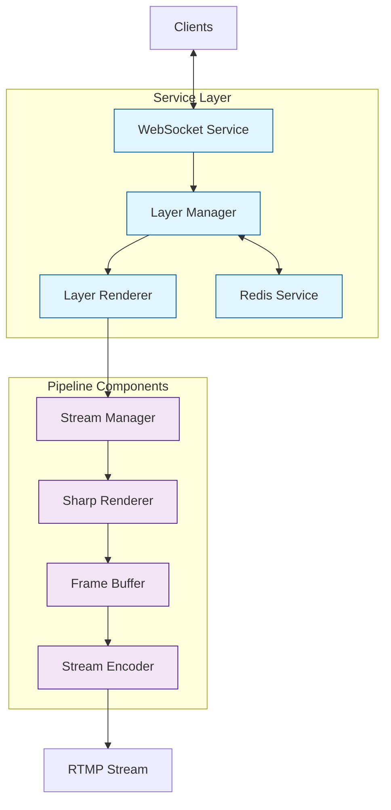

# Streaming Pipeline

This directory contains the core components of the streaming pipeline, which work together to process, compose, and stream video content.

## Components

### 1. Stream Manager (`stream-manager.ts`)
The orchestrator of the streaming pipeline that:
- Coordinates between different pipeline components using event-driven architecture
- Manages the streaming lifecycle and state
- Provides comprehensive metrics via Prometheus
- Handles layer management and updates
- Implements singleton pattern for global state management

### 2. Sharp Renderer (`sharp-renderer.ts`)
High-performance image processing component that:
- Processes and composites layers using the Sharp library
- Supports advanced text rendering with customizable fonts and styles
- Handles animations with configurable effects (fade, slide, scale, rotate)
- Implements caching mechanisms for images, fonts, and animations
- Provides specialized handling for different layer types (visual feed, chat, overlays)
- Supports SVG shape generation and image transformations
- Includes error state visualization

### 3. Frame Buffer Manager (`frame-buffer.ts`)
Memory management component that:
- Manages frame buffers using Uint8ClampedArray for efficient memory usage
- Provides buffer pooling with configurable pool size
- Implements low-level pixel manipulation functions
- Supports basic shape drawing and text rendering
- Includes RGBA color management
- Provides metrics for buffer operations and memory usage

### 4. Stream Encoder (`stream-encoder.ts`)
FFmpeg-based encoding component that:
- Handles video encoding using FFmpeg with multiple codec support (h264, vp8, vp9)
- Manages RTMP streaming with automatic restart capability
- Provides detailed encoding metrics and monitoring
- Supports dynamic configuration updates
- Implements error handling and recovery mechanisms
- Offers various encoding presets for performance optimization

## Services Architecture

The pipeline is supported by several service components that handle state management, rendering coordination, and real-time updates:

### 1. Layer Manager (`services/layer-manager.ts`)
State management service that:
- Maintains the state of all layers (host, assistant, visual feed, overlay, chat)
- Provides type-safe layer manipulation through TypeScript generics
- Emits events for layer lifecycle changes (create, update, delete)
- Manages layer properties (visibility, transform, z-index, opacity)
- Supports active layer tracking and state persistence

### 2. Layer Renderer (`services/layer-renderer.ts`)
Rendering coordination service that:
- Manages the render loop with configurable FPS
- Coordinates between Sharp Renderer and Frame Buffer
- Implements layer caching for performance optimization
- Provides detailed rendering metrics and health monitoring
- Handles dynamic resolution changes and cleanup

### 3. Redis Service (`services/redis.ts`)
Persistent state management that:
- Stores and retrieves layer state
- Provides reliable state recovery after restarts
- Handles connection management and error recovery
- Ensures data consistency across service restarts

### 4. WebSocket Service (`services/websocket.ts`)
Real-time communication service that:
- Broadcasts layer state changes to connected clients
- Handles stream events and error notifications
- Manages client connections and message routing
- Provides real-time monitoring capabilities

## Pipeline Flow



The pipeline follows a strict flow through coordinated components:

1. **Client Layer**: WebSocket Service handles client connections and updates
2. **State Management**: Layer Manager maintains layer state and persists to Redis
3. **Render Coordination**: Layer Renderer coordinates frame generation timing
4. **Pipeline Processing**:
   - Stream Manager orchestrates pipeline components
   - Sharp Renderer composites layers with effects
   - Frame Buffer manages memory and pixel data
   - Stream Encoder produces the final RTMP stream

### Component Responsibilities

1. **Service Layer**
   - WebSocket Service: Client communication
   - Layer Manager: State management
   - Redis Service: State persistence
   - Layer Renderer: Render coordination

2. **Pipeline Layer**
   - Stream Manager: Pipeline orchestration
   - Sharp Renderer: Image processing
   - Frame Buffer: Memory management
   - Stream Encoder: Video encoding

### Data Flow

1. **Layer Updates**:
   ```
   Client -> WebSocket -> Layer Manager -> Layer Renderer -> Stream Manager
   ```

2. **Frame Processing**:
   ```
   Stream Manager -> Sharp Renderer -> Frame Buffer -> Stream Encoder -> RTMP
   ```

3. **State Persistence**:
   ```
   Layer Manager <-> Redis Service
   ```

## Metrics

Each component provides detailed Prometheus metrics for monitoring:
- Frame processing and encoding times
- Memory usage across components
- Buffer operation performance
- Stream health (FPS, bitrate)
- Cache hit rates
- Animation performance
- Error states and recovery attempts
- WebSocket connection status
- Redis operation latency
- Layer state changes

## Usage Example

```typescript
import { StreamManager } from './stream-manager.js';
import { SharpRenderer } from './sharp-renderer.js';
import { LayerManager } from '../services/layer-manager.js';
import { LayerRenderer } from '../services/layer-renderer.js';

// Initialize components with configuration
const config = {
  width: 1920,
  height: 1080,
  fps: 60,
  bitrate: 6000000,
  codec: 'h264',
  preset: 'veryfast',
  streamUrl: 'rtmp://streaming.service/live'
};

// Initialize core services
const layerManager = LayerManager.getInstance();
const layerRenderer = LayerRenderer.getInstance();
await layerManager.initialize();
await layerRenderer.initialize();

// Initialize pipeline
const streamManager = StreamManager.initialize(config);
const sharpRenderer = SharpRenderer.getInstance();

// Start services and streaming
await layerRenderer.startRenderLoop(config.fps);
await streamManager.start();

// Create and update layers
const overlayLayer = await layerManager.createLayer('overlay', {
  content: {
    type: 'image',
    source: '/path/to/overlay.png',
    position: { x: 0, y: 0 }
  }
});

// Layer updates are automatically propagated through the pipeline
await layerManager.updateLayer(overlayLayer.id, {
  transform: { scale: 1.5, rotation: 45 }
});
``` 