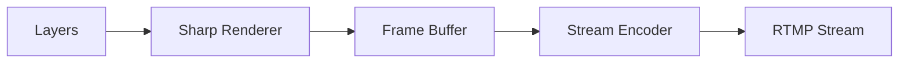

# Streaming Pipeline

This directory contains the core components of the streaming pipeline, which work together to process, compose, and stream video content.

## Components

### 1. Stream Manager (`stream-manager.ts`)
The orchestrator of the streaming pipeline that:
- Coordinates between different pipeline components
- Manages the streaming lifecycle
- Handles stream configuration and state
- Provides metrics and health monitoring

### 2. Sharp Renderer (`sharp-renderer.ts`)
High-performance image processing component that:
- Processes and composites layers using the Sharp library
- Handles image transformations and effects
- Optimizes memory usage through buffer management
- Provides efficient caching mechanisms

### 3. Frame Buffer Manager (`frame-buffer.ts`)
Memory management component that:
- Manages frame buffers for efficient memory usage
- Provides buffer pooling to reduce allocations
- Handles buffer synchronization
- Optimizes memory access patterns

### 4. Stream Encoder (`stream-encoder.ts`)
FFmpeg-based encoding component that:
- Handles video encoding using FFmpeg
- Manages streaming to RTMP/other protocols
- Provides encoding metrics and monitoring
- Handles encoder configuration and optimization

## Pipeline Flow



1. **Input**: Layers (host, visual feed, overlay, chat)
2. **Processing**: Sharp Renderer composites layers
3. **Buffering**: Frame Buffer manages memory
4. **Encoding**: Stream Encoder handles video encoding
5. **Output**: Final stream is sent to streaming service

## Configuration

The pipeline uses centralized configuration from `config/index.ts` for:
- Stream resolution and quality
- FFmpeg encoding settings
- Buffer management parameters
- Performance tuning options

## Metrics

Each component provides detailed metrics for monitoring:
- Frame processing times
- Memory usage
- Encoding performance
- Stream health
- Cache hit rates

## Usage Example

```typescript
import { OptimizedStreamManager } from './stream-manager.js';
import { SharpRenderer } from './sharp-renderer.js';

// Initialize components
const streamManager = OptimizedStreamManager.getInstance();
const sharpRenderer = SharpRenderer.getInstance();

// Start streaming
await streamManager.start();

// Process and stream frames
const layers = getLayersToRender();
const composited = await sharpRenderer.composite(layers);
await streamManager.processFrame(composited);
``` 