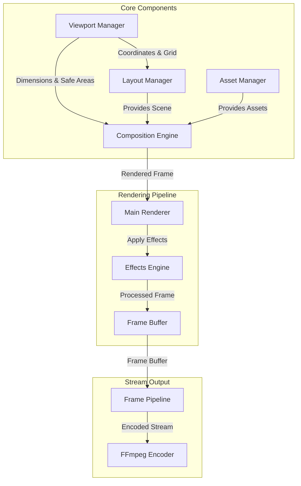

# Stream Manager Rendering System

The rendering system is a core component of the Stream Manager service, responsible for high-performance frame generation, visual effects, and buffer management. This directory contains the implementation of the rendering pipeline.

## Architecture



## Components

### 1. Renderer (`renderer.ts`)
The main rendering engine that orchestrates the entire rendering pipeline:
- Manages frame timing and FPS control
- Coordinates with the composition engine
- Handles scene transitions
- Provides performance metrics
- Emits frame events for the streaming pipeline

Key features:
- Target FPS control with frame timing
- Frame dropping detection
- Performance statistics
- Event-based frame delivery

### 2. Effects Engine (`effects.ts`)
Handles all visual effects and transitions using Sharp for image processing:
- Scene transitions (fade, slide, zoom)
- Easing functions for smooth animations
- Real-time effect application
- Buffer composition

Supported transitions:
- Fade transitions with opacity control
- Slide transitions with position interpolation
- Zoom transitions with scale interpolation
- Custom easing functions (linear, easeIn, easeOut, easeInOut)

### 3. Frame Buffer Manager (`frame-buffer.ts`)
Manages frame memory and provides low-level drawing operations:
- Efficient buffer pooling
- Memory optimization
- Basic drawing operations
- Performance metrics
- Buffer synchronization

Features:
- Buffer pool for memory reuse
- Direct pixel manipulation
- Rectangle and text drawing
- Prometheus metrics integration
- Error handling and logging

## Integration

### Core Integration
The rendering system integrates with core components:
```typescript
import { CompositionEngine } from '../core/composition';
import { LayoutManager } from '../core/layout';
import { AssetManager } from '../core/assets';
```

### Streaming Integration
Connects to the streaming pipeline:
```typescript
// Frame delivery to streaming pipeline
renderer.on('frame:ready', (frame: Buffer) => {
  streamingPipeline.processFrame(frame);
});
```

## Performance

### Metrics
The system exposes Prometheus metrics for monitoring:
- Frame render time
- Buffer operation time
- Memory usage
- Dropped frames
- FPS statistics

### Optimization
- Buffer pooling for memory reuse
- Frame dropping detection
- Efficient Sharp operations
- Memory usage monitoring
- Performance logging

## Usage Example

```typescript
// Get renderer instance
const renderer = Renderer.getInstance();

// Configure FPS
renderer.setTargetFPS(60);

// Start rendering
await renderer.start();

// Handle rendered frames
renderer.on('frame:ready', (frame: Buffer) => {
  // Process the frame
});

// Get performance stats
const stats = renderer.getStats();
console.log('Current FPS:', stats.fps);
```

## Error Handling

The rendering system implements comprehensive error handling:
- Frame render errors
- Buffer operation errors
- Memory allocation errors
- Asset loading errors
- Effect application errors

All errors are logged with context for debugging.

## Development

### Prerequisites
- Node.js 18+
- Sharp for image processing
- FFmpeg for encoding

### Best Practices
1. Always use buffer pooling for memory efficiency
2. Monitor performance metrics
3. Handle all error cases
4. Use appropriate logging levels
5. Clean up resources properly

## Related Components

- **Composition Engine**: Provides scene composition
- **Layout Manager**: Manages scene layouts
- **Asset Manager**: Handles asset loading and caching
- **Streaming Pipeline**: Processes rendered frames
- **FFmpeg Encoder**: Encodes frames for streaming

## Future Improvements

1. **Performance**
   - GPU acceleration support
   - Advanced buffer pooling
   - Frame prediction

2. **Features**
   - More transition types
   - Advanced effects
   - Custom shaders
   - Hardware acceleration

3. **Monitoring**
   - Enhanced metrics
   - Performance profiling
   - Memory analysis
   - Error tracking