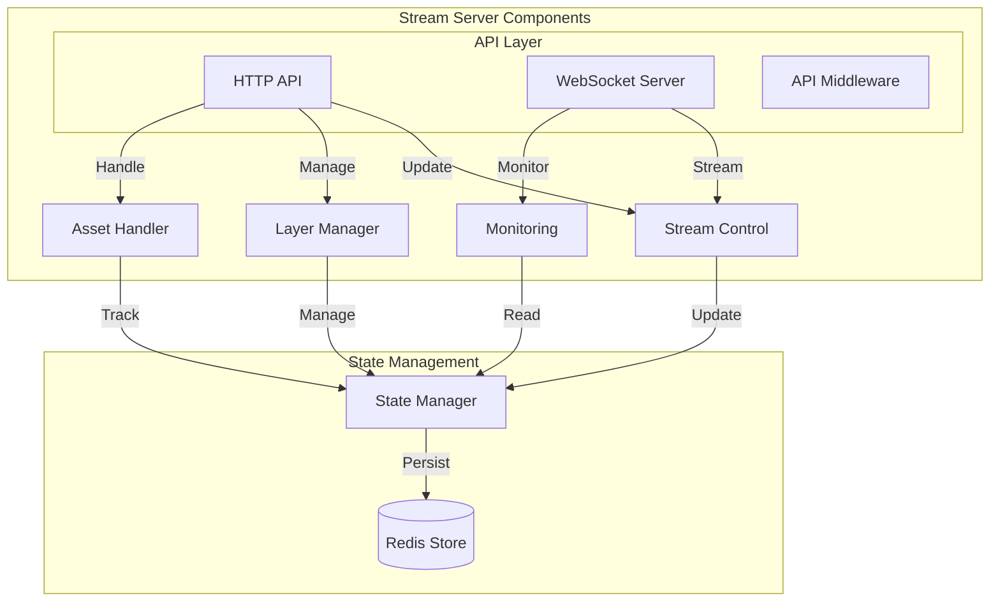

# Stream Manager Server

This directory contains the HTTP server components that provide the REST API, WebSocket communication, monitoring capabilities, and default configuration for the streaming platform.

## Architecture Overview



## Project Structure

```
src/server/
├── README.md           # Server documentation
├── api/               # REST API endpoints
│   ├── stream/        # Stream control endpoints
│   ├── layers/        # Layer management
│   └── assets/        # Asset handling
├── websocket.ts       # WebSocket server
├── monitoring/        # Health & metrics
└── stream-server.ts   # Stream control
```

## Current Implementation Status

### ✅ Completed (MVP)
- Basic HTTP server setup
- REST endpoints for stream control
- Initial WebSocket server implementation
- Basic layer management
- Stream state monitoring
- Asset upload handling
- Health check endpoints

### 🚧 In Progress
1. **WebSocket Event Standardization**
   ```typescript
   type StreamEvent = 
     | { type: 'stateUpdate'; payload: StreamState }
     | { type: 'layerUpdate'; payload: LayerState }
     | { type: 'preview'; payload: PreviewFrame };
   ```

2. **Layer State Events**
   ```typescript
   interface LayerStateEvent {
     type: 'layerUpdate';
     payload: {
       id: string;
       visible: boolean;
       content?: LayerContent;
     };
   }
   ```

3. **Preview Frame Delivery**
   ```typescript
   interface PreviewEvent {
     type: 'preview';
     payload: {
       data: string;  // Base64 encoded frame
       timestamp: number;
       quality: 'low' | 'medium' | 'high';
     };
   }
   ```

## API Endpoints

### 1. Stream Control
- `GET /stream/status` - Get current stream state
- `POST /stream/{start|stop|pause}` - Control stream
- `POST /stream/reset` - Reset stream state

### 2. Layer Management
- `GET /stream/layers` - Get layer states
- `POST /stream/layers` - Create new layer
- `PUT /stream/layers/:id` - Update layer
- `DELETE /stream/layers/:id` - Delete layer
- `PATCH /stream/layers/:id/visibility` - Toggle layer visibility

### 3. Asset Management
- `POST /stream/assets/upload` - Upload new asset
- `GET /stream/assets/:id` - Get asset info
- `DELETE /stream/assets/:id` - Delete asset

### 4. Monitoring
- `GET /metrics` - Prometheus metrics
- `GET /health` - Health check endpoint

## WebSocket Events

### 1. Stream Events
- `frame` - New frame available
- `quality` - Quality setting update
- `streamState` - Stream state updates

### 2. Layer Events
- `layerUpdate` - Layer state changes
- `layerVisibility` - Layer visibility updates

### 3. System Events
- `ping/pong` - Connection health check
- `error` - Error notifications
- `status` - System status updates

## Default Configuration

### Layer Templates
```typescript
const defaultLayers = {
  host: {
    character: {
      modelUrl: 'assets/characters/auctioneer.png',
      animations: {
        idle: 'idle-animation',
        talking: 'talking-animation'
      }
    }
  },
  overlay: {
    content: {
      type: 'text',
      content: 'Current Bid: 1.5 ETH',
      style: {
        font: 'Arial',
        fontSize: 24,
        color: '#ffffff'
      }
    }
  }
};
```

## Server Features

### 1. Real-time Communication
- WebSocket-based updates
- Bi-directional messaging
- Connection management
- Client state tracking

### 2. Request Validation
- Input sanitization
- Schema validation
- Type checking
- Error formatting

### 3. Error Handling
- Structured error responses
- Error logging
- Recovery mechanisms
- Client-friendly messages

### 4. Asset Management
- File upload handling
- Asset validation
- Storage management
- URL generation

### 5. Security
- Request rate limiting
- Input validation
- Error sanitization
- CORS configuration

## Metrics & Monitoring

### 1. WebSocket Metrics
- Connected clients
- Message throughput
- Connection status
- Event broadcasting

### 2. HTTP Metrics
- Request counts
- Response times
- Error rates
- Status codes

### 3. Resource Metrics
- Asset count
- Storage usage
- Memory usage
- CPU usage

## Configuration

```typescript
interface ServerConfig {
  PORT: number;
  WS_PORT: number;
  HOST: string;
  ASSET_STORAGE_PATH: string;
  MAX_UPLOAD_SIZE: number;
  RATE_LIMIT: {
    windowMs: number;
    max: number;
  };
}
```

## Usage Example

```typescript
import express from 'express';
import { setupStreamServer } from './stream-server';
import { setupWebSocketServer } from './websocket';

async function main() {
  const app = express();
  
  // Basic setup
  app.use(express.json());
  
  // Initialize servers
  const httpServer = await setupStreamServer(app);
  await setupWebSocketServer(httpServer);
  
  // Start server
  const port = process.env.PORT || 4200;
  httpServer.listen(port, () => {
    console.log(`Stream manager running on port ${port}`);
  });
}

main().catch(console.error);
```

## Error Handling

```typescript
// Error handling middleware
app.use((err: Error, req: Request, res: Response, next: NextFunction) => {
  logger.error('Server error', {
    error: err.message,
    stack: err.stack,
    path: req.path,
    method: req.method
  });

  res.status(500).json({
    error: 'Internal server error',
    message: process.env.NODE_ENV === 'development' ? err.message : undefined
  });
});
```

## Security Considerations

### 1. API Security
- [ ] Authentication implementation
- [ ] Authorization rules
- [ ] Rate limiting configuration
- [ ] Input validation

### 2. WebSocket Security
- [ ] Connection validation
- [ ] Message validation
- [ ] Rate limiting
- [ ] Client authentication

### 3. Asset Security
- [ ] Upload validation
- [ ] Size limits
- [ ] Type checking
- [ ] Access control

## Performance Optimization

### 1. Request Handling
- [ ] Request pooling
- [ ] Response caching
- [ ] Connection keep-alive
- [ ] Load balancing

### 2. WebSocket Performance
- [ ] Message compression
- [ ] Binary protocols
- [ ] Connection pooling
- [ ] Load balancing

### 3. Asset Handling
- [ ] Asset caching
- [ ] Compression
- [ ] CDN integration
- [ ] Progressive loading

## Debugging Guide

### 1. HTTP Issues
1. Check request/response payloads
2. Verify headers
3. Monitor response codes
4. Check rate limits

### 2. WebSocket Issues
1. Monitor connection state
2. Check message flow
3. Verify client state
4. Track frame delivery

### 3. Asset Issues
1. Check upload process
2. Verify storage paths
3. Monitor file sizes
4. Validate access URLs

## Common Issues
- Connection timeouts
- Rate limit exceeded
- Invalid request format
- Asset upload failures
- WebSocket disconnections
- Authorization failures 