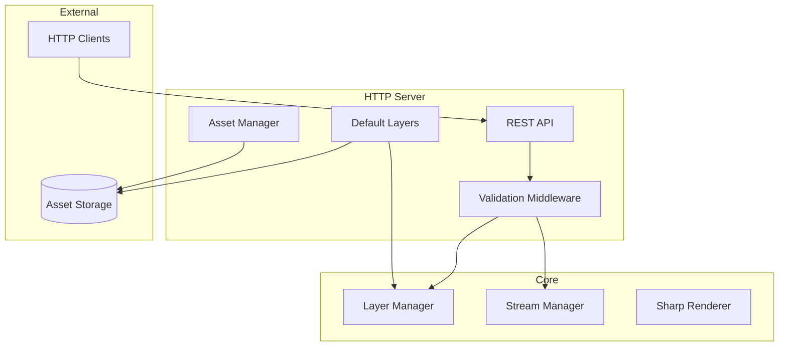

# Stream Manager Server

This directory contains the HTTP server components that provide the REST API and default configuration for the streaming platform.

## Architecture Overview

The server components provide:
- REST API endpoints for stream control
- Layer management endpoints
- Default layer configurations
- Asset management
- Error handling and validation



## Components

### Stream Server (`stream-server.ts`)

The main HTTP server component that:
- Provides RESTful API endpoints for stream control
- Handles layer management requests
- Manages stream state
- Implements error handling and validation
- Provides metrics endpoints

```typescript
// Example: Stream control endpoint
app.post('/stream/control', async (req, res) => {
  const { action } = req.body;
  
  switch (action) {
    case 'start':
      await streamManager.start();
      break;
    case 'stop':
      await streamManager.stop();
      break;
  }
});
```

#### API Endpoints

1. **Stream Control**
   - `POST /stream/control` - Start/stop stream
   - `GET /stream/status` - Get stream status
   - `POST /stream/reset` - Reset stream state

2. **Layer Management**
   - `POST /stream/layers` - Create new layer
   - `PUT /stream/layers/:id` - Update layer
   - `DELETE /stream/layers/:id` - Delete layer
   - `PATCH /stream/layers/:id/visibility` - Toggle layer visibility

3. **Asset Management**
   - `POST /stream/assets/upload` - Upload new asset
   - `GET /stream/assets/:id` - Get asset info
   - `DELETE /stream/assets/:id` - Delete asset

4. **Metrics**
   - `GET /metrics` - Prometheus metrics
   - `GET /health` - Health check endpoint

### Default Layers (`default-layers.ts`)

Configuration and initialization of default stream layers:
- Defines standard layer templates
- Provides asset configurations
- Sets up initial stream state
- Manages default styling and positioning

```typescript
// Example: Default layer configuration
const defaultLayers = {
  host: {
    character: {
      modelUrl: 'assets/characters/auctioneer.png',
      animations: {
        idle: 'idle-animation',
        talking: 'talking-animation'
      }
    }
  },
  overlay: {
    content: {
      type: 'text',
      content: 'Current Bid: 1.5 ETH',
      style: {
        font: 'Arial',
        fontSize: 24,
        color: '#ffffff'
      }
    }
  }
};
```

## Server Features

1. **Request Validation**
   - Input sanitization
   - Schema validation
   - Type checking
   - Error formatting

2. **Error Handling**
   - Structured error responses
   - Error logging
   - Recovery mechanisms
   - Client-friendly messages

3. **Asset Management**
   - File upload handling
   - Asset validation
   - Storage management
   - URL generation

4. **Security**
   - Request rate limiting
   - Input validation
   - Error sanitization
   - CORS configuration

## Metrics

The server exposes Prometheus metrics for monitoring:

- **HTTP Metrics**:
  - Request counts
  - Response times
  - Error rates
  - Status codes

- **Resource Metrics**:
  - Asset count
  - Storage usage
  - Memory usage
  - CPU usage

## Configuration

Server configuration via environment variables:

```typescript
interface ServerConfig {
  PORT: number;
  HOST: string;
  ASSET_STORAGE_PATH: string;
  MAX_UPLOAD_SIZE: number;
  RATE_LIMIT: {
    windowMs: number;
    max: number;
  };
  CORS: {
    origin: string[];
    methods: string[];
  };
}
```

## Usage Example

```typescript
import express from 'express';
import { setupStreamServer } from './stream-server.js';
import { createDefaultLayers } from './default-layers.js';

async function main() {
  const app = express();
  
  // Setup server middleware
  app.use(express.json());
  app.use(express.static('assets'));
  
  // Initialize stream server
  await setupStreamServer(app);
  
  // Create default layers
  await createDefaultLayers();
  
  // Start server
  const port = process.env.PORT || 3000;
  app.listen(port, () => {
    console.log(`Stream server listening on port ${port}`);
  });
}

main().catch(console.error);
```

## Error Handling Example

```typescript
// Error handling middleware
app.use((err: Error, req: Request, res: Response, next: NextFunction) => {
  logger.error('Server error', {
    error: err.message,
    stack: err.stack,
    path: req.path,
    method: req.method
  });

  res.status(500).json({
    error: 'Internal server error',
    message: process.env.NODE_ENV === 'development' ? err.message : undefined
  });
});
``` 