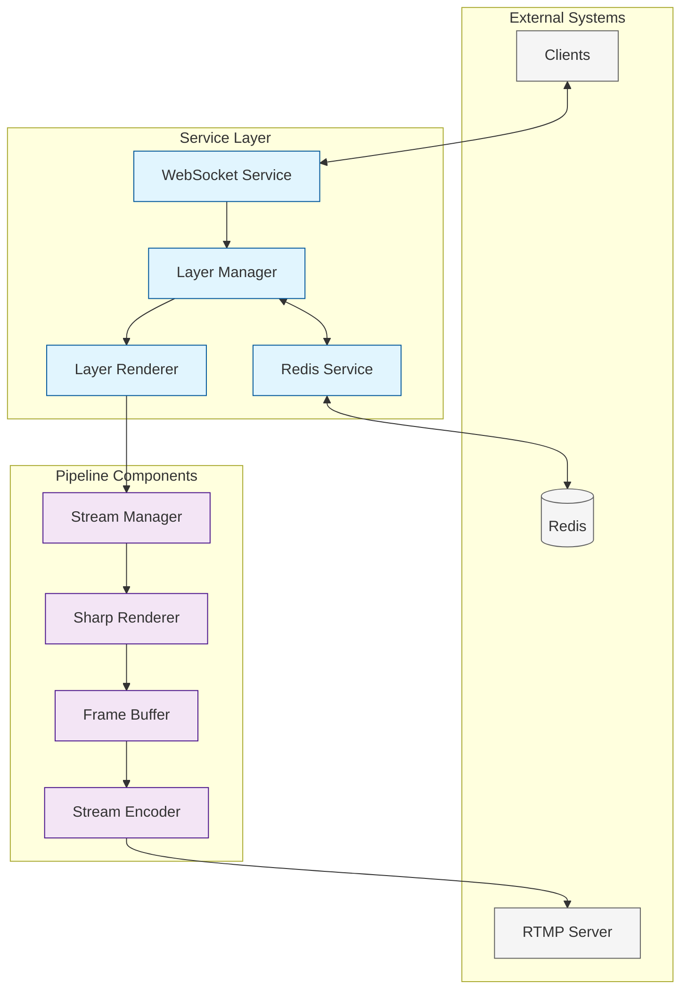

# Stream Manager Services

This directory contains the service layer components that manage state, coordination, and real-time communication for the streaming pipeline.

## Architecture Overview

The services in this directory work together to provide:
- State management and persistence
- Real-time updates and communication
- Layer rendering coordination
- Event-driven updates



## Core Services

### Layer Manager (`layer-manager.ts`)

The central state management service that:
- Maintains the source of truth for all layer states
- Provides type-safe layer manipulation APIs
- Emits events for layer changes
- Coordinates with Redis for persistence
- Manages layer lifecycle and properties

```typescript
// Example: Layer management
const layerManager = LayerManager.getInstance();

// Create a new layer
const overlay = await layerManager.createLayer('overlay', {
  content: { type: 'image', source: '/path/to/image.png' }
});

// Update layer properties
await layerManager.updateLayer(overlay.id, {
  transform: { scale: 1.2, rotation: 45 },
  opacity: 0.8
});

// Listen for layer changes
layerManager.on('layer:updated', (layer) => {
  console.log('Layer updated:', layer.id);
});
```

### Layer Renderer (`layer-renderer.ts`)

The rendering coordination service that:
- Manages the render loop timing
- Coordinates with the Sharp Renderer
- Handles frame synchronization
- Provides performance optimization
- Manages render state and cleanup

```typescript
// Example: Render loop management
const layerRenderer = LayerRenderer.getInstance();

// Start render loop with specific FPS
await layerRenderer.startRenderLoop(60);

// Handle render events
layerRenderer.on('frameRendered', (stats) => {
  console.log('Frame rendered in:', stats.renderTime, 'ms');
});
```

### Redis Service (`redis.ts`)

The persistence layer that:
- Provides reliable state storage
- Handles connection management
- Ensures data consistency
- Supports state recovery
- Manages error handling

```typescript
// Example: State persistence
const redisService = RedisService.getInstance();

// Store layer state
await redisService.set('layer_state', {
  layers: currentLayers,
  version: stateVersion
});

// Recover state after restart
const savedState = await redisService.get('layer_state');
```

### WebSocket Service (`websocket.ts`)

The real-time communication service that:
- Manages client connections
- Broadcasts state changes
- Handles message routing
- Provides connection monitoring
- Ensures reliable delivery

```typescript
// Example: Real-time updates
const wsService = WebSocketService.getInstance();

// Broadcast layer update
wsService.broadcast({
  type: 'layerUpdate',
  payload: updatedLayer
});

// Handle client messages
wsService.on('message', (client, message) => {
  handleClientMessage(message);
});
```

## Service Interactions

1. **Client Update Flow**:
   ```
   Client -> WebSocket Service -> Layer Manager -> Layer Renderer -> Stream Manager -> Pipeline
   ```

2. **State Management Flow**:
   ```
   Layer Manager <-> Redis Service <-> Redis Database
   ```

3. **Render Coordination Flow**:
   ```
   Layer Renderer -> Stream Manager -> Sharp Renderer -> Frame Buffer -> Stream Encoder -> RTMP
   ```

## Event System

The services use an event-driven architecture to coordinate:

- **Layer Events**: Created, Updated, Deleted, Visibility Changed
- **Render Events**: Frame Rendered, Performance Stats
- **Connection Events**: Client Connected, Disconnected
- **State Events**: State Saved, Recovered, Changed

## Error Handling

Each service implements robust error handling:

1. **Layer Manager**:
   - Validates layer operations
   - Maintains state consistency
   - Rolls back failed operations

2. **Layer Renderer**:
   - Handles render failures
   - Implements frame skip logic
   - Manages resource cleanup

3. **Redis Service**:
   - Handles connection failures
   - Implements retry logic
   - Maintains data integrity

4. **WebSocket Service**:
   - Manages connection drops
   - Handles message failures
   - Implements reconnection logic

## Metrics

Each service exposes Prometheus metrics for monitoring:

- **Layer Manager**: Layer counts, operation latency
- **Layer Renderer**: Frame times, memory usage
- **Redis Service**: Connection status, operation latency
- **WebSocket Service**: Client counts, message rates

## Configuration

Services can be configured through the central config:

```typescript
interface ServiceConfig {
  REDIS_URL: string;
  REDIS_PASSWORD: string;
  WS_PORT: number;
  RENDER_FPS: number;
  MAX_LAYERS: number;
  // ... other configuration options
}
```

## Usage Example

```typescript
// Initialize services
const config = loadConfig();
const layerManager = LayerManager.getInstance();
const layerRenderer = LayerRenderer.getInstance();
const redisService = RedisService.getInstance();
const wsService = WebSocketService.getInstance();

// Start services
await redisService.initialize(config);
await wsService.initialize(config);
await layerManager.initialize();
await layerRenderer.initialize();

// Start render loop
await layerRenderer.startRenderLoop(config.RENDER_FPS);

// Handle client connections
wsService.on('connection', (client) => {
  // Send current state to new client
  const state = layerManager.getCurrentState();
  client.send({ type: 'state', payload: state });
});

// Handle layer updates
layerManager.on('layer:updated', (layer) => {
  // Persist state
  redisService.saveLayerState(layer);
  // Broadcast update
  wsService.broadcast({ type: 'layerUpdate', payload: layer });
});
``` 