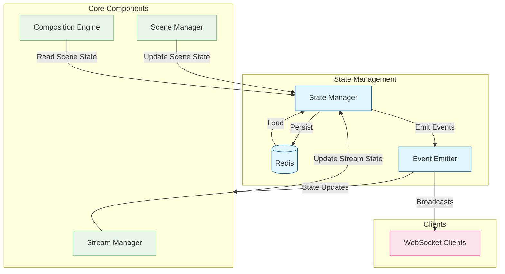

# Stream Manager State System

The state system manages the application's runtime state, focusing on two primary aspects:
1. Stream operational state (metrics, status)
2. Scene composition state (visual elements)

## Architecture



## State Structure

### Stream State
Tracks operational metrics and status:
```typescript
interface StreamState {
  isLive: boolean;
  isPaused: boolean;
  fps: number;
  targetFPS: number;
  frameCount: number;
  droppedFrames: number;
  averageRenderTime: number;
  startTime: number | null;
  error: string | null;
}
```

### Scene State
Manages the current visual composition:
```typescript
interface SceneState {
  background: Asset[];     // Fixed bottom layer assets
  quadrants: Map<QuadrantId, Quadrant>;  // Main content areas
  overlay: Asset[];        // Fixed top layer assets
}
```

## Event System

The state manager emits events for all state changes, allowing components to react to updates.

### Event Types

1. Stream State Events
```typescript
interface StreamEvent {
  id: string;
  timestamp: number;
  type: EventType.STATE_STREAM_UPDATE;
  source: EventSource.STATE_MANAGER;
  payload: {
    previous: StreamState;
    current: StreamState;
    changes: string[];
  }
}
```

2. Scene State Events
```typescript
interface SceneEvent {
  id: string;
  timestamp: number;
  type: EventType.STATE_SCENE_UPDATE;
  source: EventSource.STATE_MANAGER;
  payload: {
    previous: SceneState;
    current: SceneState;
    changes: string[];
  }
}
```

### Event Flow
1. Component calls state update method
2. State manager updates in-memory state
3. State is persisted to Redis
4. Event is emitted with previous/current states
5. Event is broadcast to WebSocket clients
6. Components react to state changes

## State Updates

### Stream State Updates
```typescript
// Update stream metrics
await stateManager.updateStreamState({
  fps: currentFPS,
  frameCount: totalFrames,
  droppedFrames: droppedFrameCount
});
```

### Scene State Updates
```typescript
// Update scene composition
await stateManager.updateSceneState({
  background: newBackgroundAssets,
  overlay: newOverlayAssets
});
```

## Persistence

The state system uses Redis for persistence with automatic serialization/deserialization:

1. Stream State: Simple JSON serialization
2. Scene State: Custom serialization for Map structures
   ```typescript
   // Serialization
   const serialized = {
     ...state,
     quadrants: Array.from(state.quadrants.entries())
   };

   // Deserialization
   const reconstructed = {
     ...parsed,
     quadrants: new Map(parsed.quadrants)
   };
   ```

## Usage Guidelines

### State Updates
1. Always use state manager methods for updates
2. Never modify state objects directly
3. Keep updates atomic and focused
4. Handle update errors appropriately

### Event Handling
1. Subscribe to specific event types
2. Use type guards for event payloads
3. Keep event handlers lightweight
4. Unsubscribe when components unmount

Example:
```typescript
// Subscribe to scene updates
stateManager.on(EventType.STATE_SCENE_UPDATE, (event) => {
  if (event.type === EventType.STATE_SCENE_UPDATE) {
    // Handle scene update
    const { previous, current, changes } = event.payload;
    // React to changes
  }
});
```

### Error Handling
1. State updates are atomic
2. Failed updates roll back
3. Redis errors don't block state updates
4. Events emit even if persistence fails

## Implementation Details

### Singleton Pattern
The state manager uses a singleton pattern to ensure a single source of truth:
```typescript
export class StateManagerImpl implements StateManager {
  private static instance: StateManagerImpl | null = null;

  public static getInstance(): StateManagerImpl {
    if (!StateManagerImpl.instance) {
      StateManagerImpl.instance = new StateManagerImpl();
    }
    return StateManagerImpl.instance;
  }
}
```

### Initialization
The state manager requires explicit initialization:
```typescript
await stateManager.initialize();
```
This ensures:
1. Redis connection is established
2. Initial state is loaded
3. Event system is ready

### Type Safety
The system uses TypeScript for type safety:
1. State interfaces define valid state shape
2. Event types ensure correct payload structure
3. Type guards validate Redis data

## Best Practices

1. **State Updates**
   - Keep updates minimal and focused
   - Use partial updates when possible
   - Handle update errors appropriately

2. **Event Handling**
   - Subscribe to specific event types
   - Use type guards for event payloads
   - Clean up subscriptions

3. **Error Handling**
   - Catch and log errors
   - Provide fallback states
   - Maintain system stability

4. **Performance**
   - Batch related updates
   - Keep event handlers lightweight
   - Use appropriate event types

## Project Structure

```
src/
├── state/                  # State Management System
│   ├── README.md          # State system documentation
│   ├── state-manager.ts   # Core state management
│   ├── redis-service.ts   # Redis integration & persistence
│   └── __tests__/        # Unit tests
├── types/                 # Type Definitions
│   ├── state-manager.types.ts  # State types
│   ├── layers.ts              # Layer types
│   └── stream.ts             # Stream types
├── utils/
│   └── logger.ts        # Logging utilities
└── server/
    ├── api/            # REST API endpoints
    ├── websocket.ts    # WebSocket server
    └── monitoring/     # Health & metrics

```

## Core Components

### 1. State Manager (`state-manager.ts`)
- Singleton instance for centralized state management
- Immediate state persistence with Redis
- Event system with WebSocket broadcasting
- Type-safe state access and updates
- Preview client state management
- Comprehensive logging

### 2. Redis Service (`redis-service.ts`)
- Redis connection management
- Type-safe persistence operations
- Connection state monitoring
- Error handling and recovery
- Configurable client options

### 3. Type System (in `types/`)
```typescript
// Core state interfaces
export interface AppState {
  stream: StreamState;
  layers: LayerState;
  previewClients: Record<string, PreviewClientState>;
}

export interface StreamState {
  isLive: boolean;
  isPaused: boolean;
  fps: number;
  targetFPS: number;
  frameCount: number;
  droppedFrames: number;
  averageRenderTime: number;
  startTime?: number | null;
  error?: string | null;
}

export interface PreviewClientState {
  id: string;
  quality: 'high' | 'medium' | 'low';
  lastPing: number;
  connected: boolean;
}

export type StateUpdateEvent = {
  type: 'stream' | 'layers' | 'previewClient';
  payload: Partial<StreamState> | Partial<LayerState> | PreviewClientState;
};
```

## State Management Flow

### 1. State Loading
```typescript
// In state-manager.ts
public async loadState(): Promise<void> {
  const streamState = await redisService.getStreamState();
  const layerState = await redisService.getLayerState();
  
  this.state.stream = streamState ?? { ...DEFAULT_STREAM_STATE };
  this.state.layers = layerState ?? { ...DEFAULT_LAYER_STATE };
}
```

### 2. State Updates
```typescript
// Example state update with debounced persistence
public async updateStreamState(update: Partial<StreamState>): Promise<void> {
  this.state.stream = {
    ...this.state.stream,
    ...update
  };
  await this.scheduleSave();
  this.notifyListeners({ type: 'stream', payload: update });
}
```

### 3. Event System
```typescript
// Event listener registration
public addEventListener(listener: StateEventListener): void {
  this.listeners.add(listener);
}

// Event emission
private notifyListeners(event: StateUpdateEvent): void {
  this.listeners.forEach(listener => listener(event));
}
```

## API Integration

### HTTP Endpoints
- `GET /stream/status` - Get current stream state
- `POST /stream/{start|stop|pause}` - Control stream
- `GET /stream/layers` - Get layer states
- `POST /stream/layers/:id/visibility` - Update layer visibility
- `POST /stream/layers` - Create new layer
- `PUT /stream/layers/:id` - Update layer
- `DELETE /stream/layers/:id` - Delete layer
- `POST /stream/assets/upload` - Upload new asset
- `GET /stream/assets/:id` - Get asset info
- `DELETE /stream/assets/:id` - Delete asset

### WebSocket Events
- `frame` - New frame available
- `quality` - Quality setting update
- `ping/pong` - Connection health check
- `streamState` - Stream state updates
- `layerUpdate` - Layer state changes
- `preview` - Preview frame updates

## Implementation Status

### ✅ Completed
1. Core State Management
   - [x] Singleton state manager with immediate Redis persistence
   - [x] Type-safe state updates with validation
   - [x] Event system with typed events and WebSocket broadcasting
   - [x] Redis persistence with reconnection and error handling
   - [x] Comprehensive logging system
   - [x] Preview client management
   - [x] Real-time state synchronization

2. Type System
   - [x] AppState with stream, layers, and preview clients
   - [x] Type guards for runtime validation
   - [x] Event type system with payload validation
   - [x] Preview client types
   - [x] Strict type checking for state updates

3. Persistence
   - [x] Redis integration with robust connection management
   - [x] Immediate state saving (removed debouncing)
   - [x] Type validation with guards
   - [x] Error recovery and logging
   - [x] Configurable Redis options
   - [x] Connection state monitoring

4. Server Integration
   - [x] HTTP server with state endpoints
   - [x] WebSocket integration for real-time updates
   - [x] Layer management with validation
   - [x] Stream state monitoring
   - [x] State change broadcasting

### 🚧 In Progress
1. WebSocket Features
   - [x] Event standardization
   - [x] Layer state synchronization
   - [✅] Preview frame optimization
     - [x] Quality-based throttling (30/20/10 fps)
     - [x] Resolution scaling (1080p/720p/480p)
     - [x] JPEG compression (85%/75%/60%)
     - [x] Frame buffer management
     - [ ] Message batching
     - [ ] Binary protocol
   - [x] Connection management with health checks

2. Performance
   - [x] Immediate Redis persistence
   - [x] Real-time state updates
   - [ ] State change batching for WebSocket broadcasts only
   - [x] Performance logging

3. Monitoring
   - [x] Comprehensive logging
   - [ ] Prometheus metrics
   - [x] State change tracking
   - [x] Redis connection monitoring

### 📋 Future Improvements
1. Advanced Features
   - [ ] State versioning
   - [ ] Multi-node synchronization
   - [ ] Conflict resolution
   - [ ] State snapshots

2. Asset Management
   - [ ] Asset validation
   - [ ] Storage management
   - [ ] URL generation
   - [ ] Cleanup routines

## Configuration

### State Configuration
```typescript
interface StateConfig {
  REDIS_URL: string;
  REDIS_PASSWORD: string;
  SAVE_DEBOUNCE_MS?: number;
}
```

### Server Configuration
```typescript
interface ServerConfig {
  PORT: number;
  WS_PORT: number;
  HOST: string;
  ASSET_STORAGE_PATH: string;
  MAX_UPLOAD_SIZE: number;
  RATE_LIMIT: {
    windowMs: number;
    max: number;
  };
}
```

## Port Configuration

The system uses the following default ports:
- `4200`: Main HTTP API server
- `4201`: WebSocket server for preview streaming
- `9090`: Metrics server (Prometheus)

These can be configured via environment variables:
```env
PORT=4200           # Main HTTP API port
WS_PORT=4201       # WebSocket server port
METRICS_PORT=9090  # Metrics server port
```

## Communication Flow

### 1. Admin Operations Flow
1. Admin UI makes HTTP request
2. State middleware validates request
3. StateManager updates runtime state
4. Immediate persistence to Redis (no debouncing)
5. Event emission to listeners and WebSocket broadcast
6. Response sent to Admin UI

### 2. Preview Flow
1. Preview client connects via WebSocket
2. Client state tracked in StateManager
3. Frame updates streamed
4. Quality settings managed
5. Health monitoring via ping/pong

### 3. Layer Management Flow
1. Layer update request received
2. State validation performed
3. Layer state updated in memory
4. Immediate persistence to Redis
5. Events emitted to clients and WebSocket broadcast

## Security Considerations

### 1. API Security
- [ ] Authentication
- [ ] Authorization
- [ ] Rate limiting
- [ ] Input validation

### 2. WebSocket Security
- [ ] Connection validation
- [ ] Message validation
- [ ] Rate limiting
- [ ] Client authentication

### 3. Asset Security
- [ ] Upload validation
- [ ] Size limits
- [ ] Type checking
- [ ] Access control

## Performance Optimization

### 1. State Updates
- [ ] Update batching
- [ ] Optimistic updates
- [ ] Change detection
- [ ] Cache management

### 2. WebSocket Performance
- [ ] Message compression
- [ ] Binary protocols
- [ ] Connection pooling
- [ ] Load balancing

### 3. Asset Handling
- [ ] Asset caching
- [ ] Compression
- [ ] CDN integration
- [ ] Progressive loading

## Debugging Notes

### HTTP API Debugging
1. Check request/response payloads
2. Monitor state updates
3. Verify Redis persistence
4. Check error responses

### WebSocket Debugging
1. Monitor connection state
2. Check frame delivery
3. Verify client state
4. Monitor quality adaptation

### Asset Debugging
1. Check upload process
2. Verify storage paths
3. Monitor file sizes
4. Check access URLs

## Common Issues
- Redis connection issues
- State synchronization delays
- WebSocket disconnections
- Type validation errors
- Asset upload failures
- Layer state inconsistencies

## State Update Flow

### 1. Stream State Updates
```typescript
// Immediate persistence with validation and broadcasting
public async updateStreamState(update: Partial<StreamState>): Promise<void> {
  // Validate and update in-memory state
  this.state.stream = { ...this.state.stream, ...update };
  
  // Persist to Redis immediately
  await redisService.saveStreamState(this.state.stream);
  
  // Broadcast via WebSocket
  webSocketService.broadcastStateUpdate(this.state.stream);
  
  // Notify listeners
  this.notifyListeners({ type: 'stream', payload: this.state.stream });
}
```

### 2. Type Validation
```typescript
function isStreamState(obj: unknown): obj is StreamState {
  if (!obj || typeof obj !== 'object') return false;
  const state = obj as Partial<StreamState>;
  return (
    typeof state.isLive === 'boolean' &&
    typeof state.isPaused === 'boolean' &&
    typeof state.fps === 'number' &&
    // ... other validations
  );
}
```

## Event System

The state manager now uses a standardized event system for all state changes and notifications. Events are structured as follows:

### Event Types
```typescript
enum EventType {
  // State events
  STATE_STREAM_UPDATE = 'state:stream:update',
  STATE_LAYER_UPDATE = 'state:layer:update',
  STATE_PREVIEW_UPDATE = 'state:preview:update',
  
  // Stream events
  STREAM_START = 'stream:start',
  STREAM_STOP = 'stream:stop',
  STREAM_PAUSE = 'stream:pause',
  STREAM_RESUME = 'stream:resume',
  STREAM_ERROR = 'stream:error',
  
  // Preview events
  PREVIEW_FRAME = 'preview:frame',
  PREVIEW_QUALITY_CHANGE = 'preview:quality:change',
  PREVIEW_CONNECTION = 'preview:connection',
  PREVIEW_DISCONNECTION = 'preview:disconnection',
  
  // Layer events
  LAYER_CREATE = 'layer:create',
  LAYER_UPDATE = 'layer:update',
  LAYER_DELETE = 'layer:delete',
  LAYER_REORDER = 'layer:reorder'
}
```

### Event Structure
All events follow a standard structure:
```typescript
interface BaseEvent {
  id: string;          // Unique event identifier
  timestamp: number;   // Event creation timestamp
  type: EventType;     // Event type from enum
  source: EventSource; // Source of the event
}

interface StreamEvent extends BaseEvent {
  payload: {
    previous?: Partial<StreamState>;  // Previous state
    current: Partial<StreamState>;    // New state
    changes: string[];               // Changed fields
  }
}
```

### Usage Example
```typescript
// Subscribe to stream state updates
stateManager.on(EventType.STATE_STREAM_UPDATE, async (event) => {
  console.log('Stream state changed:', event.payload.changes);
  console.log('New state:', event.payload.current);
});

// Subscribe to layer updates
stateManager.on(EventType.LAYER_UPDATE, async (event) => {
  console.log('Layer updated:', event.payload.changes);
});

// One-time subscription
stateManager.once(EventType.STREAM_START, async (event) => {
  console.log('Stream started:', event.payload);
});
```

### Event Flow
1. State change is initiated
2. In-memory state is updated
3. Changes are persisted to Redis
4. Standardized event is created and emitted
5. WebSocket broadcasts the event
6. Event listeners are notified

This standardized event system ensures consistent handling of state changes across the application and provides a robust foundation for real-time updates and monitoring. 