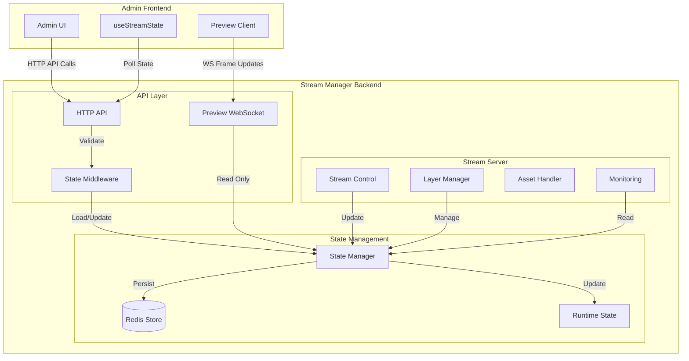

# Stream Manager State System

## Architecture Overview



## Project Structure

```
src/
├── state/
│   ├── README.md           # State system documentation
│   ├── persistence.ts      # Redis integration & validation
│   └── store/
│       ├── state-manager.types.ts  # Type definitions
│       ├── state-manager.ts        # Core state management
│       └── __tests__/             # Unit tests
└── server/
    ├── README.md           # Server documentation
    ├── api/               # REST API endpoints
    ├── websocket.ts      # WebSocket server
    ├── monitoring/       # Health & metrics
    └── stream-server.ts  # Stream control
```

## Core Components

### 1. State Manager (`state-manager.ts`)
- Singleton instance for centralized state management
- Implements debounced state persistence with Redis
- Event system for state change notifications
- Type-safe state access and updates
- Preview client state management
- Automatic state saving with debounce

### 2. Type System (`state-manager.types.ts`)
```typescript
// Core state interfaces
export interface AppState {
  stream: StreamState;
  layers: LayerState;
  previewClients: Record<string, PreviewClientState>;
}

export interface StreamState {
  isLive: boolean;
  isPaused: boolean;
  fps: number;
  targetFPS: number;
  frameCount: number;
  droppedFrames: number;
  averageRenderTime: number;
  startTime?: number | null;
  error?: string | null;
}

export interface PreviewClientState {
  id: string;
  quality: 'high' | 'medium' | 'low';
  lastPing: number;
  connected: boolean;
}

export type StateUpdateEvent = {
  type: 'stream' | 'layers' | 'previewClient';
  payload: Partial<StreamState> | Partial<LayerState> | PreviewClientState;
};
```

### 3. Persistence Layer (`persistence.ts`)
- Redis integration with connection management
- Type guards for runtime validation
- Automatic reconnection handling
- Data integrity checks
- Configurable Redis connection options

## State Management Flow

### 1. State Loading
```typescript
// In state-manager.ts
public async loadState(): Promise<void> {
  const streamState = await redisService.getStreamState();
  const layerState = await redisService.getLayerState();
  
  this.state.stream = streamState ?? { ...DEFAULT_STREAM_STATE };
  this.state.layers = layerState ?? { ...DEFAULT_LAYER_STATE };
}
```

### 2. State Updates
```typescript
// Example state update with debounced persistence
public async updateStreamState(update: Partial<StreamState>): Promise<void> {
  this.state.stream = {
    ...this.state.stream,
    ...update
  };
  await this.scheduleSave();
  this.notifyListeners({ type: 'stream', payload: update });
}
```

### 3. Event System
```typescript
// Event listener registration
public addEventListener(listener: StateEventListener): void {
  this.listeners.add(listener);
}

// Event emission
private notifyListeners(event: StateUpdateEvent): void {
  this.listeners.forEach(listener => listener(event));
}
```

## API Integration

### HTTP Endpoints
- `GET /stream/status` - Get current stream state
- `POST /stream/{start|stop|pause}` - Control stream
- `GET /stream/layers` - Get layer states
- `POST /stream/layers/:id/visibility` - Update layer visibility
- `POST /stream/layers` - Create new layer
- `PUT /stream/layers/:id` - Update layer
- `DELETE /stream/layers/:id` - Delete layer
- `POST /stream/assets/upload` - Upload new asset
- `GET /stream/assets/:id` - Get asset info
- `DELETE /stream/assets/:id` - Delete asset

### WebSocket Events
- `frame` - New frame available
- `quality` - Quality setting update
- `ping/pong` - Connection health check
- `streamState` - Stream state updates
- `layerUpdate` - Layer state changes
- `preview` - Preview frame updates

## Implementation Status

### ✅ Completed
1. Core State Management
   - [x] Singleton state manager with debounced persistence
   - [x] Type-safe state updates
   - [x] Event system with typed events
   - [x] Redis persistence with reconnection
   - [x] Error handling and logging
   - [x] Preview client management

2. Type System
   - [x] AppState with stream, layers, and preview clients
   - [x] Type guards for runtime validation
   - [x] Event type system
   - [x] Preview client types

3. Persistence
   - [x] Redis integration with connection management
   - [x] Debounced state saving
   - [x] Type validation
   - [x] Error recovery
   - [x] Configurable Redis options

4. Server Integration
   - [x] Basic HTTP server setup
   - [x] REST endpoints for stream control
   - [x] Initial WebSocket server
   - [x] Basic layer management
   - [x] Stream state monitoring

### 🚧 In Progress
1. WebSocket Features
   - [ ] Event standardization
   - [ ] Layer state synchronization
   - [ ] Preview frame optimization
   - [ ] Connection management

2. Performance
   - [ ] Redis connection pooling
   - [ ] Optimistic updates
   - [ ] State change batching
   - [ ] Performance metrics

3. Monitoring
   - [ ] Prometheus metrics
   - [ ] State change analytics
   - [ ] Redis performance tracking
   - [ ] Client connection metrics

### 📋 Future Improvements
1. Advanced Features
   - [ ] State versioning
   - [ ] Multi-node synchronization
   - [ ] Conflict resolution
   - [ ] State snapshots

2. Asset Management
   - [ ] Asset validation
   - [ ] Storage management
   - [ ] URL generation
   - [ ] Cleanup routines

## Configuration

### State Configuration
```typescript
interface StateConfig {
  REDIS_URL: string;
  REDIS_PASSWORD: string;
  SAVE_DEBOUNCE_MS?: number;
}
```

### Server Configuration
```typescript
interface ServerConfig {
  PORT: number;
  WS_PORT: number;
  HOST: string;
  ASSET_STORAGE_PATH: string;
  MAX_UPLOAD_SIZE: number;
  RATE_LIMIT: {
    windowMs: number;
    max: number;
  };
}
```

## Port Configuration

The system uses the following default ports:
- `4200`: Main HTTP API server
- `4201`: WebSocket server for preview streaming
- `9090`: Metrics server (Prometheus)

These can be configured via environment variables:
```env
PORT=4200           # Main HTTP API port
WS_PORT=4201       # WebSocket server port
METRICS_PORT=9090  # Metrics server port
```

## Communication Flow

### 1. Admin Operations Flow
1. Admin UI makes HTTP request
2. State middleware validates request
3. StateManager updates state
4. Debounced persistence to Redis
5. Event emission to listeners
6. Response sent to Admin UI

### 2. Preview Flow
1. Preview client connects via WebSocket
2. Client state tracked in StateManager
3. Frame updates streamed
4. Quality settings managed
5. Health monitoring via ping/pong

### 3. Layer Management Flow
1. Layer update request received
2. State validation performed
3. Layer state updated
4. Events emitted to clients
5. State persisted to Redis

## Security Considerations

### 1. API Security
- [ ] Authentication
- [ ] Authorization
- [ ] Rate limiting
- [ ] Input validation

### 2. WebSocket Security
- [ ] Connection validation
- [ ] Message validation
- [ ] Rate limiting
- [ ] Client authentication

### 3. Asset Security
- [ ] Upload validation
- [ ] Size limits
- [ ] Type checking
- [ ] Access control

## Performance Optimization

### 1. State Updates
- [ ] Update batching
- [ ] Optimistic updates
- [ ] Change detection
- [ ] Cache management

### 2. WebSocket Performance
- [ ] Message compression
- [ ] Binary protocols
- [ ] Connection pooling
- [ ] Load balancing

### 3. Asset Handling
- [ ] Asset caching
- [ ] Compression
- [ ] CDN integration
- [ ] Progressive loading

## Debugging Notes

### HTTP API Debugging
1. Check request/response payloads
2. Monitor state updates
3. Verify Redis persistence
4. Check error responses

### WebSocket Debugging
1. Monitor connection state
2. Check frame delivery
3. Verify client state
4. Monitor quality adaptation

### Asset Debugging
1. Check upload process
2. Verify storage paths
3. Monitor file sizes
4. Check access URLs

## Common Issues
- Redis connection issues
- State synchronization delays
- WebSocket disconnections
- Type validation errors
- Asset upload failures
- Layer state inconsistencies 