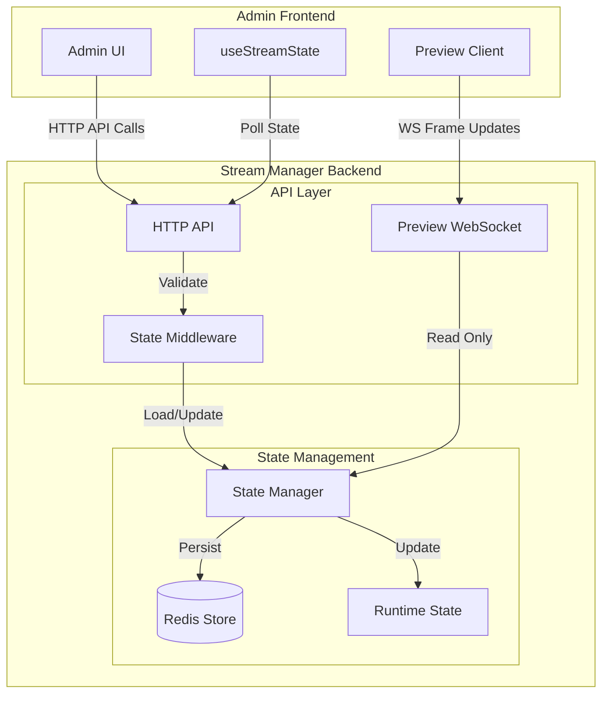

# Stream Manager State System

## Architecture Overview



## Project Structure

```
src/state/
├── README.md           # Documentation
├── persistence.ts      # Redis integration & type validation
└── store/
    ├── state-manager.types.ts  # Type definitions
    ├── state-manager.ts        # Core state management
    └── __tests__/             # Unit tests
```

## Core Components

### 1. State Manager (`state-manager.ts`)
- Singleton instance for centralized state management
- Handles state updates with immediate Redis persistence
- Implements event system for state change notifications
- Provides type-safe state access and updates
- Manages preview client connections

### 2. Type System (`state-manager.types.ts`)
```typescript
// Core state interfaces
export interface StreamState {
  isLive: boolean;
  isPaused: boolean;
  fps: number;
  targetFPS: number;
  frameCount: number;
  droppedFrames: number;
  averageRenderTime: number;
  startTime?: number | null;
  error?: string | null;
}

export interface PreviewClientState {
  id: string;
  quality: 'high' | 'medium' | 'low';
  lastPing: number;
  connected: boolean;
}
```

### 3. Persistence Layer (`persistence.ts`)
- Redis integration with connection management
- Type validation for stored state
- Error handling and recovery
- Automatic reconnection
- Data integrity checks

## State Management Flow

### 1. State Loading
```typescript
// In state-manager.ts
public async loadState(): Promise<void> {
  const streamState = await redisService.getStreamState();
  if (streamState) {
    this.state.stream = streamState;
  } else {
    // Initialize with defaults
    this.state.stream = { ...DEFAULT_STREAM_STATE };
    await redisService.saveStreamState(this.state.stream);
  }
}
```

### 2. State Updates
```typescript
// Example state update with validation
public async updateStreamState(update: Partial<StreamState>): Promise<void> {
  this.state.stream = {
    ...this.state.stream,
    ...update
  };
  await redisService.saveStreamState(this.state.stream);
  this.notifyListeners({ type: 'stream', payload: this.state.stream });
}
```

### 3. Event System
```typescript
// Event listener registration
public addEventListener(listener: StateEventListener): void {
  this.listeners.add(listener);
}

// Event emission
private notifyListeners(event: StateUpdateEvent): void {
  this.listeners.forEach(listener => listener(event));
}
```

## Type Safety & Validation

### 1. Type Guards
```typescript
// In persistence.ts
function isStreamState(obj: unknown): obj is StreamState {
  if (!obj || typeof obj !== 'object') return false;
  const state = obj as Partial<StreamState>;
  return (
    typeof state.isLive === 'boolean' &&
    typeof state.isPaused === 'boolean' &&
    typeof state.fps === 'number' &&
    // ... other validations
  );
}
```

### 2. Error Handling
```typescript
try {
  const parsed = JSON.parse(state);
  if (!isStreamState(parsed)) {
    logger.error('Invalid stream state format');
    return null;
  }
  return parsed;
} catch (error) {
  logger.error('Failed to parse state', { error });
  return null;
}
```

## Implementation Status

### ✅ Completed
1. Core State Management
   - [x] Singleton state manager
   - [x] Type-safe state updates
   - [x] Event system
   - [x] Redis persistence
   - [x] Error handling
   - [x] Preview client management

2. Type System
   - [x] Stream state types
   - [x] Layer state types
   - [x] Preview client types
   - [x] Type guards and validation

3. Persistence
   - [x] Redis integration
   - [x] Connection management
   - [x] Data validation
   - [x] Error recovery

4. Testing
   - [x] Unit tests for state manager
   - [x] Mock Redis service
   - [x] Event system tests
   - [x] State update tests

### 🎯 Future Improvements
1. Performance
   - [ ] State change batching
   - [ ] Redis connection pooling
   - [ ] Optimistic updates

2. Monitoring
   - [ ] Prometheus metrics
   - [ ] State change analytics
   - [ ] Performance tracking

3. Advanced Features
   - [ ] State versioning
   - [ ] Multi-node synchronization
   - [ ] Conflict resolution

## Best Practices

### 1. State Updates
- Use type-safe update methods
- Validate state before persistence
- Handle errors appropriately
- Notify listeners of changes

### 2. Error Handling
- Log errors with context
- Provide fallback values
- Maintain data integrity
- Implement recovery strategies

### 3. Performance
- Use type guards for validation
- Implement connection pooling
- Handle reconnection gracefully
- Monitor state size

## Configuration

```typescript
interface Config {
  REDIS_URL: string;
  REDIS_PASSWORD: string;
  WS_PORT: number;
  METRICS_PORT: number;
}
```

## API Integration

### HTTP Endpoints
- `GET /stream/status` - Get current stream state
- `POST /stream/{start|stop|pause}` - Control stream
- `GET /stream/layers` - Get layer states
- `POST /stream/layers/:id/visibility` - Update layer

### WebSocket Events
- `frame` - New frame available
- `quality` - Quality setting update
- `ping/pong` - Connection health check
- `streamState` - Stream state updates

## Components

### 1. State Manager Service
- Central state management
- Handles state loading/persistence
- Manages runtime state
- Provides type-safe state access

### 2. State Middleware
- Ensures state is loaded for API requests
- Handles state loading errors
- Provides consistent error responses
- Manages state validation

### 3. Frontend State Hook
```typescript
const { streamState, error, isLoading } = useStreamState({
  pollInterval: 1000,
  maxRetries: 3
});
```

## Error Handling

### 1. State Loading Errors
```typescript
try {
  await stateManager.loadState();
} catch (error) {
  logger.error('State loading failed', { error });
  // Handle error appropriately
}
```

### 2. State Update Errors
```typescript
try {
  await stateManager.updateStreamState(newState);
} catch (error) {
  logger.error('State update failed', { error });
  // Rollback if necessary
}
```

### 3. Redis Connection Errors
- Automatic reconnection handling
- Error logging and monitoring
- Fallback to runtime state
- Recovery mechanisms

## Best Practices

### 1. State Updates
- Always use type-safe state updates
- Validate state before updates
- Use atomic operations when possible
- Handle race conditions

### 2. Error Handling
- Log all state errors
- Provide clear error messages
- Include error context
- Implement recovery strategies

### 3. Performance
- Use debounced state updates
- Implement state caching
- Optimize polling intervals
- Batch state changes

## Implementation Status

### ✅ Completed
1. Core State Management
   - [x] State Manager implementation
   - [x] Redis integration
   - [x] State middleware
   - [x] Error handling

2. Frontend Integration
   - [x] useStreamState hook
   - [x] State polling
   - [x] Error handling
   - [x] Loading states

### 🚧 In Progress
1. State Optimization
   - [ ] State caching
   - [ ] Batch updates
   - [ ] Performance monitoring

2. Error Recovery
   - [ ] Automatic retries
   - [ ] State rollback
   - [ ] Connection recovery

## Debugging

### Common Issues
1. State Loading Failures
   - Check Redis connection
   - Verify state schema
   - Check middleware logs
   - Validate state data

2. State Update Errors
   - Check update payload
   - Verify state consistency
   - Check for race conditions
   - Monitor update timing

3. Performance Issues
   - Monitor update frequency
   - Check Redis performance
   - Verify polling intervals
   - Monitor state size

## Configuration

```typescript
interface StateConfig {
  REDIS_URL: string;
  REDIS_PREFIX: string;
  STATE_UPDATE_DEBOUNCE: number;
  MAX_RETRIES: number;
  POLL_INTERVAL: number;
}
```

## Monitoring

1. Metrics to Track
   - State load time
   - Update frequency
   - Error rates
   - Redis latency

2. Logging
   - State changes
   - Error events
   - Performance issues
   - Recovery attempts

## Port Configuration

The system uses the following default ports:
- `4200`: Main HTTP API server
- `4201`: WebSocket server for preview streaming
- `9090`: Metrics server (Prometheus)

These can be configured via environment variables:
```env
PORT=4200           # Main HTTP API port
WS_PORT=4201       # WebSocket server port
METRICS_PORT=9090  # Metrics server port
```

## Communication Protocols

### HTTP API (Admin Operations)
- Used for all admin operations
- Endpoints:
  - `POST /stream/{start|stop|pause}` - Stream control
  - `GET /stream/status` - Stream status
  - `GET /stream/layers` - Layer states
  - `POST /stream/layers/:id/visibility` - Layer updates
  - `POST /stream/chat` - Chat messages
- Integrated with StateManager for consistent state updates

### WebSocket (Preview Server)
- Dedicated to preview/streaming functionality
- Handles:
  - Frame buffer updates
  - Quality settings (high/medium/low)
  - Preview client management
  - Health monitoring
- Uses StateManager for client state tracking

## State Flow

### 1. Admin Operations Flow
1. Admin UI makes HTTP request
2. HTTP API processes request
3. StateManager updates state
4. State is persisted to Redis if needed
5. Response sent back to Admin UI
6. Admin UI polls for updates (1s interval)

### 2. Preview Flow
1. Preview client connects via WebSocket
2. Receives initial configuration
3. Starts receiving frame updates
4. Can update quality settings
5. Real-time frame streaming

## Testing & Documentation

### 1. Integration Tests
- [ ] Integration tests for HTTP API
- [ ] E2E tests for Preview WebSocket

### 2. API Documentation
- [ ] API documentation updates

### 3. Performance Testing
- [ ] Performance testing

## Monitoring & Metrics

### 1. Prometheus Metrics
- [ ] Add Prometheus metrics

### 2. Grafana Dashboards
- [ ] Grafana dashboards

### 3. Alert Configurations
- [ ] Alert configurations

### 4. Performance Monitoring
- [ ] Performance monitoring

## Security Enhancements

### 1. API Authentication
- [ ] API authentication

### 2. WebSocket Security
- [ ] WebSocket security

### 3. Rate Limiting
- [ ] Rate limiting

### 4. Input Validation
- [ ] Input validation

## Performance Optimization

### 1. Frame Buffer Optimization
- [ ] Frame buffer optimization

### 2. WebSocket Message Compression
- [ ] WebSocket message compression

### 3. Redis Connection Pooling
- [ ] Redis connection pooling

### 4. State Update Batching
- [ ] State update batching

## Debugging Notes

### HTTP API Debugging
1. Use browser dev tools Network tab
2. Check response status codes
3. Verify request/response payloads
4. Monitor polling performance

### WebSocket Debugging
1. Check PreviewServer logs
2. Monitor frame delivery rate
3. Check client connection status
4. Verify quality adaptation

## Common Issues
- HTTP polling delays
- WebSocket connection drops
- State synchronization lag
- Redis connection issues
- Frame buffer performance 