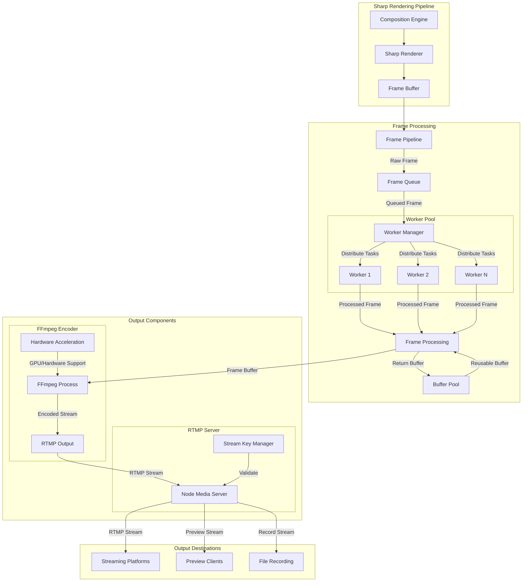

# Stream Manager Streaming Implementation

This directory contains the core streaming functionality for the Stream Manager service, including RTMP server implementation and FFmpeg encoding with direct RTMP output.

## Architecture Overview



## Directory Structure

```
streaming/
├── rtmp/                  # RTMP server implementation
│   ├── server.ts         # RTMP server core
│   └── events.ts         # RTMP event handlers
├── output/               # Output handling
│   ├── pipeline.ts       # Sharp frame pipeline
│   └── encoder.ts        # FFmpeg encoding with RTMP output
└── websocket.ts         # WebSocket communication
```

## Streaming Components

The streaming system consists of the following components:

### Frame Pipeline
- Processes raw frames using Sharp
- Handles resizing, format conversion
- Manages memory with buffer pooling
- Provides quality settings

### FFmpeg Encoder
- Uses FFmpeg for H264/VP8/VP9 encoding
- Outputs directly to RTMP server
- Supports hardware acceleration
- Handles frame rate control
- Manages audio mixing and muxing
- Provides direct RTMP output

### RTMP Server
- Manages RTMP connections
- Handles stream keys and authentication
- Provides metrics and monitoring
- Supports multiple clients

## Example Usage

```typescript
const pipeline = FramePipeline.initialize({
  maxQueueSize: 30,
  poolSize: 3,
  quality: 80,
  format: 'raw',
  width: 1920,
  height: 1080
});

const encoder = StreamEncoder.initialize({
  width: 1920,
  height: 1080,
  fps: 60,
  bitrate: 6000000,
  codec: 'h264',
  preset: 'veryfast',
  streamUrl: 'rtmp://streaming.service/live/stream-key'
});

const rtmpServer = RTMPServer.initialize({
  port: 1935,
  chunk_size: 60000,
  gop_cache: true,
  ping: 30,
  ping_timeout: 60
});

// Start streaming pipeline
composition.on('frame', async (frame: Buffer) => {
  // Process frame with Sharp pipeline
  const processedFrame = await pipeline.processFrame(frame);
  
  // Send to encoder (outputs directly to RTMP)
  encoder.sendFrame(processedFrame);
});

// Start components
pipeline.start();
encoder.start();
rtmpServer.start();

// Handle errors
composition.on('error', handleError);
pipeline.on('error', handleError);
encoder.on('error', handleError);
rtmpServer.on('error', handleError);
```

## Metrics

The streaming components expose the following Prometheus metrics:

### RTMP Metrics
- `rtmp_connections_total`: Total number of RTMP connections
- `rtmp_active_streams`: Number of active streams
- `rtmp_bandwidth_bytes`: Bandwidth usage in bytes
- `rtmp_errors_total`: Total number of RTMP errors

### Encoder Metrics
- `encoder_fps`: Current encoding FPS
- `encoder_bitrate`: Current bitrate
- `encoder_queue_size`: Frame queue size
- `encoder_dropped_frames`: Number of dropped frames
- `encoder_rtmp_latency`: RTMP output latency

## Error Handling

### RTMP Errors
1. Connection failures
2. Authentication errors
3. Stream key validation
4. Bandwidth issues

### Encoder Errors
1. FFmpeg process crashes
2. Resource exhaustion
3. Frame dropping
4. Quality degradation
5. RTMP output failures

## Performance Considerations

1. Frame Pipeline
   - Buffer pooling for memory efficiency
   - Quality vs performance tradeoffs
   - Worker thread utilization

2. FFmpeg Encoder
   - Hardware acceleration when available
   - Preset selection for CPU usage
   - Frame dropping under load
   - Direct RTMP output optimization
   - Audio mixing efficiency

3. RTMP Server
   - Connection limits
   - Bandwidth management
   - GOP cache settings

## CPU Optimization

The streaming service is optimized for our specific hardware configuration:

### Hardware Configuration
- **CPU**: AMD EPYC 9354P 32-Core Processor
- **Allocated Cores**: 2 cores
- **Available Instructions**: SSE4.2, AVX, AVX2
- **Environment**: VPS/Cloud Environment

### FFmpeg Optimizations
1. **Thread Management**
   - Dedicated thread allocation (2 cores)
   - Frame-based threading for parallel processing
   - Optimized thread distribution between encoding and lookahead

2. **x264 Parameters**
   ```
   threads=2
   lookahead_threads=1
   sliced_threads=1
   sync-lookahead=0
   rc-lookahead=10
   aq-mode=2
   direct=auto
   me=hex
   subme=6
   trellis=1
   deblock=1,1
   psy-rd=0.8,0.8
   aq-strength=0.9
   ref=1
   ```

3. **Pipeline Optimizations**
   - Zero-copy buffer handling
   - Adaptive frame dropping (>500ms latency)
   - Maximum latency threshold: 1000ms
   - CPU instruction set utilization (SSE4.2, AVX, AVX2)
   - Direct RTMP output with minimal buffering

4. **Quality/Performance Balance**
   - High profile, Level 5.1
   - CBR (Constant Bitrate) encoding
   - Psychovisual optimizations
   - Adaptive quantization for visual quality
   - Minimal reference frames for low latency

### Monitoring
- Frame encoding time
- Current FPS
- Bitrate stability
- Frame drop rate
- Pipeline latency
- RTMP output latency

### VP8/VP9 Specific Settings
- Single tile column (optimized for 2 cores)
- Frame-parallel encoding enabled
- Real-time deadline
- CPU usage level 4
- Error resilience enabled

## Development

### Prerequisites
- Node.js 18+
- FFmpeg with required codecs
- Node-Media-Server
- Redis for state management

### Setup
1. Install dependencies
2. Configure environment
3. Start services
4. Monitor metrics

### Testing
- Unit tests for components
- Integration tests
- Performance testing
- Load testing

## Next Steps

1. **Core Implementation**
   - Enhance RTMP server
   - Optimize encoder pipeline
   - Improve error recovery

2. **Advanced Features**
   - Multiple quality variants
   - Adaptive bitrate
   - Recording system
   - Preview delivery

3. **Monitoring**
   - Detailed metrics
   - Performance profiling
   - Error tracking
   - Health checks

## Stream Key Management

The RTMP server includes a secure stream key validation system:

### Features
- Simple in-memory stream key validation
- Basic operations for key management
- Active stream tracking
- Planned future enhancements:
  - Redis-based persistence
  - Key expiration
  - IP restrictions
  - User management integration

### Usage Example
```typescript
const rtmpServer = RTMPServer.getInstance();

// Add a stream key
rtmpServer.addStreamKey('stream-key-123');

// Remove a stream key
rtmpServer.removeStreamKey('stream-key-123');

// Check active streams
const activeStreams = rtmpServer.getActiveStreams();
```

### Security Considerations
- Stream key validation before accepting streams
- Protection against unauthorized streaming
- Active stream monitoring
- Comprehensive logging of streaming activities 