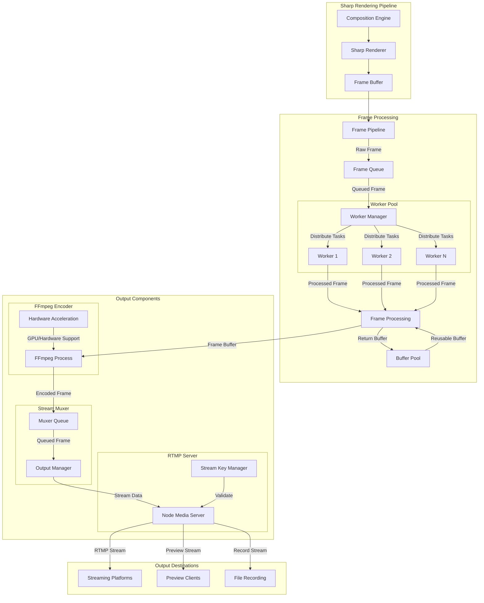

# Stream Manager Streaming Implementation

This directory contains the core streaming functionality for the Stream Manager service, including RTMP server implementation, FFmpeg encoding, and stream multiplexing.

## Architecture Overview



## Directory Structure

```
streaming/
├── rtmp/                  # RTMP server implementation
│   ├── server.ts         # RTMP server core
│   └── events.ts         # RTMP event handlers
├── output/               # Output handling
│   ├── pipeline.ts       # Sharp frame pipeline
│   ├── encoder.ts        # FFmpeg encoding
│   └── muxer.ts         # Stream multiplexing
└── websocket.ts         # WebSocket communication
```

## Components

### 1. Frame Pipeline (`output/pipeline.ts`)
- Sharp-based frame processing
- Buffer pool management
- Frame queue handling
- Memory optimization
- Performance metrics

### 2. FFmpeg Encoder (`output/encoder.ts`)
- Frame encoding
- Quality management
- Performance monitoring
- Error recovery
- Hardware acceleration

### 3. Stream Muxer (`output/muxer.ts`)
- Multiple output support
- Frame distribution
- Error handling
- Reconnection logic
- Output statistics

### 4. RTMP Server (`rtmp/server.ts` & `events.ts`)
- Node-Media-Server integration
- Stream key validation
- Connection management
- Event handling
- Metrics collection

## Implementation Status

### Phase 1: Sharp Integration ✅
1. **Frame Processing**
   - [x] Sharp buffer handling
   - [x] Frame rate control
   - [x] Memory management
   - [x] Performance metrics
   - [x] Buffer pooling

2. **Pipeline Setup**
   - [x] Frame queue implementation
   - [x] Buffer pooling
   - [x] Memory optimization
   - [x] Error handling

3. **Quality Control**
   - [x] Resolution scaling
   - [x] Format conversion
   - [x] Quality presets
   - [x] Performance tuning

### Phase 2: FFmpeg Integration 🚧
1. **Encoder Setup**
   - [x] Process management
   - [x] Command generation
   - [x] Error handling
   - [x] Resource cleanup

2. **Sharp to FFmpeg**
   - [x] Buffer conversion
   - [x] Format matching
   - [x] Pipeline optimization
   - [x] Memory efficiency

3. **Performance**
   - [~] Hardware acceleration
   - [~] Pipeline optimization
   - [x] Memory management
   - [x] Error recovery

### Phase 3: Stream Output 🚧
1. **RTMP Server**
   - [x] Node-Media-Server setup
   - [ ] Stream key management
   - [x] Connection handling
   - [x] Error recovery

2. **Advanced Features**
   - [ ] Multiple qualities
   - [ ] Adaptive bitrate
   - [ ] Recording support
   - [ ] Thumbnail generation

## Configuration

```typescript
interface StreamConfig {
  // Frame Pipeline Configuration
  pipeline: {
    maxQueueSize: number;
    poolSize: number;
    quality: number;
    format: 'raw' | 'jpeg';
  };

  // Encoder Configuration
  encoder: {
    width: number;
    height: number;
    fps: number;
    bitrate: number;
    codec: 'h264' | 'vp8' | 'vp9';
    preset: 'ultrafast' | 'superfast' | 'veryfast' | 'faster' | 'fast' | 'medium';
    hwaccel?: string;
  };

  // Muxer Configuration
  muxer: {
    outputs: string[];
    maxQueueSize: number;
    retryAttempts: number;
    retryDelay: number;
  };

  // RTMP Configuration
  rtmp: {
    port: number;
    chunk_size: number;
    gop_cache: boolean;
    ping: number;
    ping_timeout: number;
  };
}
```

## Integration Example

```typescript
import { CompositionEngine } from '../core/composition';
import { FramePipeline } from './output/pipeline';
import { StreamEncoder } from './output/encoder';
import { StreamMuxer } from './output/muxer';
import { RTMPServer } from './rtmp/server';

// Initialize components
const composition = CompositionEngine.getInstance();
const pipeline = FramePipeline.initialize({
  maxQueueSize: 30,
  poolSize: 3,
  quality: 80,
  format: 'jpeg'
});

const encoder = StreamEncoder.initialize({
  width: 1920,
  height: 1080,
  fps: 60,
  bitrate: 6000000,
  codec: 'h264',
  preset: 'veryfast'
});

const muxer = StreamMuxer.initialize({
  outputs: ['rtmp://streaming.service/live/stream-key'],
  maxQueueSize: 60,
  retryAttempts: 3,
  retryDelay: 1000
});

const rtmpServer = RTMPServer.initialize({
  port: 1935,
  chunk_size: 60000,
  gop_cache: true,
  ping: 30,
  ping_timeout: 60
});

// Start streaming pipeline
composition.on('frame', async (frame: Buffer) => {
  // Process frame with Sharp pipeline
  const processedFrame = await pipeline.processFrame(frame);
  
  // Encode frame
  const encodedFrame = await encoder.encodeFrame(processedFrame);
  
  // Send to muxer
  await muxer.processFrame(encodedFrame);
});

// Start components
pipeline.start();
encoder.start();
muxer.start();
rtmpServer.start();

// Handle errors
composition.on('error', handleError);
pipeline.on('error', handleError);
encoder.on('error', handleError);
muxer.on('error', handleError);
rtmpServer.on('error', handleError);
```

## Metrics

The streaming components expose the following Prometheus metrics:

### RTMP Metrics
- `rtmp_connections_total`: Total number of RTMP connections
- `rtmp_active_streams`: Number of active streams
- `rtmp_bandwidth_bytes`: Bandwidth usage in bytes
- `rtmp_errors_total`: Total number of RTMP errors

### Encoder Metrics
- `encoder_fps`: Current encoding FPS
- `encoder_bitrate`: Current bitrate
- `encoder_queue_size`: Frame queue size
- `encoder_dropped_frames`: Number of dropped frames

### Muxer Metrics
- `muxer_active_outputs`: Number of active outputs
- `muxer_queue_size`: Output queue size
- `muxer_errors`: Number of muxing errors

## Error Handling

### RTMP Errors
1. Connection failures
2. Authentication errors
3. Stream key validation
4. Bandwidth issues

### Encoder Errors
1. FFmpeg process crashes
2. Resource exhaustion
3. Frame dropping
4. Quality degradation

### Muxer Errors
1. Output connection failures
2. Format conversion errors
3. Queue overflow
4. Resource limitations

## Performance Considerations

1. **Sharp Processing**
   - Efficient buffer handling
   - Memory pooling
   - Cache management
   - Pipeline optimization

2. **FFmpeg Integration**
   - Zero-copy pipeline
   - Hardware acceleration
   - Format optimization
   - Memory efficiency

3. **Stream Output**
   - Connection pooling
   - Error recovery
   - Quality adaptation
   - Resource management

## CPU Optimization

The streaming service is optimized for our specific hardware configuration:

### Hardware Configuration
- **CPU**: AMD EPYC 9354P 32-Core Processor
- **Allocated Cores**: 2 cores
- **Available Instructions**: SSE4.2, AVX, AVX2
- **Environment**: VPS/Cloud Environment

### Encoding Optimizations
1. **Thread Management**
   - Dedicated thread allocation (2 cores)
   - Frame-based threading for parallel processing
   - Optimized thread distribution between encoding and lookahead

2. **x264 Parameters**
   ```
   threads=2
   lookahead_threads=1
   sliced_threads=1
   sync-lookahead=0
   rc-lookahead=10
   aq-mode=2
   direct=auto
   me=hex
   subme=6
   trellis=1
   deblock=1,1
   psy-rd=0.8,0.8
   aq-strength=0.9
   ref=1
   ```

3. **Pipeline Optimizations**
   - Zero-copy buffer handling
   - Adaptive frame dropping (>500ms latency)
   - Maximum latency threshold: 1000ms
   - CPU instruction set utilization (SSE4.2, AVX, AVX2)

4. **Quality/Performance Balance**
   - High profile, Level 5.1
   - CBR (Constant Bitrate) encoding
   - Psychovisual optimizations
   - Adaptive quantization for visual quality
   - Minimal reference frames for low latency

### Monitoring
- Frame encoding time
- Current FPS
- Bitrate stability
- Frame drop rate
- Pipeline latency

### VP8/VP9 Specific Settings
- Single tile column (optimized for 2 cores)
- Frame-parallel encoding enabled
- Real-time deadline
- CPU usage level 4
- Error resilience enabled

## Development

### Prerequisites
- Node.js 18+
- FFmpeg with required codecs
- Node-Media-Server
- Redis for state management

### Setup
1. Install dependencies
2. Configure environment
3. Start services
4. Monitor metrics

### Testing
- Unit tests for components
- Integration tests
- Performance testing
- Load testing

## Next Steps

1. **Core Implementation**
   - Complete RTMP server
   - Finalize encoder pipeline
   - Implement muxer

2. **Advanced Features**
   - Multiple quality variants
   - Adaptive bitrate
   - Recording system
   - Preview delivery

3. **Monitoring**
   - Detailed metrics
   - Performance profiling
   - Error tracking
   - Health checks

## Overview
The Stream Manager handles RTMP streaming with a simplified but secure stream key validation system.

## Components

### RTMP Server
- Built on `node-media-server`
- Handles incoming RTMP streams
- Validates stream keys before accepting streams
- Tracks active streams and connections

### Stream Key Management (MVP Implementation)
- Simple in-memory stream key validation
- Basic operations:
  - Add/remove stream keys
  - Validate incoming stream keys
  - Track active streams
- No persistence (keys are reset on server restart)
- No expiration or IP restrictions (planned for future)

## Usage

### Managing Stream Keys
```typescript
const rtmpServer = RTMPServer.getInstance();

// Add a stream key
rtmpServer.addStreamKey('stream-key-123');

// Remove a stream key
rtmpServer.removeStreamKey('stream-key-123');

// Check active streams
const activeStreams = rtmpServer.getActiveStreams();
```

### Starting the Server
```typescript
const config = {
  port: 1935,
  chunk_size: 60000,
  gop_cache: true,
  ping: 60,
  ping_timeout: 30
};

const server = RTMPServer.initialize(config);
server.start();
```

## Future Enhancements
- Redis-based key storage
- Key expiration
- IP restrictions
- User management integration
- Analytics and usage tracking

## Security Considerations
While the current implementation is simplified, it still provides:
- Stream key validation
- Protection against unauthorized streaming
- Active stream monitoring
- Logging of all streaming activities

## Metrics
The server tracks:
- Active connections
- Bandwidth usage
- Error counts

## Logging
All streaming events are logged through the central logging system, including:
- Connection attempts
- Stream starts/stops
- Validation failures
- Error conditions 