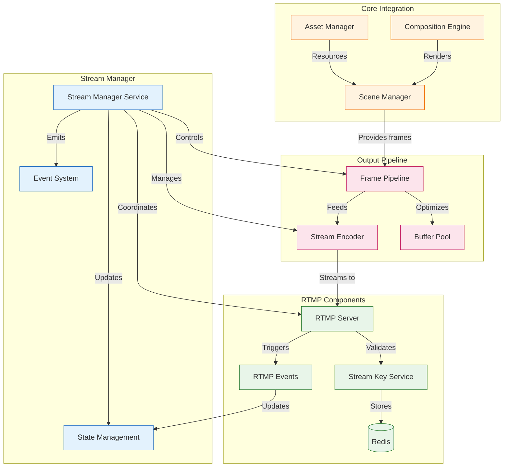

# Stream Manager Streaming Implementation

This directory contains the core streaming functionality for the Stream Manager service, including RTMP server implementation and FFmpeg encoding with direct RTMP output.

## Directory Structure

```
streaming/
├── stream-manager.ts     # Main streaming orchestrator
├── rtmp/                 # RTMP server implementation
│   ├── server.ts        # RTMP server core
│   ├── stream-key.ts    # Stream key management
│   └── events.ts        # RTMP event handlers
└── output/              # Output handling
    ├── pipeline.ts      # Frame pipeline
    └── encoder.ts       # FFmpeg encoding with RTMP output
```

## Component Overview

### Stream Manager (`stream-manager.ts`)
The main orchestrator for all streaming functionality:
- Coordinates frame generation and streaming pipeline
- Manages RTMP server and encoder initialization
- Handles stream key validation and management
- Coordinates with state management for stream status
- Manages frame timing and performance metrics
- Interfaces with core components (Scene, Asset, Composition)

### RTMP Components (`rtmp/`)
#### RTMP Server (`server.ts`)
- Handles incoming RTMP connections
- Manages stream key validation
- Controls stream output
- Manages viewer connections
- Provides metrics and monitoring
- Implements connection security

#### Stream Key Service (`stream-key.ts`)
- Secure stream key generation and validation
- Redis-based key storage and persistence
- Key expiration management
- IP restriction capabilities
- Alias system for persistent endpoints

#### Event Handlers (`events.ts`)
- RTMP event processing
- Connection lifecycle management
- Stream publishing controls
- Error handling and logging

### Output Components (`output/`)
#### Frame Pipeline (`pipeline.ts`)
- Frame processing and optimization
- Buffer management and pooling
- Frame timing control
- Frame dropping logic
- Quality/performance balancing
- Memory usage optimization

#### Stream Encoder (`encoder.ts`)
- FFmpeg-based frame encoding
- Bitrate and quality management
- Hardware acceleration support
- Multiple output format support
- Encoding performance optimization
- Stream health monitoring



## Example Usage

```typescript
const pipeline = FramePipeline.initialize({
  maxQueueSize: 30,
  poolSize: 3,
  quality: 80,
  format: 'raw',
  width: 1920,
  height: 1080
});

const encoder = StreamEncoder.initialize({
  width: 1920,
  height: 1080,
  fps: 60,
  bitrate: 6000000,
  codec: 'h264',
  preset: 'veryfast',
  streamUrl: 'rtmp://streaming.service/live/stream-key'
});

const rtmpServer = RTMPServer.initialize({
  port: 1935,
  chunk_size: 60000,
  gop_cache: true,
  ping: 30,
  ping_timeout: 60
});

// Start streaming pipeline
composition.on('frame', async (frame: Buffer) => {
  // Process frame with Sharp pipeline
  const processedFrame = await pipeline.processFrame(frame);
  
  // Send to encoder (outputs directly to RTMP)
  encoder.sendFrame(processedFrame);
});

// Start components
pipeline.start();
encoder.start();
rtmpServer.start();

// Handle errors
composition.on('error', handleError);
pipeline.on('error', handleError);
encoder.on('error', handleError);
rtmpServer.on('error', handleError);
```

## Metrics

The streaming components expose the following Prometheus metrics:

### RTMP Metrics
- `rtmp_connections_total`: Total number of RTMP connections
- `rtmp_active_streams`: Number of active streams
- `rtmp_bandwidth_bytes`: Bandwidth usage in bytes
- `rtmp_errors_total`: Total number of RTMP errors

### Encoder Metrics
- `encoder_fps`: Current encoding FPS
- `encoder_bitrate`: Current bitrate
- `encoder_queue_size`: Frame queue size
- `encoder_dropped_frames`: Number of dropped frames
- `encoder_rtmp_latency`: RTMP output latency

## Error Handling

### RTMP Errors
1. Connection failures
2. Authentication errors
3. Stream key validation
4. Bandwidth issues

### Encoder Errors
1. FFmpeg process crashes
2. Resource exhaustion
3. Frame dropping
4. Quality degradation
5. RTMP output failures

## Performance Considerations

1. Frame Pipeline
   - Buffer pooling for memory efficiency
   - Quality vs performance tradeoffs
   - Worker thread utilization

2. FFmpeg Encoder
   - Hardware acceleration when available
   - Preset selection for CPU usage
   - Frame dropping under load
   - Direct RTMP output optimization
   - Audio mixing efficiency

3. RTMP Server
   - Connection limits
   - Bandwidth management
   - GOP cache settings

## Stream Key Management

The RTMP server includes a secure stream key validation system:

### Features
- Simple in-memory stream key validation
- Basic operations for key management
- Active stream tracking
- Planned future enhancements:
  - Redis-based persistence
  - Key expiration
  - IP restrictions
  - User management integration

### Usage Example
```typescript
const rtmpServer = RTMPServer.getInstance();

// Add a stream key
rtmpServer.addStreamKey('stream-key-123');

// Remove a stream key
rtmpServer.removeStreamKey('stream-key-123');

// Check active streams
const activeStreams = rtmpServer.getActiveStreams();
```

### Security Considerations
- Stream key validation before accepting streams
- Protection against unauthorized streaming
- Active stream monitoring
- Comprehensive logging of streaming activities

## Stream Key Service Integration

The stream key system is built around `stream-key.ts` which provides secure key management through Redis:

### Core Functionality
- Generates cryptographically secure 32-byte stream keys
- Stores hashed keys in Redis with metadata
- Manages key lifecycle (creation, validation, revocation)
- Supports IP restrictions and expiration times
- Provides human-readable aliases for easier debugging

### Integration with RTMP Server
```typescript
// In server.ts
class RTMPServer {
  private streamKeyService: StreamKeyService;

  constructor() {
    // Get singleton instance
    this.streamKeyService = StreamKeyService.getInstance();
  }

  // Called during stream publish attempts
  async handlePrePublish(id: string, StreamPath: string) {
    const keyOrAlias = StreamPath.split('/').pop();
    
    // Check if it's an alias first
    const streamKey = await this.streamKeyService.getKeyByAlias(keyOrAlias) 
      || keyOrAlias;
    
    // Validate with optional IP check
    if (!await this.streamKeyService.validateKey(streamKey, args.ip)) {
      // Reject the stream
      session.reject();
    }
  }
}
```

### Key Types and Usage
1. **Regular Keys**
   - Generated for specific users/streams
   - Default 30-day expiration
   - Optional IP restrictions
   - Full validation and tracking

2. **Alias Keys**
   - Human-readable identifiers
   - Maps to regular stream keys
   - Useful for development/testing
   - Example: `preview` -> actual stream key

3. **Development Keys**
   - Generated during initialization
   - Short expiration (24 hours)
   - No IP restrictions
   - Used for testing/development

### Redis Storage Structure
```
stream:key:<hashed_key>   -> StreamKeyInfo JSON
stream:alias:<alias_name> -> actual_stream_key
```

## RTMP Events System

The RTMP event system (`events.ts`) provides a structured way to handle RTMP server events:

### Event Flow
1. **Connection Events**
   ```
   preConnect -> postConnect -> (streaming) -> doneConnect
   ```

2. **Publishing Events**
   ```
   prePublish -> postPublish -> (streaming) -> donePublish
   ```

3. **Playback Events**
   ```
   prePlay -> postPlay -> (viewing) -> donePlay
   ```

### Event Handlers
```typescript
// In server.ts
private setupEventHandlers(): void {
  // Connection lifecycle
  this.server.on('preConnect', async (id, StreamPath, args) => {
    // Track new connection attempt
    // Validate connection parameters
  });

  this.server.on('postConnect', (id, args) => {
    // Connection established
    // Update metrics
    // Emit events
  });

  // Publishing lifecycle
  this.server.on('prePublish', async (id, StreamPath, args) => {
    // Validate stream key
    // Check permissions
    // Setup stream resources
  });

  // ... other handlers
}
```

### Metrics and Monitoring
Each event type has associated Prometheus metrics:
```typescript
// Connection metrics
const connectionCounter = new Counter({
  name: 'rtmp_connection_attempts_total',
  labelNames: ['status']
});

// Publishing metrics
const publishCounter = new Counter({
  name: 'rtmp_publish_attempts_total',
  labelNames: ['status']
});
```

### Connection States
Connections are tracked through different states:
```typescript
enum ConnectionType {
  PENDING,    // Initial connection
  PUBLISHER,  // Publishing stream
  PLAYER      // Viewing stream
}
```

### Event Payloads
Events emit standardized payloads:
```typescript
interface RTMPEventPayload {
  clientId: string;
  connectionType: ConnectionType;
  streamPath?: string;
  timestamp: number;
  duration?: number;
}
```

### Integration Points
1. **State Management**
   - Events trigger state updates
   - State changes are broadcast via WebSocket
   - Metrics are updated

2. **Stream Key Service**
   - Events trigger key validation
   - Key usage is tracked
   - Failed attempts are logged

3. **Monitoring**
   - Events update Prometheus metrics
   - Connection states are tracked
   - Bandwidth usage is monitored

4. **Error Handling**
   - Events can trigger error responses
   - Failed attempts are logged
   - Cleanup is performed 