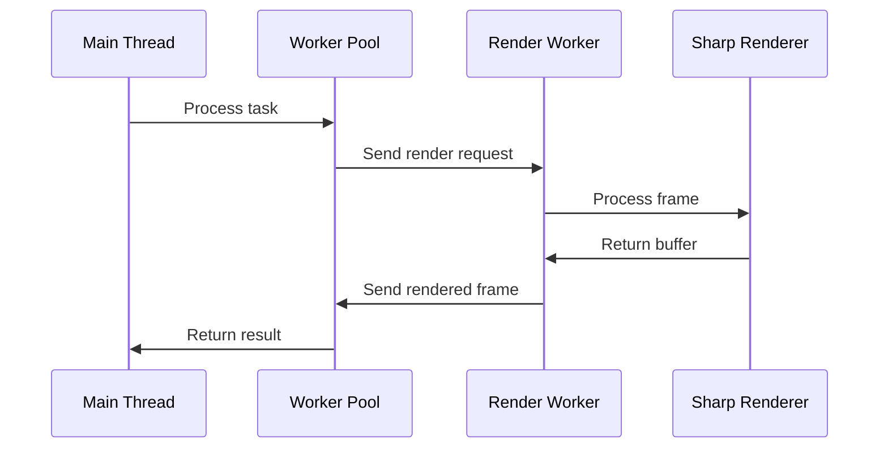

# Stream Manager Workers

This directory contains worker thread implementations for CPU-intensive tasks in the Stream Manager application.

## Overview

The worker system provides:
- Parallel processing of render operations
- Automatic worker scaling based on CPU cores
- Task queuing and load balancing
- Worker health monitoring and recovery
- Performance metrics collection

## Components

### Worker Pool (`worker-pool.ts`)

Manages a pool of worker threads:
- Automatically scales based on available CPU cores
- Handles task distribution and queuing
- Monitors worker health and performance
- Provides metrics and status information
- Implements graceful shutdown

```typescript
// Worker pool usage
const workerPool = new WorkerPool();

// Process render task
const result = await workerPool.processTask({
  type: 'render',
  data: {
    width: 1920,
    height: 1080,
    layers: currentLayers,
    options: {
      quality: 'high',
      format: 'rgba'
    }
  }
});

// Get worker metrics
const metrics = workerPool.getMetrics();
```

### Render Worker (`render-worker.ts`)

Worker thread for handling render operations:
- Processes frame composition using Sharp
- Handles image transformations
- Manages memory efficiently
- Reports performance metrics

```typescript
// Worker message types
interface RenderWorkerMessage {
  type: 'render' | 'transform' | 'composite';
  data: {
    width: number;
    height: number;
    layers: Layer[];
    options: RenderOptions;
  };
}

// Worker response types
interface RenderWorkerResponse {
  type: 'rendered' | 'error';
  data: Buffer | Error;
  metadata?: {
    duration: number;
    memory: number;
  };
}
```

## Worker Communication

### Message Flow



### Performance Benefits

1. **Parallel Processing**
   - Multiple frames processed simultaneously
   - Reduced main thread blocking
   - Better CPU utilization
   - Automatic scaling based on load

2. **Memory Management**
   - Isolated memory space per worker
   - Efficient buffer handling
   - Automatic resource cleanup
   - Memory usage monitoring

3. **Error Isolation**
   - Worker crashes don't affect main thread
   - Automatic worker replacement
   - Detailed error reporting
   - Task retry capabilities

4. **Load Balancing**
   - Task queuing system
   - Fair task distribution
   - Worker availability tracking
   - Backpressure handling

## Error Handling

```typescript
// Worker error handling
worker.on('error', (error) => {
  logger.error('Worker error occurred', { 
    error: error.message,
    stack: error.stack
  });
  
  // Replace failed worker
  handleWorkerError(worker);
});

// Worker exit handling
worker.on('exit', (code) => {
  if (code !== 0) {
    logger.error('Worker stopped with exit code', { code });
    handleWorkerError(worker);
  }
});
```

## Performance Monitoring

```typescript
interface WorkerMetrics {
  activeWorkers: number;
  pendingTasks: number;
  averageProcessingTime: number;
  memoryUsage: {
    heap: number;
    external: number;
  };
}

// Get worker pool metrics
const metrics = workerPool.getMetrics();
logger.info('Worker pool status', metrics);
```

## Best Practices

1. **Resource Management**
   - Scale workers based on CPU cores
   - Monitor memory usage per worker
   - Clean up resources on shutdown
   - Use buffer pooling when possible

2. **Error Recovery**
   - Implement task retry logic
   - Replace crashed workers
   - Log detailed error information
   - Monitor worker health

3. **Performance Optimization**
   - Batch similar tasks
   - Reuse worker instances
   - Cache frequently used data
   - Monitor processing times

4. **Message Handling**
   - Validate all messages
   - Handle timeouts
   - Implement backpressure
   - Clean up event listeners
``` 