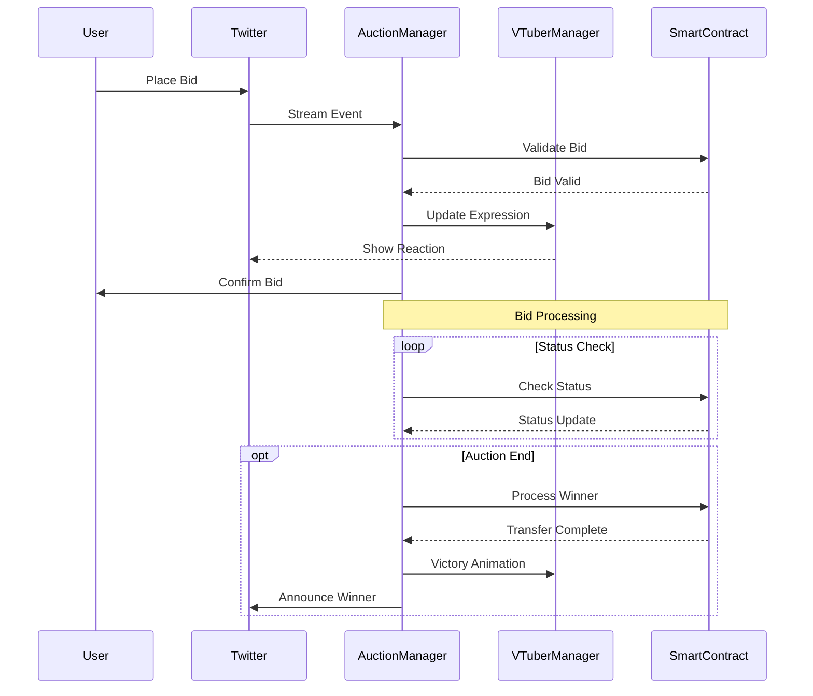

```mermaid
    sequenceDiagram
        participant U as User
        participant T as Twitter
        participant AM as AuctionManager
        participant VM as VTuberManager
        participant SC as SmartContract
    
        U->>T: Place Bid
        T->>AM: Stream Event
        AM->>SC: Validate Bid
        SC-->>AM: Bid Valid
        AM->>VM: Update Expression
        VM-->>T: Show Reaction
        AM->>U: Confirm Bid
        
        Note over AM,SC: Bid Processing
        
        loop Status Check
            AM->>SC: Check Status
            SC-->>AM: Status Update
        end
    
        opt Auction End
            AM->>SC: Process Winner
            SC-->>AM: Transfer Complete
            AM->>VM: Victory Animation
            AM->>T: Announce Winner
        end
```