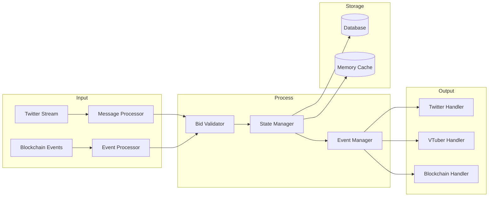

```mermaid
graph LR
    subgraph Input
        TS[Twitter Stream] --> MP[Message Processor]
        BC[Blockchain Events] --> EP[Event Processor]
    end

    subgraph Process
        MP --> BV[Bid Validator]
        EP --> BV
        BV --> SM[State Manager]
        SM --> EM[Event Manager]
    end

    subgraph Storage
        SM --> DB[(Database)]
        SM --> Cache[(Memory Cache)]
    end

    subgraph Output
        EM --> TH[Twitter Handler]
        EM --> VH[VTuber Handler]
        EM --> BH[Blockchain Handler]
    end
```