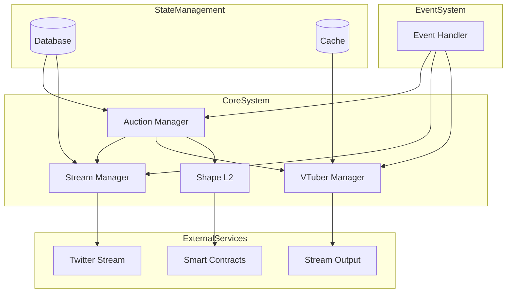

```mermaid
graph TD
    subgraph CoreSystem
        AM[Auction Manager] --> SM[Stream Manager]
        AM --> VM[VTuber Manager]
        AM --> SL[Shape L2]
    end

    subgraph ExternalServices
        SM --> TS[Twitter Stream]
        VM --> SO[Stream Output]
        SL --> SC[Smart Contracts]
    end

    subgraph StateManagement
        DB[(Database)] --> AM
        DB --> SM
        Cache[(Cache)] --> VM
    end

    subgraph EventSystem
        EH[Event Handler] --> AM
        EH --> SM
        EH --> VM
    end
```