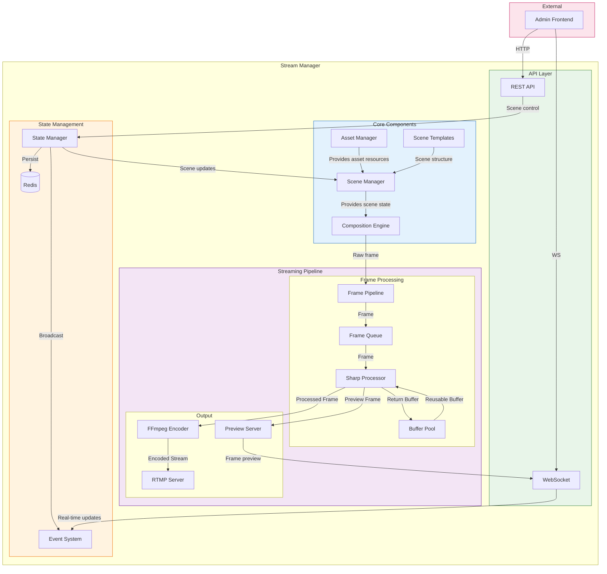
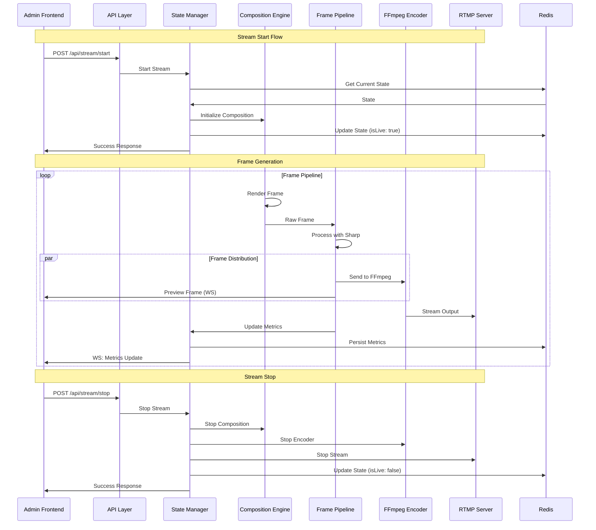

# Backend API Design

## Overview

This document outlines the API design for the backend services, focusing on the Stream Manager's core components and streaming pipeline.

## Component Architecture



## Data Flow



## API Structure

### HTTP Endpoints

```typescript
// Base URL: stream-manager:4200

// Stream Control
POST /api/stream/start
POST /api/stream/stop
POST /api/stream/pause
POST /api/stream/resume

// Stream Configuration
GET  /api/stream/config
PATCH /api/stream/config

// System
GET /api/health
GET /metrics
```

### WebSocket API

```typescript
// WebSocket URL: ws://stream-manager:4201

// Message Types
type WebSocketMessage =
  | { type: 'stateUpdate'; payload: StreamState }
  | { type: 'metricsUpdate'; payload: StreamMetrics }
  | { type: 'previewFrame'; payload: PreviewFrame }
  | { type: 'error'; payload: ErrorPayload };

// Connection Flow
1. Client connects to WebSocket
2. Server sends initial state
3. Real-time updates begin
```

## Core Components

### Scene Manager
```typescript
interface SceneManager {
  // Scene state management
  getScene(): Scene;
  updateScene(updates: Partial<Scene>): Promise<void>;
  
  // Asset positioning
  getAssetPosition(assetId: string): Position;
  updateAssetPosition(assetId: string, position: Position): Promise<void>;
  
  // Canvas management
  getCanvasProperties(): CanvasProperties;
  updateCanvasProperties(props: Partial<CanvasProperties>): Promise<void>;
}
```

### Composition Engine
```typescript
interface CompositionEngine {
  // Frame generation
  renderFrame(): Promise<Buffer>;
  
  // Scene composition
  renderScene(scene: Scene): Promise<void>;
  
  // Performance
  getMetrics(): CompositionMetrics;
}
```

### Frame Pipeline
```typescript
interface FramePipeline {
  // Pipeline control
  start(): Promise<void>;
  stop(): Promise<void>;
  
  // Frame processing
  processFrame(frame: Buffer): Promise<Buffer>;
  
  // Buffer management
  getBufferPool(): BufferPool;
  
  // Metrics
  getMetrics(): PipelineMetrics;
}
```

## State Management

### Redis Keys
```typescript
// Redis key structure
const KEYS = {
  // Stream state
  STREAM_STATE: 'stream:state',
  STREAM_CONFIG: 'stream:config',
  STREAM_METRICS: 'stream:metrics',
  
  // System state
  SYSTEM_HEALTH: 'system:health',
  SYSTEM_METRICS: 'system:metrics'
};

// TTL configuration
const TTL = {
  STREAM_METRICS: 60,    // 1 minute
  SYSTEM_METRICS: 300,   // 5 minutes
  SYSTEM_HEALTH: 60      // 1 minute
};
```

### State Types
```typescript
interface StreamState {
  isLive: boolean;
  isPaused: boolean;
  fps: number;
  targetFPS: number;
  frameCount: number;
  droppedFrames: number;
  averageRenderTime: number;
  startTime?: number;
  error: string | null;
}

interface StreamMetrics {
  fps: number;
  bitrate: number;
  droppedFrames: number;
  encoderLatency: number;
  bufferHealth: number;
  cpuUsage: number;
  memoryUsage: number;
}

interface SystemMetrics {
  cpu: {
    usage: number;
    cores: number;
  };
  memory: {
    used: number;
    total: number;
  };
  network: {
    bytesIn: number;
    bytesOut: number;
  };
}
```

## Implementation Guidelines

### 1. Frame Pipeline

#### Buffer Management
- Use buffer pooling for memory efficiency
- Implement proper cleanup
- Monitor buffer usage
- Handle pool exhaustion

#### Performance Optimization
- Worker thread utilization
- Frame dropping under load
- Quality vs performance balance
- Hardware acceleration when available

### 2. State Management

#### Redis Integration
- Immediate state persistence
- Handle connection issues
- Implement proper cleanup
- Monitor Redis health

#### Event System
- Type-safe events
- Proper error handling
- Event batching
- Connection management

### 3. Error Handling

#### Component Errors
- Scene manager errors
- Composition failures
- Pipeline errors
- Encoder issues
- RTMP failures

#### Recovery Procedures
- Automatic recovery
- State restoration
- Resource cleanup
- Error reporting

### 4. Monitoring

#### Metrics Collection
- Frame pipeline metrics
- Encoder performance
- RTMP statistics
- System resources
- Redis health

#### Health Checks
- Component health
- Service status
- Resource usage
- Error rates 