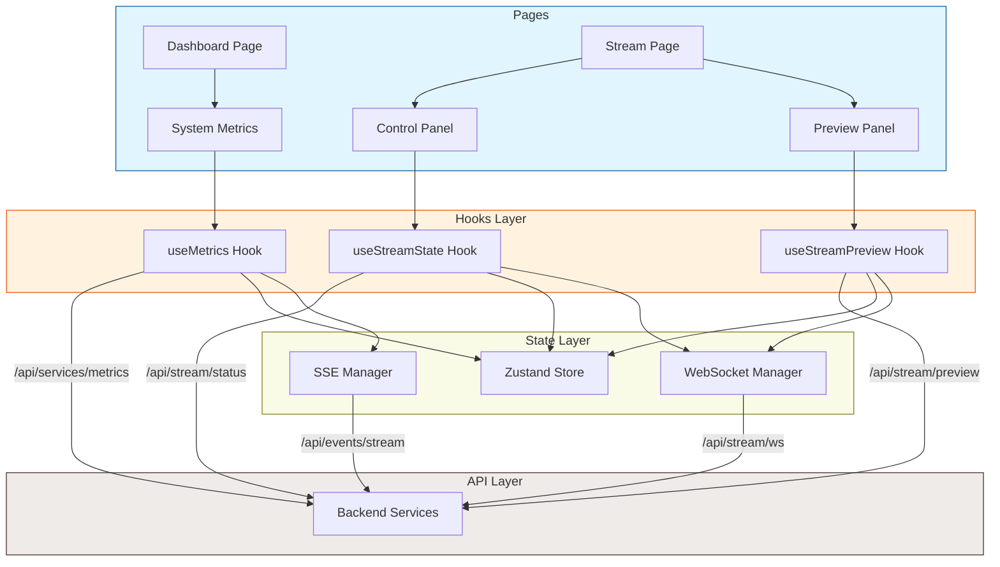
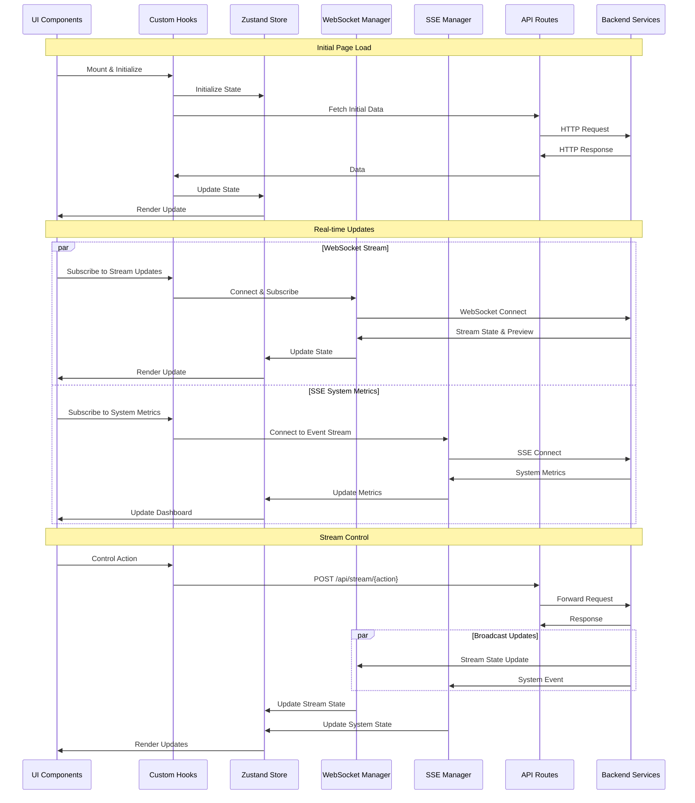

# Frontend API Design

## Overview

This document outlines the API design for the admin frontend, including API routes, custom hooks, and state management patterns.

## Component Architecture



## Data Flow



## API Structure

### Core API Routes
```typescript
// src/app/api/
├── stream/
│   ├── status/route.ts      # GET - Stream status and metrics
│   ├── control/route.ts     # POST - Stream control operations
│   ├── config/route.ts      # GET/PATCH - Stream configuration
│   └── ws/route.ts         # WebSocket - Real-time updates
└── services/
    ├── metrics/route.ts    # GET - System-wide metrics
    └── status/route.ts     # GET - Service health status
```

## Custom Hooks

### Stream Management
```typescript
// src/hooks/stream/
export function useStreamState() {
  // Real-time stream state with WebSocket updates
  return {
    isLive: boolean;
    isPaused: boolean;
    fps: number;
    targetFPS: number;
    frameCount: number;
    droppedFrames: number;
    averageRenderTime: number;
    startTime?: number;
    error: string | null;
  };
}

export function useStreamControl() {
  // Stream control operations
  return {
    startStream: () => Promise<void>;
    stopStream: () => Promise<void>;
    pauseStream: () => Promise<void>;
    resumeStream: () => Promise<void>;
    error: string | null;
  };
}

export function useStreamPreview() {
  // Stream preview with WebSocket
  return {
    previewUrl: string | null;
    quality: 'high' | 'medium' | 'low';
    setQuality: (quality: Quality) => void;
    error: string | null;
  };
}
```

### System Monitoring
```typescript
// src/hooks/system/
export function useSystemMetrics() {
  // System-wide metrics with SSE updates
  return {
    metrics: {
      containers: ContainerMetrics[];
      system: SystemMetrics;
    };
    isLoading: boolean;
    error: string | null;
  };
}

interface ContainerMetrics {
  id: string;
  name: string;
  status: string;
  cpu: {
    usage: number;
    limit: number;
  };
  memory: {
    usage: number;
    limit: number;
  };
  network: {
    rx_bytes: number;
    tx_bytes: number;
  };
}

interface SystemMetrics {
  cpu: {
    usage: number;
    cores: number;
  };
  memory: {
    used: number;
    total: number;
  };
  network: {
    bytesIn: number;
    bytesOut: number;
  };
}
```

## State Management

### Zustand Store Structure
```typescript
// src/store/
├── stream.ts       # Stream state store
└── system.ts      # System metrics store

// Stream Store
interface StreamStore {
  // State
  isLive: boolean;
  isPaused: boolean;
  metrics: StreamMetrics;
  error: string | null;

  // Actions
  startStream: () => Promise<void>;
  stopStream: () => Promise<void>;
  pauseStream: () => Promise<void>;
  resumeStream: () => Promise<void>;
  setError: (error: string | null) => void;
}

// System Store
interface SystemStore {
  // State
  containers: ContainerMetrics[];
  system: SystemMetrics;
  error: string | null;

  // Actions
  updateMetrics: (metrics: SystemMetrics) => void;
  updateContainer: (id: string, metrics: ContainerMetrics) => void;
  setError: (error: string | null) => void;
}
```

## Real-time Updates

### WebSocket Integration
```typescript
// src/lib/websocket/
interface WebSocketMessage {
  type: 'stateUpdate' | 'metricsUpdate' | 'previewFrame' | 'error';
  payload: any;
  timestamp: number;
}

class WebSocketManager {
  connect(): void;
  disconnect(): void;
  subscribe(channel: string, callback: (data: any) => void): () => void;
}
```

### Server-Sent Events
```typescript
// src/lib/sse/
class SSEManager {
  connect(url: string): void;
  disconnect(): void;
  onMessage(callback: (event: MessageEvent) => void): void;
}
```

## Error Handling

### API Error Structure
```typescript
interface ApiError {
  code: string;
  message: string;
  details?: Record<string, unknown>;
}

// Error handling in hooks
const handleError = (error: unknown) => {
  if (error instanceof ApiError) {
    // Handle known API errors
    setError(error.message);
  } else {
    // Handle unexpected errors
    setError('An unexpected error occurred');
  }
};
``` 