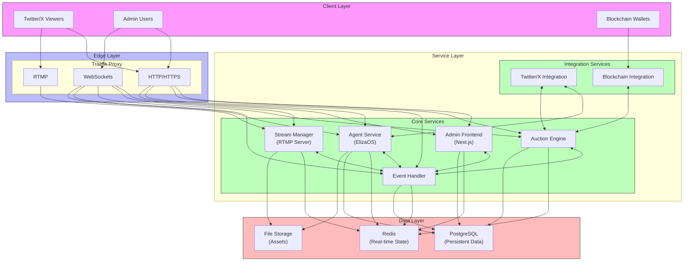
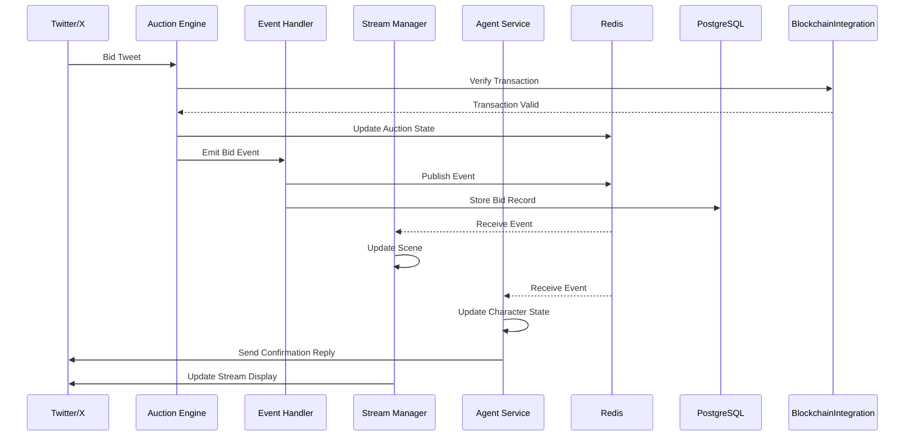
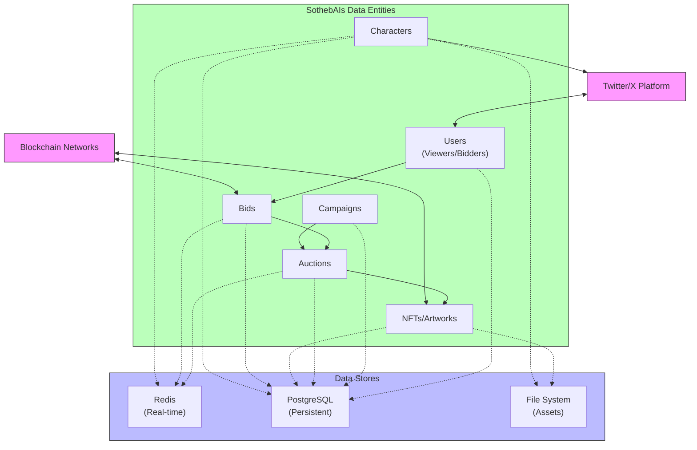
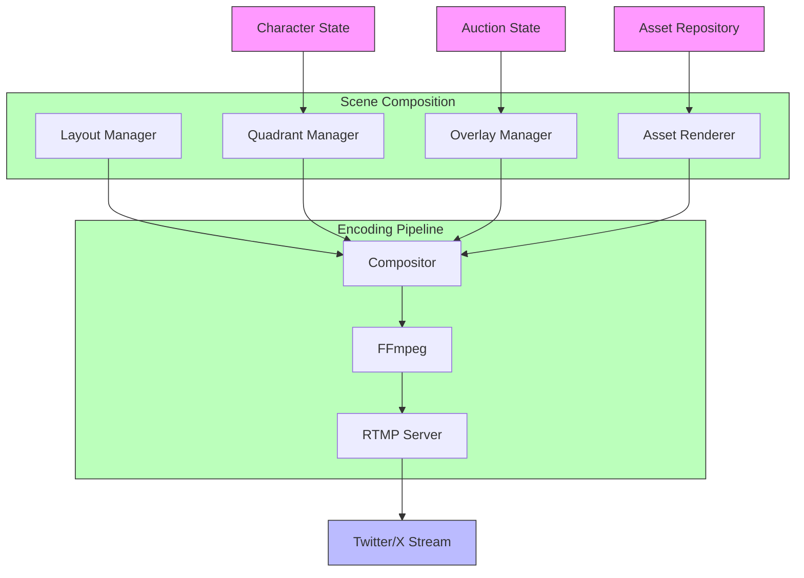

# SothebAIs Architecture

## 1. Overview

SothebAIs is a real-time NFT auction platform that enables social interaction through Twitter/X livestreams. The system is designed to handle concurrent auctions, real-time bidding, and dynamic stream composition while maintaining high reliability and performance.

## 2. Core Services

### 2.1. Traefik (Reverse Proxy/Load Balancer)
- **Purpose**: Edge routing, load balancing, and SSL termination
- **Key Features**:
  - WebSocket support for real-time communication
  - Built-in monitoring and metrics
  - Health check management
  - Access logging and security
  - SSL/TLS termination
- **Metrics & Monitoring**:
  - Request rates and latencies
  - HTTP status codes
  - WebSocket connection stats
  - Error rates
  - Built-in dashboard (`:8080`)

### 2.2. Admin Frontend (Next.js)
- **Purpose**: Administration dashboard and auction management interface
- **Key Features**:
  - Auction configuration and monitoring
  - Real-time auction status and preview
  - Stream composition control
  - Bidding interface and history
  - User authentication (Clerk)
  - WebSocket client for real-time updates
- **Metrics & Monitoring**:
  - Page load times
  - API route performance
  - Client-side errors
  - Build analytics
  - Custom system dashboard

### 2.3. Stream Manager
- **Purpose**: Handle stream composition, RTMP ingestion, and real-time updates
- **Key Features**:
  - RTMP server (port 1935)
  - WebSocket server for real-time communication
  - Stream composition and scene management
  - Asset management and caching
  - FFmpeg pipeline management
  - Twitter/X stream integration
- **Metrics & Monitoring**:
  - Bandwidth usage
  - FPS metrics
  - Error rates
  - Connected viewers

### 2.3.4. State Management
- **Campaign State**
  | Component | Storage | Example |
  |:----------|:--------|:---------|
  | Campaign ID | Redis | `campaign:123` |
  | Start Date | Redis | `2024-06-01` |
  | End Date | Redis | `2024-08-31` |
  | Status | Redis | `ACTIVE` |
  | Current Day | Redis | `15` |
  | Project Info | PostgreSQL | `{ name: "Yuga Labs", ... }` |
  | Collection Info | PostgreSQL | `{ name: "CryptoPunks", ... }` |

- **Auction State**
  | Component | Storage | Example |
  |:----------|:--------|:---------|
  | Auction ID | Redis | `auction:123` |
  | Status | Redis | `ACTIVE` |
  | Current Price | Redis | `2.5 ETH` |
  | Highest Bid | Redis | `{ amount: 2.5, bidder: "@user", timestamp: "..." }` |
  | Start Time | Redis | `2024-06-01 14:00 EST` |
  | End Time | Redis | `2024-06-01 16:00 EST` |
  | Art Item | PostgreSQL | `{ id: "CP1234", metadata: {...} }` |
  | Bid History | PostgreSQL | `[{ amount: 2.5, bidder: "@user", timestamp: "..." }, ...]` |

- **Stream State**
  | Component | Storage | Example |
  |:----------|:--------|:---------|
  | Stream ID | Redis | `stream:123` |
  | Status | Redis | `LIVE` |
  | Scene Layout | Redis | `{ quadrants: [...], overlays: [...] }` |
  | Viewer Count | Redis | `1234` |
  | Quality Metrics | Redis | `{ fps: 30, bitrate: 4000 }` |
  | Assets | Docker Volume | `/stream_assets/{backgrounds,overlays,nfts}/` |

- **User State**
  | Component | Storage | Example |
  |:----------|:--------|:---------|
  | User ID | PostgreSQL | `user:123` |
  | Twitter Handle | PostgreSQL | `@crypto_collector` |
  | Wallet Address | PostgreSQL | `0x123...` |
  | Bid History | PostgreSQL | `[{ auctionId: "123", amount: 2.5, ... }, ...]` |
  | Preferences | PostgreSQL | `{ notifications: true, ... }` |

- **Agent State**
  | Component | Storage | Example |
  |:----------|:--------|:---------|
  | Character ID | Redis | `character:123` |
  | Mood | Redis | `EXCITED` |
  | Context | Redis | `{ lastInteraction: "...", topic: "..." }` |
  | Active Scene | Redis | `{ background: "...", expression: "..." }` |
  | Memory | PostgreSQL | `{ pastInteractions: [...], preferences: {...} }` |
  | Assets | Docker Volume | `/character_assets/{expressions,backgrounds}/` |

### 2.4. Auction Engine
- **Purpose**: Core auction business logic and bid processing
- **Key Features**:
  - Bid validation and processing
  - Smart contract integration
  - Twitter bid monitoring
  - Real-time price updates
  - Winner determination
  - Campaign scheduling
- **Metrics & Monitoring**:
  - Active auctions
  - Bid processing rate
  - Contract interaction stats
  - Twitter API usage
  - Event processing latency

### 2.5. Redis
- **Purpose**: Real-time data store and message broker
- **Key Features**:
  - In-memory data storage
  - Pub/sub messaging
  - Session management
  - Caching layer
  - Rate limiting
- **Metrics & Monitoring**:
  - Memory usage
  - Connected clients
  - Operations per second
  - Cache hit/miss ratio
  - Channel subscription stats

### 2.6. Event Handler
- **Purpose**: Manage system-wide event distribution and processing
- **Key Features**:
  - Event validation and routing
  - Event persistence and replay
  - Dead letter queue management
  - Event correlation and tracking
  - Retry mechanisms
  - Event filtering and transformation
- **Metrics & Monitoring**:
  - Event throughput
  - Processing latency
  - Retry counts
  - Dead letter queue size
  - Channel statistics

### 2.7. Agent Service (ElizaOS)
- **Purpose**: Manage AI-driven social interactions and stream personality
- **Key Features**:
  - Twitter/X message monitoring
  - LLM-based response generation
  - Character/Personality management
  - Character asset selection for responses
  - Contextual memory
- **Metrics & Monitoring**:
  - Response latency
  - Message queue size
  - Character state transitions
  - Social engagement metrics
  - LLM token usage

## 3. Port Configuration

### 3.1. System Ports (0-1023)
- **80**: HTTP (Traefik)
- **443**: HTTPS (Traefik)

### 3.2. User Ports (1024-9999)
- **1935**: RTMP Streaming (Stream Manager)
- **3000**: Admin Frontend
  - **3001**: Admin WebSocket (Stream Preview)
  - **3090**: Admin Metrics
  - **3091**: Admin Health

- **4200-4299**: Stream Manager Block
  - **4200**: Stream Manager API
  - **4201**: Stream Manager WebSocket
  - **4290**: Stream Manager Metrics
  - **4291**: Stream Manager Health

- **4300-4399**: Event Handler Block
  - **4300**: Event Handler API
  - **4301**: Event Handler WebSocket
  - **4390**: Event Handler Metrics
  - **4391**: Event Handler Health

- **4400-4499**: Auction Engine Block
  - **4400**: Auction Engine API
  - **4401**: Auction Engine WebSocket
  - **4490**: Auction Engine Metrics
  - **4491**: Auction Engine Health

- **4500-4599**: Agent Service Block
  - **4500**: Agent Service API
  - **4501**: Agent WebSocket
  - **4590**: Agent Metrics
  - **4591**: Agent Health

- **6379**: Redis
- **8080**: Traefik Dashboard

### 3.3. Port Patterns
- **Service Block**: 100 ports per service (x00-x99)
- **Base Service Port**: Block start (e.g., 4200, 4300)
- **WebSocket Port**: Base + 1 (e.g., 4201, 4301)
- **Metrics Port**: Base + 90 (e.g., 4290, 4390)
- **Health Port**: Base + 91 (e.g., 4291, 4391)
- **Additional Ports**: Base + 2 through Base + 89 (reserved for service-specific needs)

### 3.4. Environment Variables
```env
# Traefik Ports
TRAEFIK_HTTP_PORT=80
TRAEFIK_HTTPS_PORT=443
TRAEFIK_DASHBOARD_PORT=8080

# Admin Frontend Ports (3000 block)
ADMIN_PORT=3000
ADMIN_WS_PORT=3001
ADMIN_METRICS_PORT=3090
ADMIN_HEALTH_PORT=3091

# Stream Manager Ports (4200 block)
STREAM_MANAGER_PORT=4200
STREAM_MANAGER_WS_PORT=4201
STREAM_MANAGER_METRICS_PORT=4290
STREAM_MANAGER_HEALTH_PORT=4291
STREAM_MANAGER_RTMP_PORT=1935

# Event Handler Ports (4300 block)
EVENT_HANDLER_PORT=4300
EVENT_HANDLER_STREAM_PORT=4301
EVENT_HANDLER_METRICS_PORT=4390
EVENT_HANDLER_HEALTH_PORT=4391

# Auction Engine Ports (4400 block)
AUCTION_ENGINE_PORT=4400
AUCTION_ENGINE_WS_PORT=4401
AUCTION_ENGINE_METRICS_PORT=4490
AUCTION_ENGINE_HEALTH_PORT=4491

# Agent Service Ports (4500 block)
AGENT_SERVICE_PORT=4500
AGENT_SERVICE_WS_PORT=4501
AGENT_SERVICE_METRICS_PORT=4590
AGENT_SERVICE_HEALTH_PORT=4591

# Redis Port
REDIS_PORT=6379
```

### 3.5. Port Exposure
- **Public Ports**: 
  - 80 (HTTP)
  - 443 (HTTPS)
  - 1935 (RTMP)
- **Internal Ports**:
  - All metrics ports
  - All health check ports
  - Redis
- **Conditional Exposure**:
  - 8080 (Traefik Dashboard) - Development only
  - WebSocket ports - Through Traefik reverse proxy

## 4. Data Storage Strategy

### 4.1. Redis (Real-time Data)
- **Purpose**: Fast, in-memory data store and message broker
- **Use Cases**:
  - Real-time state (auction status, bids)
  - Caching layer
  - Session management
  - Pub/sub messaging
  - Rate limiting
- **Metrics**:
  - Memory usage
  - Connected clients
  - Operations per second
  - Hit/miss ratios
  - Pub/sub stats

### 4.2. Local File System (Docker Volumes)
- **Purpose**: Persistent storage for local assets and logs
- **Use Cases**:
  - Stream assets (overlays, backgrounds)
  - Generated content
  - System logs
  - Temporary stream recordings
- **Volumes**:
  - `stream_storage`: Stream-related assets
  - `assets_storage`: General assets

### 4.3. PostgreSQL (Structured Data)
- **Purpose**: Persistent storage for business data
- **Use Cases**:
  - Auction data
  - User information
  - Bid history
  - Analytics
  - Relationships between entities

## 5. Inter-Service Communication

### 5.1. Event-Driven Architecture
- **Event Categories**:
  - System Events: Health checks, metrics, debugging
  - Business Events: Bids, auction state changes, winners
  - Stream Events: Quality updates, scene changes
  - User Events: Connections, interactions
  - **Agent Events**:
    - Social interactions
    - Character state changes
    - Asset selection requests
    - Stream state updates
    - Personality transitions

- **Event Channel Structure**:
  ```typescript
  // Base event interface
  interface BaseEvent {
    id: string;          // UUID
    timestamp: number;   // Unix timestamp
    type: EventType;     // Event type enum
    source: EventSource; // Source service
    version: string;     // Event schema version
  }

  // Event type categorization
  enum EventType {
    // Auction Events (auction:*)
    AUCTION_START = 'auction:start',
    AUCTION_END = 'auction:end',
    BID_PLACED = 'auction:bid:placed',
    BID_ACCEPTED = 'auction:bid:accepted',
    BID_REJECTED = 'auction:bid:rejected',
    WINNER_DETERMINED = 'auction:winner',

    // Stream Events (stream:*)
    STREAM_START = 'stream:start',
    STREAM_END = 'stream:end',
    STREAM_ERROR = 'stream:error',
    STREAM_QUALITY = 'stream:quality',
    SCENE_UPDATE = 'stream:scene:update',
    ASSET_LOADED = 'stream:asset:loaded',

    // Agent Events (agent:*)
    AGENT_MESSAGE = 'agent:message',
    AGENT_MOOD = 'agent:mood',
    AGENT_INTERACTION = 'agent:interaction',
    AGENT_ASSET = 'agent:asset:request',
    AGENT_MEMORY = 'agent:memory:update',

    // User Events (user:*)
    USER_CONNECT = 'user:connect',
    USER_DISCONNECT = 'user:disconnect',
    USER_ACTION = 'user:action',
    USER_PREFERENCE = 'user:preference',

    // System Events (system:*)
    SYSTEM_HEALTH = 'system:health',
    SYSTEM_METRIC = 'system:metric',
    SYSTEM_ERROR = 'system:error',
    SYSTEM_CONFIG = 'system:config'
  }

  // Event source identification
  enum EventSource {
    AUCTION_ENGINE = 'auction-engine',
    STREAM_MANAGER = 'stream-manager',
    AGENT_SERVICE = 'agent-service',
    EVENT_HANDLER = 'event-handler',
    ADMIN_FRONTEND = 'admin-frontend'
  }
  ```

- **Event Flow**:
  1. Service emits event to Redis pub/sub channel
  2. Event Handler receives and validates event
  3. Event is persisted to event store if needed
  4. Event is routed to relevant subscribers
  5. Subscribers process event and may emit new events

- **Event Patterns**:
  - Command events (requesting actions)
  - State change events (notifications)
  - Error events (system issues)
  - Metric events (monitoring)

### 5.2. Redis Pub/Sub
- Real-time updates
- Temporary state changes
- Metrics updates
- Debug messages

### 5.3. HTTP/REST
- Service-to-service API calls
- Admin operations
- Data queries
- Health checks

### 5.4. WebSocket
- Real-time bidirectional communication
- Stream updates
- Live metrics
- User notifications

### 5.5. Agent-Stream Integration
- **Character State Management**:
  - Personality selection
  - Mood transitions
  - Context awareness
  - Memory management

- **Asset Coordination**:
  - Dynamic asset selection
  - Expression changes
  - Scene composition updates
  - Overlay modifications

- **Social Interaction Flow**:
  1. Twitter message received
  2. Agent analyzes context
  3. Character state updated
  4. Response generated
  5. Assets selected
  6. Stream state modified
  7. Visual feedback rendered

## 6. External APIs & Dependencies

### 6.1. Twitter/X API
- **Purpose**: Social media integration and livestream management
- **Package**: Twitter API v2 SDK
- **Key Features**:
  - Stream management (create, update, delete)
  - Tweet monitoring and interaction
  - User engagement tracking
  - Media upload and management
- **Authentication**: OAuth 2.0
- **Rate Limits**: Managed through Redis-based rate limiter

### 6.2. Blockchain Data Providers
- **Purpose**: NFT and transaction monitoring
- **Packages**: 
  - Alchemy SDK
  - Infura SDK
- **Key Features**:
  - NFT ownership verification
  - Transaction monitoring
  - Wallet balance checks
  - Historical data access
- **Authentication**: API Key
- **Caching**: Redis-based with configurable TTL

### 6.3. Redis
- **Purpose**: State management and caching
- **Package**: ioredis
- **Key Features**:
  - Pub/Sub messaging
  - State caching
  - Rate limiting
  - Session management
- **Configuration**: Cluster-ready setup

### 6.4. PostgreSQL
- **Purpose**: Persistent data storage
- **Package**: Prisma ORM
- **Key Features**:
  - User data management
  - Auction history
  - Analytics storage
  - Relationship management

## 7. Internal APIs

### 7.1. Stream Manager API
- **Base URL**: `/api/stream`
- **Transport**: HTTP & WebSocket
- **Endpoints**:
  ```typescript
  // HTTP Endpoints
  GET    /status           // Stream status
  POST   /playback        // Control stream
  GET    /layers          // Get layer states
  POST   /layers/:id      // Update layer
  POST   /assets/upload   // Upload assets
  
  // WebSocket Events
  stream:state   // Stream state updates
  stream:frame   // New frame available
  stream:quality // Quality updates
  stream:layer   // Layer updates
  ```

### 7.2. Event Handler API
- **Base URL**: `/api/events`
- **Transport**: HTTP & Redis Pub/Sub
- **Endpoints**:
  ```typescript
  // HTTP Endpoints
  POST   /:type          // Emit event
  GET    /:type/history  // Get event history
  
  // Redis Channels
  events:system    // System events
  events:auction   // Auction events
  events:stream    // Stream events
  events:user      // User events
  ```

### 7.3. Auction Engine API
- **Base URL**: `/api/auction`
- **Transport**: HTTP & WebSocket
- **Endpoints**:
  ```typescript
  // HTTP Endpoints
  GET    /status         // Auction status
  POST   /bid           // Place bid
  GET    /history       // Bid history
  
  // WebSocket Events
  auction:state    // Auction state
  auction:bid      // New bid
  auction:result   // Auction result
  ```

### 7.4. Agent Service API
- **Base URL**: `/api/agent`
- **Transport**: HTTP & WebSocket
- **Endpoints**:
  ```typescript
  // HTTP Endpoints
  GET    /state          // Agent state
  POST   /interact       // User interaction
  GET    /memory        // Agent memory
  
  // WebSocket Events
  agent:state     // Agent state
  agent:message   // Agent messages
  agent:mood      // Mood updates
  ```

### 7.5. Admin API
- **Base URL**: `/api/admin`
- **Transport**: HTTP
- **Endpoints**:
  ```typescript
  // Service Management
  GET    /services/status   // Service health
  GET    /services/metrics  // Service metrics
  
  // System Management
  POST   /config           // Update config
  GET    /logs            // System logs
  POST   /maintenance     // Maintenance tasks
  ```

### 7.6. API Standards
- **Authentication**: JWT-based with role permissions
- **Rate Limiting**: Redis-based per endpoint/user
- **Response Format**:
  ```typescript
  interface ApiResponse<T> {
    success: boolean;
    data?: T;
    error?: {
      code: string;
      message: string;
      details?: any;
    };
  }
  ```
- **Error Handling**: Standardized error codes and messages
- **Validation**: Schema-based request validation
- **Documentation**: OpenAPI/Swagger specs
- **Monitoring**: Prometheus metrics for all endpoints

## 8. System Monitoring

### 8.1. Health Checks
- Each service implements health endpoints
- Traefik monitors service health
- Automatic recovery procedures
- Health status in admin dashboard

### 8.2. Metrics Collection
- **Stream Metrics**:
  - Active streams
  - Bandwidth usage
  - FPS
  - Viewer count
  - Error rates

- **System Metrics**:
  - Memory usage
  - CPU utilization
  - Network stats
  - Error rates
  - API latencies

- **Business Metrics**:
  - Active auctions
  - Bid rates
  - User engagement
  - Success rates
  - Revenue stats

### 8.3. Monitoring Dashboard
- Integrated into Admin Frontend
- Real-time updates via WebSocket
- Custom metrics visualization
- Alert configuration
- Historical data view

## 9. Stream State Management

### 9.1. Character-Driven Composition
- **Visual Elements**:
  - Character expressions

- **State Machine**:
  - Character mood states
  - Interaction modes
  - Engagement patterns

- **Asset Management**:
  - Expression library
  - Mood-based backgrounds
  - Interactive overlays
  - Transition effects

### 9.2. Social Integration
- **Twitter Integration**:
  - Message monitoring
  - Bid detection
  - Audience engagement
  - Community management

- **Response Generation**:
  - Context-aware replies
  - Personality-driven content
  - Multi-modal responses
  - Engagement strategies

- **Stream Adaptation**:
  - Dynamic scene updates
  - Character state reflection
  - Interaction visualization
  - Audience feedback display

## 10. Security

### 10.1. Edge Security
- SSL/TLS termination at Traefik
- Rate limiting
- IP filtering
- DDoS protection

### 10.2. Application Security
- Authentication via Clerk
- Role-based access control
- Input validation
- XSS protection
- CSRF protection

### 10.3. Data Security
- Encrypted storage
- Secure communication
- Access logging
- Audit trails

## 11. Deployment

### 11.1. Development
- Docker Compose
- Local volumes
- Hot reloading
- Debug logging

### 11.2. Production
- Docker Compose/Swarm
- Cloud object storage
- SSL certificates
- Production logging

## 12. Docker Implementation

### 12.1. Containerization Strategy
- **Service Containers**:
  - Each service runs in its own container
  - Containers are defined in individual Dockerfiles
  - Services are orchestrated via Docker Compose
  - Container health checks for automatic recovery

### 12.2. Container Structure
- **Base Directory Structure**:
  ```
  /
  ├── apps/                  # Application services
  │   ├── admin/             # Admin Frontend
  │   │   └── Dockerfile     # Admin container definition
  │   ├── stream-manager/    # Stream Manager
  │   │   └── Dockerfile     # Stream Manager container definition
  │   ├── auction-engine/    # Auction Engine
  │   │   └── Dockerfile     # Auction Engine container definition
  │   ├── event-handler/     # Event Handler
  │   │   └── Dockerfile     # Event Handler container definition
  │   └── agent-service/     # Agent Service
  │       └── Dockerfile     # Agent Service container definition
  ├── data/                  # Persistent data storage
  │   ├── postgres/          # PostgreSQL data
  │   ├── redis/             # Redis data
  │   └── assets/            # Shared assets
  ├── compose.yaml           # Main Docker Compose file
  └── .env                   # Environment variables
  ```

### 12.3. Container Networking
- **Network Isolation**:
  - Services communicate over internal Docker network
  - Only necessary ports exposed to host
  - Traefik handles external traffic routing
  - Internal service discovery via Docker DNS

### 12.4. Data Persistence
- **Volume Mapping**:
  - PostgreSQL data: `./data/postgres:/var/lib/postgresql/data`
  - Redis data: `./data/redis:/data`
  - Stream assets: `./data/assets:/app/assets`
  - Logs: `./data/logs:/app/logs`

### 12.5. Docker Compose Configuration
```yaml
version: '3.8'

services:
  traefik:
    image: traefik:v2.9
    command:
      - "--api.insecure=true"
      - "--providers.docker=true"
      - "--providers.docker.exposedbydefault=false"
      - "--entrypoints.web.address=:80"
      - "--entrypoints.websecure.address=:443"
    ports:
      - "${TRAEFIK_HTTP_PORT:-80}:80"
      - "${TRAEFIK_HTTPS_PORT:-443}:443"
      - "${TRAEFIK_DASHBOARD_PORT:-8080}:8080"
    volumes:
      - /var/run/docker.sock:/var/run/docker.sock
    networks:
      - sothebais-network

  admin:
    build: ./apps/admin
    labels:
      - "traefik.enable=true"
      - "traefik.http.routers.admin.rule=Host(`admin.sothebais.local`)"
      - "traefik.http.services.admin.loadbalancer.server.port=${ADMIN_PORT:-3000}"
    environment:
      - PORT=${ADMIN_PORT:-3000}
      - WS_PORT=${ADMIN_WS_PORT:-3001}
    networks:
      - sothebais-network
    depends_on:
      - redis
      - postgres

  stream-manager:
    build: ./apps/stream-manager
    ports:
      - "${STREAM_MANAGER_RTMP_PORT:-1935}:1935"
    labels:
      - "traefik.enable=true"
      - "traefik.http.routers.stream.rule=Host(`stream.sothebais.local`)"
      - "traefik.http.services.stream.loadbalancer.server.port=${STREAM_MANAGER_PORT:-4200}"
    volumes:
      - ./data/assets:/app/assets
    networks:
      - sothebais-network
    depends_on:
      - redis

  auction-engine:
    build: ./apps/auction-engine
    labels:
      - "traefik.enable=true"
      - "traefik.http.routers.auction.rule=Host(`auction.sothebais.local`)"
      - "traefik.http.services.auction.loadbalancer.server.port=${AUCTION_ENGINE_PORT:-4400}"
    networks:
      - sothebais-network
    depends_on:
      - redis
      - postgres
      - event-handler

  event-handler:
    build: ./apps/event-handler
    labels:
      - "traefik.enable=true"
      - "traefik.http.routers.events.rule=Host(`events.sothebais.local`)"
      - "traefik.http.services.events.loadbalancer.server.port=${EVENT_HANDLER_PORT:-4300}"
    networks:
      - sothebais-network
    depends_on:
      - redis
      - postgres

  agent-service:
    build: ./apps/agent-service
    labels:
      - "traefik.enable=true"
      - "traefik.http.routers.agent.rule=Host(`agent.sothebais.local`)"
      - "traefik.http.services.agent.loadbalancer.server.port=${AGENT_SERVICE_PORT:-4500}"
    networks:
      - sothebais-network
    depends_on:
      - redis
      - postgres
      - event-handler

  redis:
    image: redis:7-alpine
    ports:
      - "${REDIS_PORT:-6379}:6379"
    volumes:
      - ./data/redis:/data
    networks:
      - sothebais-network

  postgres:
    image: postgres:15-alpine
    environment:
      - POSTGRES_PASSWORD=postgres
      - POSTGRES_USER=postgres
      - POSTGRES_DB=sothebais
    volumes:
      - ./data/postgres:/var/lib/postgresql/data
    networks:
      - sothebais-network

networks:
  sothebais-network:
    driver: bridge
```

## 13. Architectural Diagrams

### 13.1. System Architecture Overview



### 13.2. Event Flow Diagram



### 13.3. Data Flow Diagram



### 13.4. Stream Composition Architecture



## 14. Testing Architecture

### 14.1. Testing Layers

- **Unit Testing**:
  - Individual service components
  - Isolated from external dependencies
  - Mock interfaces for dependencies
  - Focus on business logic validation

- **Integration Testing**:
  - Service-to-service communication
  - Redis pub/sub validation
  - API contract testing
  - Database interaction testing

- **System Testing**:
  - End-to-end auction flow
  - Stream generation and delivery
  - Twitter integration testing
  - Blockchain verification testing

- **Performance Testing**:
  - Load testing for concurrent users
  - Stream performance under load
  - Database query performance
  - Event processing throughput

### 14.2. Testing Tools

- **Unit Testing**:
  - Jest for JavaScript/TypeScript
  - Pytest for Python components
  - Mock frameworks for dependency isolation

- **Integration Testing**:
  - Docker Compose for local environment
  - API testing with Supertest/Postman
  - Database testing with test containers

- **System Testing**:
  - End-to-end testing framework
  - Selenium for UI testing
  - Twitter API test accounts
  - Test blockchain networks (testnets)

- **Performance Testing**:
  - k6 for load testing
  - Prometheus for metrics collection
  - Grafana for visualization
  - Custom stream load generators

### 14.3. Testing Environments

- **Development**:
  - Local Docker environment
  - Mock external services
  - Development database
  - Fast feedback loop

- **Staging**:
  - Mirror of production environment
  - Test data sets
  - Integration with test APIs
  - Performance testing environment

- **Production**:
  - Monitoring and observability
  - Canary deployments
  - Feature flags
  - Rollback capability

## 15. Implementation Phases Alignment

This section maps the architecture components to the implementation phases defined in the requirements document.

### 15.1. Phase 1: Foundation (2-3 weeks)

- **Core Infrastructure**:
  - Docker Compose setup
  - Basic Traefik configuration
  - Redis and PostgreSQL setup
  - Simple RTMP server configuration

- **Stream Manager (Minimal)**:
  - Static stream composition
  - Basic RTMP ingestion
  - Fixed quadrant layout
  - Simple asset display

- **Admin Frontend (Basic)**:
  - Simple configuration interface
  - Manual auction controls
  - Basic stream preview

- **Data Layer**:
  - Initial database schema
  - Basic Redis state management
  - Asset storage structure

### 15.2. Phase 2: Core Functionality (2-3 weeks)

- **Auction Engine**:
  - Bid processing logic
  - Twitter bid monitoring
  - Basic blockchain verification
  - Auction state management

- **Stream Manager (Enhanced)**:
  - Dynamic stream updates
  - Real-time bid display
  - Countdown timer
  - Basic transitions

- **Event Handler**:
  - Core event processing
  - Event routing
  - State synchronization
  - Basic error handling

- **Admin Frontend (Enhanced)**:
  - Real-time auction monitoring
  - Bid history display
  - Basic analytics

### 15.3. Phase 3: Refinement (2-3 weeks)

- **Agent Service**:
  - Basic character interactions
  - Twitter reply functionality
  - Simple mood transitions
  - Context awareness

- **Notification System**:
  - Bid confirmations
  - Outbid notifications
  - Auction results
  - Error notifications

- **System Monitoring**:
  - Health check endpoints
  - Basic metrics collection
  - Performance monitoring
  - Error tracking

- **Security Enhancements**:
  - Input validation
  - Rate limiting
  - Authentication improvements
  - Secure configuration

## 16. Disaster Recovery and Business Continuity

### 16.1. Backup Strategy

- **Database Backups**:
  - Automated daily PostgreSQL backups
  - Point-in-time recovery capability
  - Backup verification process
  - Off-site backup storage

- **State Backups**:
  - Redis persistence configuration (RDB/AOF)
  - Regular Redis snapshot exports
  - State reconstruction procedures

- **Asset Backups**:
  - Regular asset directory backups
  - Version control for critical assets
  - Asset integrity verification

### 16.2. Recovery Procedures

- **Service Recovery**:
  - Automated container restart on failure
  - Health check-based recovery
  - Manual intervention procedures
  - Service dependency management

- **Data Recovery**:
  - Database restoration procedures
  - Redis state reconstruction
  - Data consistency verification
  - Partial recovery options

- **Stream Recovery**:
  - Stream interruption handling
  - Automatic reconnection logic
  - Fallback stream configurations
  - Manual stream restart procedures

### 16.3. Business Continuity

- **Auction Continuity**:
  - Auction state persistence
  - Bid history preservation
  - Manual auction resumption
  - Auction rescheduling options

- **Communication Plan**:
  - User notification templates
  - Status page integration
  - Social media communication
  - Admin alert procedures

## 17. Error Handling Strategy

### 17.1. Error Categorization

- **Transient Errors**:
  - Network timeouts
  - Temporary service unavailability
  - Rate limiting
  - Handling: Automatic retry with exponential backoff

- **Persistent Errors**:
  - Configuration issues
  - Resource exhaustion
  - Dependency failures
  - Handling: Alert, fallback to degraded mode, manual intervention

- **Business Logic Errors**:
  - Invalid bids
  - Auction rule violations
  - Data inconsistencies
  - Handling: Validation, clear user feedback, logging

- **Critical Errors**:
  - Data corruption
  - Security breaches
  - System-wide failures
  - Handling: Immediate alerts, automatic safeguards, emergency procedures

### 17.2. Error Handling Patterns

- **Circuit Breaker Pattern**:
  - Prevent cascading failures
  - Automatic service isolation
  - Gradual recovery testing
  - Applied to: External API calls, database operations

- **Bulkhead Pattern**:
  - Isolate system components
  - Resource allocation per component
  - Failure containment
  - Applied to: Service containers, connection pools

- **Retry Pattern**:
  - Automatic retry for transient failures
  - Exponential backoff
  - Maximum retry limits
  - Applied to: Network requests, message processing

- **Fallback Pattern**:
  - Degraded functionality options
  - Alternative data sources
  - Cached results
  - Applied to: External dependencies, non-critical features
