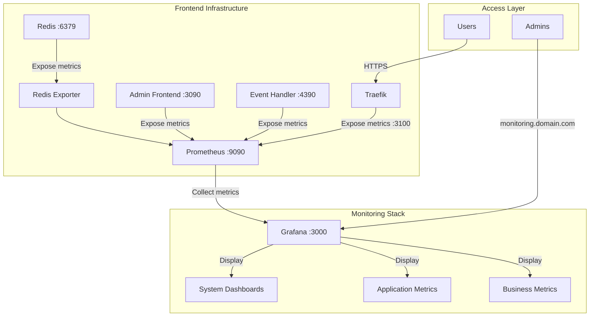

# Monitoring Architecture

This diagram illustrates how metrics flow from our services through Prometheus to Grafana:

1. Each service exposes metrics on its designated port
2. Prometheus scrapes these metrics at regular intervals
3. Grafana queries Prometheus and displays the data in dashboards
4. Access is secured through Traefik's reverse proxy

## Exposed Metrics Ports

- Traefik: 3100
- Admin Frontend: 3090
- Event Handler: 4390
- Redis Exporter: 9121
- Prometheus: 9090
- Grafana: 3000

## Security Notes

- All metrics endpoints are internal only
- Grafana access is protected by authentication
- HTTPS is enforced for all external access
