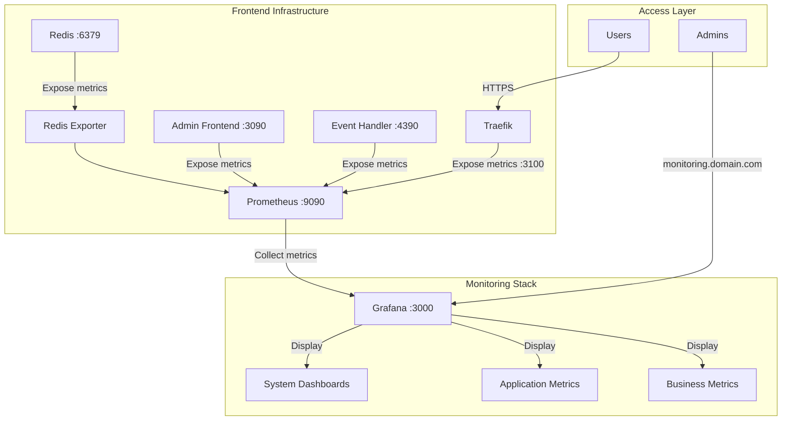

# Monitoring Frontend Implementation

## Overview
A comprehensive monitoring solution for the NFT Auction System with:
- Real-time metrics in the admin dashboard
- Detailed system monitoring through Grafana
- Prometheus for metrics collection
- Redis metrics exporter
- Traefik metrics integration

## Architecture



### Components
1. **Admin Dashboard Integration**
   - Real-time system metrics widget
   - CPU, Memory, Request Rate, and Redis metrics
   - Trend indicators for each metric
   - Auto-refresh every 5 seconds

2. **Traefik**
   - Automatic SSL/TLS with Let's Encrypt
   - Metrics exposure on port 3100
   - Request rate monitoring
   - Service discovery

3. **Prometheus**
   - Central metrics collection
   - Accessible via `/prometheus` path
   - Query API for real-time data
   - 15-second scrape interval

4. **Grafana**
   - System dashboards
   - Auto-provisioned configurations
   - Default system metrics dashboard
   - Dark theme by default

5. **Redis Exporter**
   - Redis metrics collection
   - Memory usage monitoring
   - Accessible via `/redis-metrics` path

## Implementation Details

### 1. Docker Services Configuration


### 3. Admin Dashboard Integration

The admin dashboard includes a new SystemMetrics component that displays:
- CPU Usage across services
- Memory Usage (in MB)
- Request Rate (requests/second)
- Redis Memory Usage (in MB)

Features:
- Real-time updates every 5 seconds
- Loading states with spinner
- Error handling and display
- Trend indicators (up/down/stable)
- Responsive grid layout

### 4. Environment Variables

Required environment variables:
```bash
MONITORING_SUBDOMAIN=monitoring.yourdomain.com
GRAFANA_ADMIN_USER=your_admin_user
GRAFANA_ADMIN_PASSWORD=your_secure_password
PROMETHEUS_URL=http://prometheus:9090 # For admin frontend
```

## Access Points

1. **Admin Dashboard**
   - System metrics widget in main dashboard
   - Real-time updates
   - Trend visualization

2. **Grafana**
   - URL: `https://monitoring.yourdomain.com`
   - Default dashboard: System Metrics
   - Custom dashboard support

3. **Prometheus**
   - URL: `https://monitoring.yourdomain.com/prometheus`
   - Direct query interface
   - Metric exploration

4. **Redis Metrics**
   - URL: `https://monitoring.yourdomain.com/redis-metrics`
   - Raw metrics endpoint

## Security Considerations

1. **Access Control**
   - Grafana authentication required
   - Admin dashboard authentication via Clerk
   - No direct Prometheus access (proxied through Traefik)

2. **Network Security**
   - All endpoints secured with SSL/TLS
   - Internal services not directly exposed
   - Metrics endpoints protected by authentication

3. **Data Security**
   - Persistent volumes for metrics data
   - Regular backups recommended
   - Sensitive data encryption

## Maintenance

1. **Backup Volumes**
```bash
# Important directories to backup
./grafana/dashboards/     # Dashboard configurations
./prometheus/             # Prometheus configurations
./storage/grafana/        # Grafana data
./storage/prometheus/     # Prometheus data
```

2. **Updates**
```bash
# Update images and restart services
docker compose -f compose.frontend.yaml pull
docker compose -f compose.frontend.yaml up -d
```

3. **Monitoring the Monitors**
- Check Prometheus targets status
- Monitor Grafana logs
- Verify metrics collection
- Check SSL certificate renewal

## Troubleshooting

1. **Metrics Not Showing**
   - Check Prometheus targets status
   - Verify service endpoints
   - Check network connectivity
   - Review service logs

2. **Dashboard Errors**
   - Check browser console
   - Verify API responses
   - Check Prometheus connection
   - Review error messages

3. **Performance Issues**
   - Check retention settings
   - Monitor disk usage
   - Review query performance
   - Adjust scrape intervals if needed 