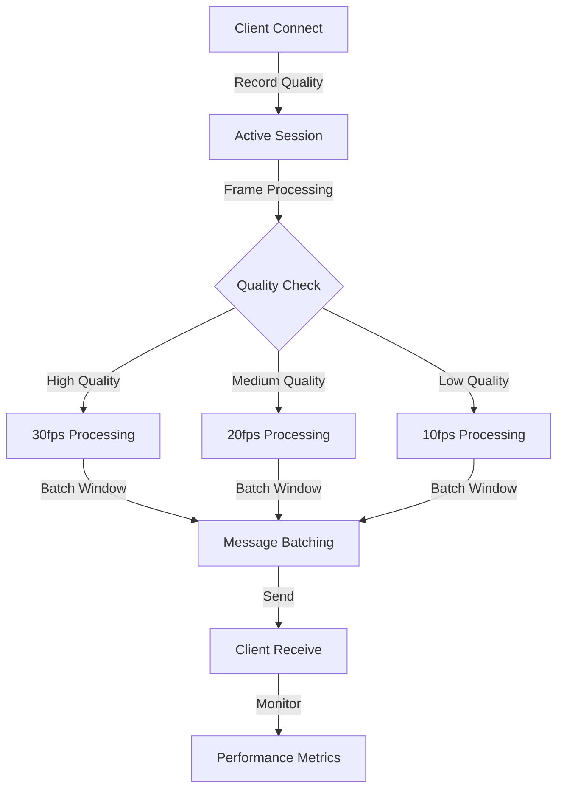
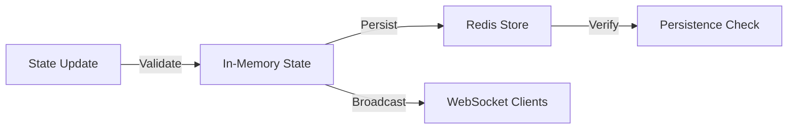
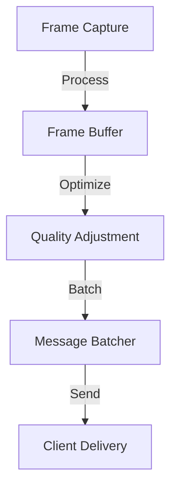

# Stream Manager Monitoring Patterns

## Monitoring Categories

### 1. WebSocket Patterns


**Key Metrics to Monitor:**
- Connection lifecycle events
- Frame processing pipeline
- Batch processing efficiency
- Client quality distribution
- WebSocket message patterns

### 2. State Management Patterns


**Key Metrics to Monitor:**
- State update frequency
- Redis operation latency
- State synchronization
- Broadcast efficiency

### 3. Performance Patterns


**Key Metrics to Monitor:**
- Frame processing time
- Buffer utilization
- Batch sizes
- Network latency

## Current Logging Coverage

### Existing Log Points:
```typescript
// Message Batcher
- Error delivering batch
- Batch size metrics
- Frame size metrics
- WebSocket message counts

// Metrics Service
- WebSocket connections
- State updates
- Redis operations
- Stream performance
- Client quality distribution
```

## Logging TODO List

### 1. Connection Lifecycle
- [ ] Client connection initialization
- [ ] Quality negotiation process
- [ ] Connection termination reason
- [ ] Session duration metrics

### 2. Frame Processing
- [ ] Frame capture timing
- [ ] Buffer queue length
- [ ] Frame drop reasons
- [ ] Quality adjustment decisions

### 3. State Management
- [ ] State change validation
- [ ] Broadcast completion status
- [ ] Redis sync conflicts
- [ ] State version tracking

### 4. Performance Monitoring
- [ ] Memory usage patterns
- [ ] CPU utilization
- [ ] Network bandwidth
- [ ] Resource bottlenecks

## Testing Regime

### 1. Load Testing
```typescript
// Test scenarios to implement
const scenarios = {
  normalLoad: {
    clients: 50,
    duration: '5m',
    frameRate: 30
  },
  highLoad: {
    clients: 200,
    duration: '10m',
    frameRate: 30
  },
  qualityMix: {
    distribution: {
      high: 0.2,    // 20% high quality
      medium: 0.5,  // 50% medium quality
      low: 0.3      // 30% low quality
    }
  }
};
```

### 2. Performance Testing
```bash
# Performance test commands
npm run perf:baseline   # Baseline performance
npm run perf:stress    # Stress test
npm run perf:endurance # Long-running test
```

### 3. Reliability Testing
- Connection drop recovery
- Redis failover
- Network latency simulation
- Error handling verification

## Results Catalog

### Test Results Structure
```
results/
├── load/
│   ├── YYYY-MM-DD_scenario_name/
│   │   ├── metrics.json
│   │   ├── logs.txt
│   │   └── analysis.md
├── performance/
│   ├── YYYY-MM-DD_test_type/
│   │   ├── metrics.json
│   │   ├── profile.json
│   │   └── analysis.md
└── reliability/
    ├── YYYY-MM-DD_test_case/
        ├── results.json
        └── report.md
```

### Metrics Dashboard Structure
```typescript
interface TestResults {
  timestamp: string;
  scenario: string;
  metrics: {
    connections: {
      total: number;
      peak: number;
      failureRate: number;
    };
    performance: {
      avgFrameTime: number;
      p95FrameTime: number;
      p99FrameTime: number;
      droppedFrames: number;
    };
    resources: {
      peakMemory: number;
      avgCPU: number;
      networkIO: number;
    };
  };
  analysis: {
    bottlenecks: string[];
    recommendations: string[];
  };
}
```

## Alert Thresholds

### Critical Alerts
```typescript
const alertThresholds = {
  connectionDrop: {
    threshold: 10,     // % drop in 5 minutes
    window: '5m'
  },
  frameLatency: {
    p95: 100,         // ms
    p99: 200          // ms
  },
  resourceUsage: {
    memory: 85,       // % usage
    cpu: 80,          // % usage
    disk: 90          // % usage
  }
};
```

### Warning Alerts
```typescript
const warningThresholds = {
  batchSize: {
    min: 1,
    max: 5
  },
  frameQueue: {
    length: 10        // frames
  },
  redisLatency: {
    threshold: 50     // ms
  }
};
```

## Next Steps

1. Implement missing log points from TODO list
2. Set up automated load testing pipeline
3. Create Grafana dashboards for metrics
4. Implement alert thresholds
5. Document baseline performance metrics
6. Create test result templates
7. Set up continuous monitoring 