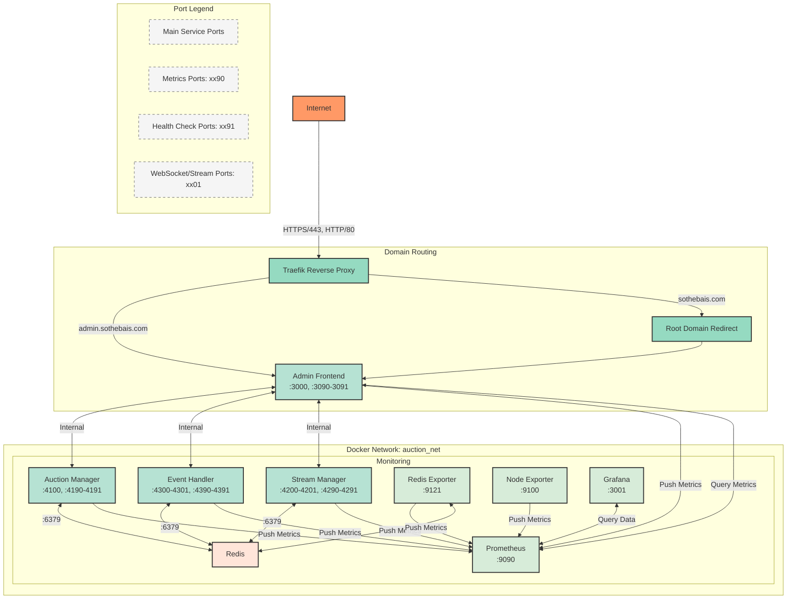
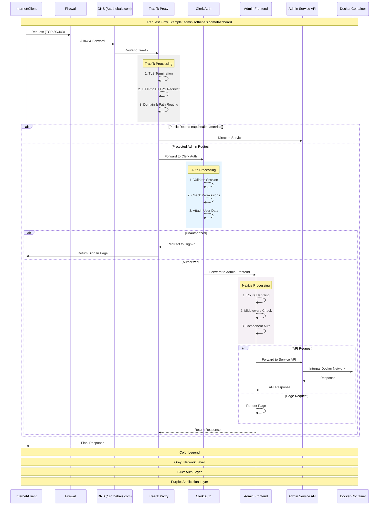
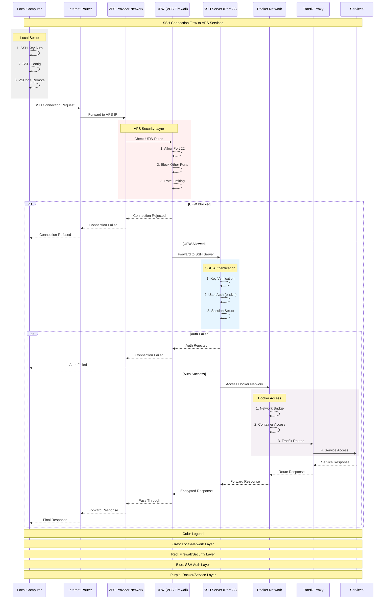

# Networking Architecture V2

This document provides a comprehensive overview of the networking architecture in the Sothebais NFT Auction System.

## HTTP Routing Architecture

## SSH Connection Architecture

## Network Architecture Details

### 1. External Access Layer
- All traffic enters through Traefik reverse proxy
- SSL/TLS termination at Traefik (ports 80/443)
- Let's Encrypt certificate management
- Root domain (sothebais.com) redirects to admin subdomain

### 2. Service Port Convention
Each service follows a consistent port numbering scheme:
- Main service port: xx00 (e.g., 3000, 4100, 4200)
- WebSocket/Stream port: xx01 (e.g., 4201, 4301)
- Metrics port: xx90 (e.g., 3090, 4190, 4290)
- Health check port: xx91 (e.g., 3091, 4191, 4291)

### 3. Core Services
- **Admin Frontend** (3000)
  - Main web interface
  - Metrics exposed on :3090
  - Health checks on :3091
  
- **Auction Manager** (4100)
  - Core auction service
  - Metrics on :4190
  - Health on :4191
  
- **Event Handler** (4300)
  - Event processing and distribution
  - Event stream on :4301
  - Metrics on :4390
  - Health on :4391
  
- **Stream Manager** (4200)
  - Stream composition and management
  - WebSocket on :4201
  - Metrics on :4290
  - Health on :4291

### 4. Monitoring Infrastructure
- **Prometheus** (9090)
  - Central metrics collection
  - Scrapes metrics from all services
  - Accessible via Traefik at /prometheus path
  
- **Grafana** (3001)
  - Metrics visualization
  - Dashboards for all services
  - Accessible via Traefik at /grafana path
  
- **Redis Exporter** (9121)
  - Exports Redis metrics to Prometheus
  
- **Node Exporter** (9100)
  - Exports host system metrics

### 5. Docker Networking
- All services run on `auction_net` Docker network
- Internal service discovery via Docker DNS
- Services communicate using service names (e.g., `redis:6379`)
- Isolated network environment

### 6. Security Considerations
- SSL/TLS encryption for all external traffic
- Internal services not directly exposed to internet
- Docker network isolation
- Traefik handles security headers and HTTPS redirects
- Authentication required for admin interface
- Metrics and health check endpoints protected

### 7. Health Monitoring
Each service implements:
- Health check endpoint on port xx91
- Prometheus metrics on port xx90
- Docker health checks
- Automatic container restart on failure

### 8. Service Discovery
- Traefik auto-discovers services via Docker labels
- Internal service discovery via Docker DNS
- Prometheus service discovery via static configuration
- Grafana discovers data sources via provisioning

## Port Reference

| Service | Main Port | WS/Stream Port | Metrics Port | Health Port |
|---------|-----------|----------------|--------------|-------------|
| Traefik | 80/443 | - | 3100 | - |
| Admin Frontend | 3000 | - | 3090 | 3091 |
| Auction Manager | 4100 | - | 4190 | 4191 |
| Event Handler | 4300 | 4301 | 4390 | 4391 |
| Stream Manager | 4200 | 4201 | 4290 | 4291 |
| Prometheus | 9090 | - | - | - |
| Grafana | 3001 | - | - | - |
| Redis | 6379 | - | 9121* | - |
| Node Exporter | - | - | 9100 | - |

\* Redis metrics are exposed via Redis Exporter 