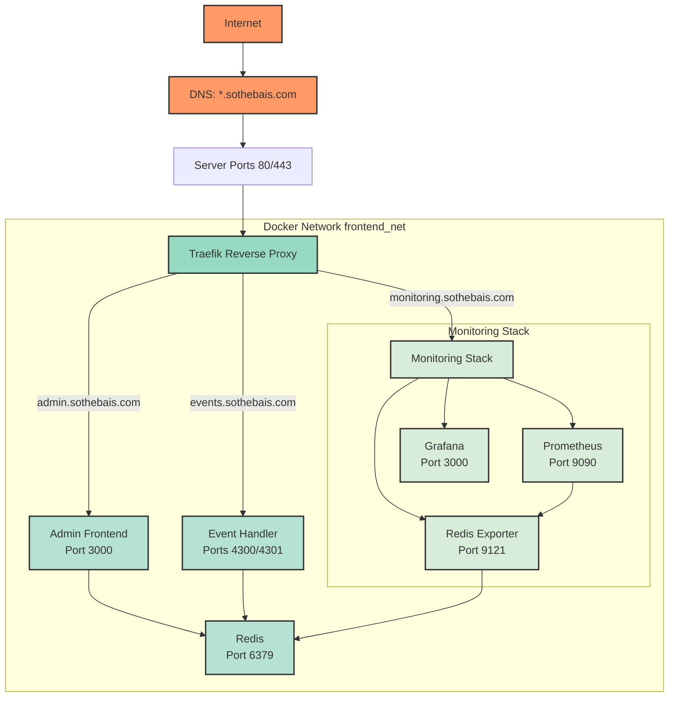

# Networking Architecture

This document details how the networking flows from local ports to public domains for the Sothebais application.

## Architecture Details

1. **External Access**
   - All traffic enters through DNS resolution of *.sothebais.com
   - Initial entry points are ports 80 (HTTP) and 443 (HTTPS)

2. **Traefik (Reverse Proxy)**
   - Handles SSL/TLS termination using Let's Encrypt
   - Routes traffic based on Host headers
   - Manages automatic certificate renewal
   - Provides load balancing

3. **Service Routing**
   - `admin.sothebais.com` → Admin Frontend (port 3000)
   - `events.sothebais.com` → Event Handler (ports 4300/4301)
   - `monitoring.sothebais.com` → Monitoring Stack

4. **Docker Network**
   - All services run on `frontend_net` Docker network
   - Internal service discovery via Docker DNS
   - Isolated network environment
   - Services communicate using service names

5. **Monitoring Infrastructure**
   - Prometheus collects metrics from services
   - Redis Exporter provides Redis metrics
   - Grafana visualizes collected metrics
   - All monitoring UIs accessible via monitoring subdomain

## Security Considerations

- SSL/TLS encryption for all public endpoints
- Internal services not directly exposed to internet
- Docker network isolation
- Traefik handles security headers and HTTPS redirects 