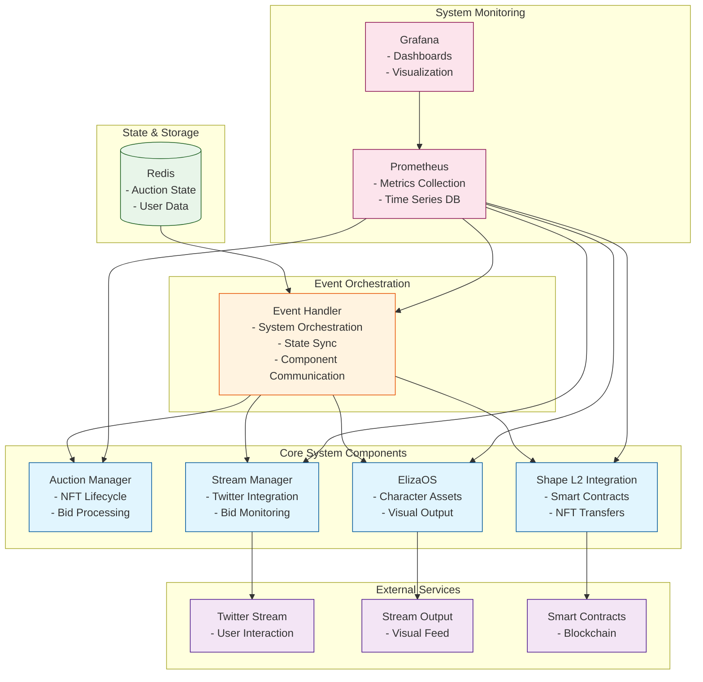

```mermaid
graph TD
    %% Core System Components
    subgraph CoreSystem[Core System Components]
        AM[Auction Manager<br>- NFT Lifecycle<br>- Bid Processing]
        SM[Stream Manager<br>- Twitter Integration<br>- Bid Monitoring]
        EL[ElizaOS<br>- Character Assets<br>- Visual Output]
        SL[Shape L2 Integration<br>- Smart Contracts<br>- NFT Transfers]
    end

    %% Event System
    subgraph EventSystem[Event Orchestration]
        EH[Event Handler<br>- System Orchestration<br>- State Sync<br>- Component Communication]
    end

    %% State Management
    subgraph StateManagement[State & Storage]
        DB[(Redis<br>- Auction State<br>- User Data)]
    end

    %% Monitoring System
    subgraph MonitoringSystem[System Monitoring]
        PR[Prometheus<br>- Metrics Collection<br>- Time Series DB]
        GF[Grafana<br>- Dashboards<br>- Visualization]
    end

    %% External Interactions
    subgraph ExternalServices[External Services]
        TS[Twitter Stream<br>- User Interaction]
        SO[Stream Output<br>- Visual Feed]
        SC[Smart Contracts<br>- Blockchain]
    end

    %% Core Connections through Event Handler
    EH --> AM
    EH --> SM
    EH --> EL
    EH --> SL
    
    %% External Service Connections
    SM --> TS
    EL --> SO
    SL --> SC
    
    %% State Connections
    DB --> EH
    
    %% Monitoring Connections
    PR --> AM
    PR --> SM
    PR --> EL
    PR --> SL
    PR --> EH
    GF --> PR
    
    %% Styling
    classDef core fill:#e1f5fe,stroke:#01579b
    classDef state fill:#e8f5e9,stroke:#1b5e20
    classDef event fill:#fff3e0,stroke:#e65100
    classDef monitoring fill:#fce4ec,stroke:#880e4f
    classDef external fill:#f3e5f5,stroke:#4a148c
    
    class AM,SM,EL,SL core
    class DB state
    class EH event
    class PR,GF monitoring
    class TS,SO,SC external
```