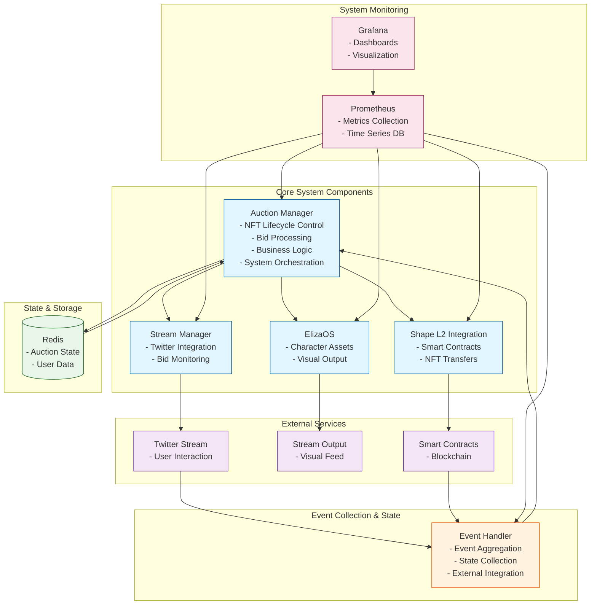

## Component Requirements

### EilzaOS
- Agent stream interaction using LLM and TTS
    - 
- Character assets  
    - Stable Diffusion pre-rendered images
- Visual output
- External API integration

### Auction Manager
- NFT Lifecycle Control
    - 
- Bid Processing
    - Read tweets responding to auction tweet
- Business Logic
- System Orchestration

### Shape L2 Integration
- Smart Contracts monitoring
    - Look at smart contract from auction contract
- NFT Transfers
- Changes handled and monitored by Event Handler and served to Auction Manager

### Twitter External Feed
- User Interaction Monitoring
- Bid Monitoring
- Changes handled and monitored by Event Handler and served to Auction Manager

### Livestream Manager
- Compose livestream from auction manager 