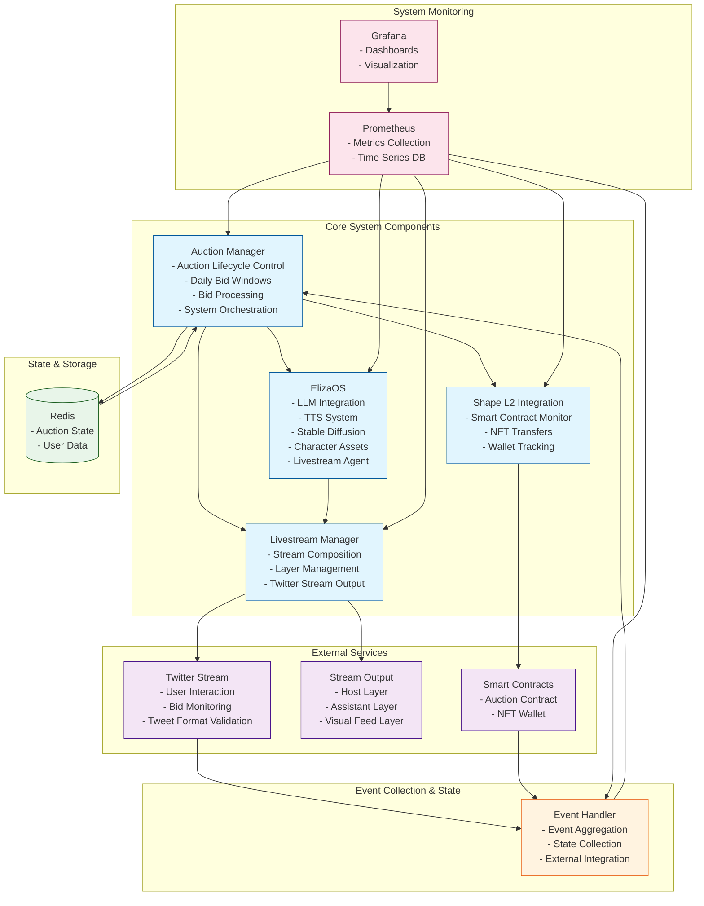

## Component Requirements

### EilzaOS
- Livestream Agent System enabling realtime stream/user interaction using:
        - LLM
        - TTS
        - Stable Diffusion pre-rendered images. 
- Character Assets
    - Anime/Vtuber aesthetic
    - Auction Host
    - Auction Assistants
        - Male and Female
        - Silly, professional art interns
        
### Auction Manager
- Auction Lifecycle Management
    - Preset time duration of stream/auction marathon. "Every day for n days." Ex: 30 days.
    - Daily bid start and end time. Ex: 3PM - 4PM EST.
- Bid Processing & Logic
    - Read tweets responding to auction tweet
    - Only accepts bids/tweets with certain format.
- System Orchestration
    - Main control system for auction and application process.

### Shape L2 Integration
- Smart Contracts monitoring
    - Look at auction contract/wallet that holds the NFT.
- NFT Transfers
- Changes handled and monitored by Event Handler and served to Auction Manager

### Twitter External Feed
- User Interaction Monitoring
- Bid Monitoring
- Changes handled and monitored by Event Handler and served to Auction Manager

### Livestream Manager
- Compose livestream from auction manager
- Stream Composition Layers (Front to Back)
    - Auction Host
    - Auction Assistants
    - Visual Feeds
- Stream to X/twitter
