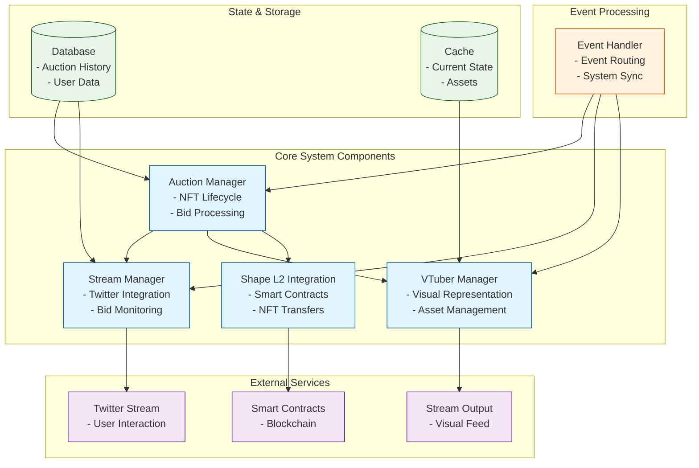

```mermaid
graph TD
    %% Core System Components
    subgraph CoreSystem[Core System Components]
        AM[Auction Manager<br>- NFT Lifecycle<br>- Bid Processing]
        SM[Stream Manager<br>- Twitter Integration<br>- Bid Monitoring]
        VM[VTuber Manager<br>- Visual Representation<br>- Asset Management]
        SL[Shape L2 Integration<br>- Smart Contracts<br>- NFT Transfers]
    end

    %% State Management
    subgraph StateManagement[State & Storage]
        DB[(Database<br>- Auction History<br>- User Data)]
        Cache[(Cache<br>- Current State<br>- Assets)]
    end

    %% Event System
    subgraph EventSystem[Event Processing]
        EH[Event Handler<br>- Event Routing<br>- System Sync]
    end

    %% External Interactions
    subgraph ExternalServices[External Services]
        TS[Twitter Stream<br>- User Interaction]
        SO[Stream Output<br>- Visual Feed]
        SC[Smart Contracts<br>- Blockchain]
    end

    %% Connections
    AM --> SM
    AM --> VM
    AM --> SL
    
    SM --> TS
    VM --> SO
    SL --> SC
    
    DB --> AM
    DB --> SM
    Cache --> VM
    
    EH --> AM
    EH --> SM
    EH --> VM
    
    %% Styling
    classDef core fill:#e1f5fe,stroke:#01579b
    classDef state fill:#e8f5e9,stroke:#1b5e20
    classDef event fill:#fff3e0,stroke:#e65100
    classDef external fill:#f3e5f5,stroke:#4a148c
    
    class AM,SM,VM,SL core
    class DB,Cache state
    class EH event
    class TS,SO,SC external
```
