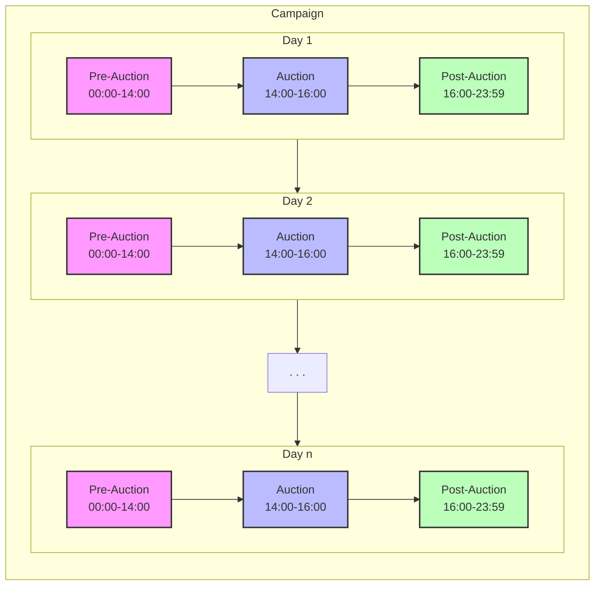
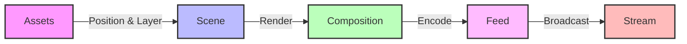

# Requirements

### Table of Contents
1. [Introduction/Overview](#1-introductionoverview)
   1. [Purpose and Scope](#11-purpose-and-scope)
   2. [Definitions](#12-definitions)
   3. [User Stories](#13-user-stories)
2. [Functional Requirements](#2-functional-requirements)
   1. [User Features](#21-user-features)
   2. [System Functions](#22-system-functions)
   3. [Data Management](#23-data-management)
   4. [Scene Management](#24-scene-management)
3. [Non-functional Requirements](#3-non-functional-requirements)
   1. [Performance](#31-performance)
   2. [Security](#32-security)
   3. [Reliability](#33-reliability)
   4. [Usability](#34-usability)
   5. [Maintainability](#35-maintainability)
   6. [Scalability](#36-scalability)
4. [System Overview](#4-system-overview)
   1. [System Requirements](#41-system-requirements)
   2. [Component Requirements](#42-component-requirements)
5. [Constraints](#5-constraints)
   1. [Technical Constraints](#51-technical-constraints)
   2. [Budget Constraints](#52-budget-constraints)
   3. [Time Constraints](#53-time-constraints)
   4. [Personnel Constraints](#54-personnel-constraints)
   5. [Operational Constraints](#55-operational-constraints)
6. [Assumptions & Dependencies](#6-assumptions--dependencies)
   1. [Assumptions](#61-assumptions)
   2. [Dependencies](#62-dependencies)
   3. [Third-Party Services](#63-third-party-services)
   4. [Technical Stack](#64-technical-stack)
7. [Implementation Roadmap](#7-implementation-roadmap)
   1. [Phase 1: Foundation ](#71-phase-1-foundation)
   2. [Phase 2: Core Functionality ](#72-phase-2-core-functionality)
   3. [Phase 3: Refinement](#73-phase-3-refinement)
   4. [Future Enhancements (Post-MVP)](#74-future-enhancements-post-mvp)
8. [Traceability Matrix](#8-traceability-matrix)
   1. [User Stories to Requirements](#81-user-stories-to-requirements)
9. [Acceptance Criteria](#9-acceptance-criteria)
   1. [Success Metrics](#91-success-metrics)
   2. [User Acceptance Criteria](#92-user-acceptance-criteria)
10. [Risks & Mitigation](#10-risks--mitigation)
    1. [Technical Risks](#101-technical-risks)
    2. [External Dependency Risks](#102-external-dependency-risks)
    3. [Performance Risks](#103-performance-risks)
    4. [Security Risks](#104-security-risks)
    5. [Operational Risks](#105-operational-risks)
11. [Testing & Validation](#11-testing--validation)
    1. [Testing Strategy](#111-testing-strategy)
    2. [Debugging and Troubleshooting](#112-debugging-and-troubleshooting)
12. [Deployment & Maintenance Plan](#12-deployment--maintenance-plan)
    1. [Deployment Strategy](#121-deployment-strategy)
    2. [Maintenance Plan](#122-maintenance-plan)

## 1. Introduction/Overview
### 1.1. Purpose and Scope

#### 1.1.1. Purpose

SothebAIs is a system that allows users to socially interact with NFT auctions and follow them in real-time on twitter/X. The social layer for NFTs.

SothebAI's elevates the auction experience by:
- Allowing users to bid on NFT auctions on chain via twitter/X.
- Use of AI agent to manage the auction and interact with viewers in real-time.

#### 1.1.2. Scope

The system will be a collection of services that can be hosted on hardware powerful enough to handle livestreaming. Should be something relatively simple. 

### 1.2. Definitions

#### 1.2.1. Entities

Entities are the main elements and participants in the auction, the characters in the stream and the people behind the auction.
- **Viewer**: A twitter/X account that is watching the livestream.
- **Bidder**: A twitter/X account with an assocated wallet address and at least one bid.
- **Auction Host**: The twitter/X account and associated character that is hosting the auction.
- **Campaign**: A series of regularly scheduled Auctions to sell a collection of art items.
- **Project**: The group behind/associated with the art items to be auctioned.
- **Collection**: The set/collection of art items to be auctioned.
- **Artwork**: A single item from the collection that is being auctioned.
- **Admin**: A user with privileged access to manage auctions, streams, and system configuration.

#### 1.2.2. Standard Terms
- **Wallet**: A cryptocurrency wallet that holds digital assets and is used to place bids.
- **Smart Contract**: Self-executing code on the blockchain that enforces auction rules and handles transactions.
- **Transaction**: A record of cryptocurrency transfer on the blockchain, used to validate bids.
- **NFT (Non-Fungible Token)**: A unique digital asset represented on the blockchain that proves ownership of the artwork.

#### 1.2.3. Events

Events detail the different phases of the campaign and auction. Includes the parameters associated with them.

- **Campaign**: A series of regularly scheduled Auctions.

    | Parameters    | Example                |
    |:-------------|:--------------------|
    | Name         | Summer NFT Series   |
    | Start Date   | 2024-06-01         |
    | End Date     | 2024-08-31         |
    | Duration     | 60 days            |
    | Auction Interval | 2 hours        |
    | Project      | Yuga Labs          |
    | Collection   | CryptoPunks        |
- **Auction Session**: A day of the campaign that has a pre-bidding, bidding and   post-bidding phase.
    - Auction Session is made up of:
    - **Pre-Auction**:
        - Section of the campaign that occurs before the auction starts.
        - Used to send announcements and publicize the auction.
        - Begins at 12:00 AM EST on the day of the auction.
        
        | Parameters    | Example                |
        |:-------------|:--------------------|
        | Start Time   | 2024-06-01 00:00 EST|
        | End Time     | 2024-06-01 14:00 EST|
    - **Auction**: 
        - A timed-event held on a livestream that at least one art  items     that are being auctioned.
        
        | Parameters     | Example                |
        |:--------------|:--------------------|
        | Name          | Genesis #1          |
        | Start Time    | 2024-06-01 14:00 EST|
        | End Time      | 2024-06-01 16:00 EST|
        | Art Item      | CryptoPunk #1234    |
        | Starting Price| 1 ETH               |
        | Current Price | 2.5 ETH             |
        | Highest Bidder| @crypto_collector   |
    - **Post-Auction**:
        - Section of the campaign that occurs after the auction ends.
        - Settle the winning bid and transfer the NFT to the winner.
        - Send notifications to the winner and the runner up.
        - Announce the end of the auction.
        - Ends at 11:59 PM EST on the day of the auction.
        
        | Parameters    | Example                |
        |:-------------|:--------------------|
        | Start Time   | 2024-06-01 16:00 EST|
        | End Time     | 2024-06-01 23:59 EST|

- **Livestream**
    - A livestream that is being hosted on X/Twitter and is a reflecting of the internal state of the system.
    
    | Parameters    | Example                |
    |:-------------|:--------------------|
    | Name         | Genesis Auction #1   |
    | Start Time   | 2024-06-01 13:45 EST|
    | End Time     | 2024-06-01 16:15 EST|
    | Auction      | Genesis #1          |

#### 1.2.4. Visual Components
- **Assets**
    - Static assets stored locally or remotely that are used in the the Scene/Render.
- **Scene**
    - High level description of elements.
    - Background, Quadrant, Overlay layers.
    - Quadrant-based scene composition.
    - Assets positioned relative to quadrant bounds.
    - Z-index ordering within quadrants.

- **Composition**
    - Takes the scene data and renders it to an image.
    - Internal data representation to image.
- **Feed**
    - The stream that is generated from the ffmpeg process.
    - Image to Video.
- **Stream**
    - The stream that is send from the RTMP server to X/Twitter.

### 1.3. User Stories

#### 1.3.1. Viewer Stories
- **As a viewer**, I want to watch NFT auctions in real-time on Twitter/X so that I can follow the market without actively participating.
- **As a viewer**, I want to see the current bid amount and time remaining so that I can understand the auction's progress.
- **As a viewer**, I want to see the artwork being auctioned in high quality so that I can appreciate its details.
- **As a viewer**, I want to receive notifications about upcoming auctions so that I don't miss events I'm interested in.
- **As a viewer**, I want to interact with the auction host through tweets so that I can ask questions and feel engaged.

#### 1.3.2. Bidder Stories
- **As a bidder**, I want to place bids via tweets so that I can participate in auctions without leaving Twitter/X.
- **As a bidder**, I want to receive immediate confirmation of my bid so that I know it was processed correctly.
- **As a bidder**, I want to be notified when I'm outbid so that I can decide whether to place a higher bid.
- **As a bidder**, I want to see my bidding history so that I can track my participation across multiple auctions.
- **As a bidder**, I want to receive notifications when I win an auction so that I can complete the transaction.
- **As a bidder**, I want to connect my crypto wallet to my Twitter/X account so that I can participate in auctions seamlessly.

#### 1.3.3. Admin Stories
- **As an admin**, I want to configure auction parameters so that I can set up new auctions quickly.
- **As an admin**, I want to monitor stream health in real-time so that I can address technical issues promptly.
- **As an admin**, I want to preview the stream composition before going live so that I can ensure everything looks correct.
- **As an admin**, I want to override auction state in emergencies so that I can handle unexpected situations.
- **As an admin**, I want to upload and manage assets so that I can customize the visual appearance of auctions.
- **As an admin**, I want to view system performance metrics so that I can optimize resource usage.

#### 1.3.4. Project Owner Stories
- **As a project owner**, I want to schedule a campaign of auctions so that I can sell my NFT collection systematically.
- **As a project owner**, I want to customize the auction host's personality so that it aligns with my brand.
- **As a project owner**, I want to view analytics about auction performance so that I can understand market interest.
- **As a project owner**, I want to receive reports on completed auctions so that I can track sales and revenue.

## 2. Functional Requirements
What the system should do.

### 2.1. User Features
Features that users directly interact with or experience.

#### 2.1.1. Livestream Viewing
- Watch the livestream on twitter/X (Priority: **CRITICAL**)
- See and hear the auction host (Priority: **HIGH**)
- See basic auction info progress live (Priority: **CRITICAL**)
- View the art item being auctioned (Priority: **CRITICAL**)
- See current bid amount, highest bidder, and time remaining (Priority: **CRITICAL**)

#### 2.1.2. Bidding & Participation
- Deposit crypto into an escrow wallet (Priority: **CRITICAL**)
- Place bids via tweet with transaction/wallet address (Priority: **CRITICAL**)
- Verify bid reception and processing (Priority: **HIGH**)
- Receive notifications for:
  - Bid acceptance (Priority: **HIGH**)
  - Being outbid (Priority: **HIGH**)
  - Winning an auction (Priority: **CRITICAL**)
- View personal bidding history (Priority: **MEDIUM**)
- Set up alerts for upcoming auctions (Priority: **MEDIUM**)

#### 2.1.3. Social Interaction
The idea is that an agent is behind the twitter account and the auction. The agent is also the one hosting the livestream. It will interact in the form of tweets and the livestream. We will split up the interaction into the places it occurs:
- **Livestream:**
    - The Auction Host will interact with the viewers. (Priority: **HIGH**)
    - The Auction Host will react to the state of the stream and auction. (Priority: **HIGH**)
- **Twitter:**
    - The Auction Host will make tweets prior, during and after the auction. (Priority: **HIGH**)
    - The Auction Host will react to the state of the stream and auction. (Priority: **MEDIUM**)

At the same time, the agent is supposed to be consistent, persist beyond the livestream/auction and follow the progress of the campaign. It should be aware of the following:
- The campaign details. (Priority: **HIGH**)
- The current day (Priority: **HIGH**)
- The daily auction details (Priority: **CRITICAL**)

#### 2.1.4. Admin Features
- **Stream Preview & Control**
  - Real-time preview of stream composition (Priority: **HIGH**)
  - Live WebSocket connection to stream manager (Priority: **HIGH**)
  - Scene layout configuration (Priority: **MEDIUM**)
  - Asset placement and management (Priority: **MEDIUM**)
  - Stream quality monitoring (Priority: **HIGH**)
  - Test overlays and transitions (Priority: **LOW**)
  - Audio level monitoring (Priority: **MEDIUM**)
- **Auction Management**
  - Configure auction parameters (Priority: **CRITICAL**)
  - Monitor bidding activity (Priority: **HIGH**)
  - Override auction state if needed (Priority: **MEDIUM**)
  - Emergency stream controls (Priority: **HIGH**)
  - Asset upload and management (Priority: **MEDIUM**)
- **System Monitoring**
  - View service health status (Priority: **HIGH**)
  - Monitor resource usage (Priority: **MEDIUM**)
  - Analyze stream performance (Priority: **MEDIUM**)

### 2.2. System Functions
Core system capabilities and backend functionality.

#### 2.2.1. Identity & Authentication
- Associate Twitter handles with wallet addresses (Priority: **CRITICAL**)
- Manage user identity verification (Priority: **HIGH**)
- Handle wallet signature verification (Priority: **CRITICAL**)
- Maintain secure identity associations (Priority: **HIGH**)

#### 2.2.2. Auction Engine
- Process and validate bids (Priority: **CRITICAL**)
- Enforce auction rules:
  - Minimum bid increments (Priority: **HIGH**)
  - Reserve prices (Priority: **HIGH**)
  - Time extensions (Priority: **MEDIUM**)
  - Winner determination (Priority: **CRITICAL**)
- Manage concurrent auctions (Priority: **LOW**)
- Schedule and queue upcoming auctions (Priority: **MEDIUM**)
- Handle campaign scheduling (Priority: **MEDIUM**)

#### 2.2.3. Blockchain Operations
- Integrate with third-party blockchain data providers (e.g., Alchemy, Infura) (Priority: **CRITICAL**)
- Monitor wallet addresses and transactions (Priority: **CRITICAL**)
- Verify transaction authenticity and finality through API calls (Priority: **CRITICAL**)
- Track NFT ownership and transfers (Priority: **HIGH**)
- Maintain low-latency blockchain data access (Priority: **HIGH**)
- Cache frequently accessed blockchain data (Priority: **MEDIUM**)

#### 2.2.4. State Management
- Keep track of users tweets, bids, and other interactions. (Priority: **HIGH**)
- Keep track of the auction state. (Priority: **CRITICAL**)
- Keep track of the stream state. (Priority: **HIGH**)
- Keep track of the campaign state. (Priority: **MEDIUM**)

#### 2.2.5. Stream Technical Management
- Control stream quality and performance (Priority: **HIGH**)
- Handle auction transitions (Priority: **MEDIUM**)
- Manage dynamic overlay updates (Priority: **MEDIUM**)
- Maintain stream stability (Priority: **CRITICAL**)

### 2.3. Data Management
Data storage, persistence, and analytics functionality.

#### 2.3.1. Auction Data
- Store and manage:
  - Bid records (amount, bidder, timestamp, tx hash, status) (Priority: **CRITICAL**)
  - Auction metadata (Priority: **HIGH**)
  - Start/end times (Priority: **HIGH**)
  - Item information (Priority: **HIGH**)
  - Winning bids (Priority: **CRITICAL**)
  - Participation statistics (Priority: **MEDIUM**)

#### 2.3.2. User Data
- Maintain user records:
  - Authentication information (Priority: **CRITICAL**)
  - Bidding history (Priority: **HIGH**)
  - Notification preferences (Priority: **MEDIUM**)
  - Wallet addresses (Priority: **CRITICAL**)
  - Twitter handles (Priority: **CRITICAL**)
- Ensure data privacy and security (Priority: **CRITICAL**)

#### 2.3.3. Analytics & Reporting
- Track and store:
  - Viewer statistics (Priority: **MEDIUM**)
  - Bidding patterns (Priority: **MEDIUM**)
  - Auction performance metrics (Priority: **HIGH**)
  - User engagement data (Priority: **LOW**)
- Generate reports for:
  - Daily auction summaries (Priority: **HIGH**)
  - Campaign performance (Priority: **MEDIUM**)
  - User activity (Priority: **LOW**)
  - Financial transactions (Priority: **HIGH**)

#### 2.3.4. State Management
- **Campaign State** (Priority: **HIGH**)
  | Component | Storage | Example |
  |:----------|:--------|:---------|
  | Campaign ID | Redis | `campaign:123` |
  | Start Date | Redis | `2024-06-01` |
  | End Date | Redis | `2024-08-31` |
  | Status | Redis | `ACTIVE` |
  | Current Day | Redis | `15` |
  | Project Info | PostgreSQL | `{ name: "Yuga Labs", ... }` |
  | Collection Info | PostgreSQL | `{ name: "CryptoPunks", ... }` |

- **Auction State** (Priority: **CRITICAL**)
  | Component | Storage | Example |
  |:----------|:--------|:---------|
  | Auction ID | Redis | `auction:123` |
  | Status | Redis | `ACTIVE` |
  | Current Price | Redis | `2.5 ETH` |
  | Highest Bid | Redis | `{ amount: 2.5, bidder: "@user", timestamp: "..." }` |
  | Start Time | Redis | `2024-06-01 14:00 EST` |
  | End Time | Redis | `2024-06-01 16:00 EST` |
  | Art Item | PostgreSQL | `{ id: "CP1234", metadata: {...} }` |
  | Bid History | PostgreSQL | `[{ amount: 2.5, bidder: "@user", timestamp: "..." }, ...]` |

- **Stream State** (Priority: **HIGH**)
  | Component | Storage | Example |
  |:----------|:--------|:---------|
  | Stream ID | Redis | `stream:123` |
  | Status | Redis | `LIVE` |
  | Scene Layout | Redis | `{ quadrants: [...], overlays: [...] }` |
  | Viewer Count | Redis | `1234` |
  | Quality Metrics | Redis | `{ fps: 30, bitrate: 4000 }` |
  | Assets | MinIO/S3 | `backgrounds/, overlays/, nfts/` |

- **User State** (Priority: **HIGH**)
  | Component | Storage | Example |
  |:----------|:--------|:---------|
  | User ID | PostgreSQL | `user:123` |
  | Twitter Handle | PostgreSQL | `@crypto_collector` |
  | Wallet Address | PostgreSQL | `0x123...` |
  | Bid History | PostgreSQL | `[{ auctionId: "123", amount: 2.5, ... }, ...]` |
  | Preferences | PostgreSQL | `{ notifications: true, ... }` |

- **Agent State** (Priority: **MEDIUM**)
  | Component | Storage | Example |
  |:----------|:--------|:---------|
  | Character ID | Redis | `character:123` |
  | Mood | Redis | `EXCITED` |
  | Context | Redis | `{ lastInteraction: "...", topic: "..." }` |
  | Active Scene | Redis | `{ background: "...", expression: "..." }` |
  | Memory | PostgreSQL | `{ pastInteractions: [...], preferences: {...} }` |

### 2.4. Scene Management
Visual composition and real-time rendering capabilities.

#### 2.4.1. Layout Management
- Implement quadrant-based composition: (Priority: **HIGH**)
  - 4 fixed quadrants
  - Defined bounds and padding
  - Relative asset positioning
  - Z-index ordering

#### 2.4.2. Asset Management
- Handle multiple asset types: (Priority: **MEDIUM**)
  - Background elements
  - Quadrant content
  - Overlay elements
- Manage asset loading and caching (Priority: **MEDIUM**)
- Support dynamic asset updates (Priority: **LOW**)

#### 2.4.3. Rendering Pipeline
- Maintain consistent frame rate (Priority: **HIGH**)
- Handle scene transitions (Priority: **MEDIUM**)
- Support real-time updates (Priority: **HIGH**)
- Ensure visual quality standards (Priority: **MEDIUM**)

## 3. Non-functional Requirements
How the system should perform.

### 3.1. Performance
- Stream Performance
    - Resolution: 1280x720p minimum (Priority: **HIGH**)
    - Frame Rate: 30fps minimum (Priority: **HIGH**)
    - Bitrate: 4-6k kbps (Priority: **MEDIUM**)
    - Latency: < 10 seconds end-to-end (Priority: **HIGH**)
    - Buffer: < 5 seconds (Priority: **MEDIUM**)

- System Response Times
    - Bid Processing: < 2 seconds (Priority: **CRITICAL**)
    - Scene Updates: < 100ms (Priority: **HIGH**)
    - User Interface Updates: < 500ms (Priority: **MEDIUM**)
    - Notification Delivery: < 5 seconds (Priority: **HIGH**)

- Time Management
    - All internal event scheduling uses EST (Eastern Standard Time) (Priority: **HIGH**)
    - System must handle daylight savings transitions gracefully (Priority: **MEDIUM**)
    - All timestamps must be stored with timezone information (Priority: **HIGH**)
    - User-facing times should be converted to local timezone when displayed (Priority: **LOW**)

- Concurrent Users
    - Support minimum 1000 simultaneous viewers (Priority: **MEDIUM**)
    - Handle 100 active bidders per auction (Priority: **HIGH**)
    - Process up to 10 bids per minute (Priority: **CRITICAL**)

### 3.2. Security
- Authentication & Authorization
    - Secure wallet signature verification (Priority: **CRITICAL**)
    - Two-factor authentication for admin access (Priority: **HIGH**)
    - Rate limiting on bid submissions (Priority: **HIGH**)
    - IP-based request throttling (Priority: **MEDIUM**)

- Data Protection
    - Encryption at rest for user data (Priority: **HIGH**)
    - Secure communication channels (HTTPS/WSS) (Priority: **CRITICAL**)
    - Compliance with crypto wallet standards (Priority: **CRITICAL**)

- Access Control
    - Role-based access control (Priority: **HIGH**)
    - Admin-only auction controls (Priority: **CRITICAL**)
    - Audit logging of all system actions (Priority: **HIGH**)
    - Session management and timeout (Priority: **MEDIUM**)

### 3.3. Reliability
- System Uptime
    - 99.9% uptime during active auctions (Priority: **CRITICAL**)
    - Automated recovery from common failures (Priority: **HIGH**)
    - Graceful degradation under load (Priority: **MEDIUM**)
    - No single point of failure (Priority: **MEDIUM**)

- Data Integrity
    - Regular data backups (Priority: **HIGH**)
    - Transaction atomicity (Priority: **CRITICAL**)
    - Bid verification redundancy (Priority: **HIGH**)
    - State consistency checks (Priority: **HIGH**)

- Error Handling
    - Graceful error recovery (Priority: **HIGH**)
    - User-friendly error messages (Priority: **MEDIUM**)
    - Automated error reporting (Priority: **MEDIUM**)
    - System state monitoring (Priority: **HIGH**)

### 3.4. Usability
- Admin Interface
    - Intuitive control panel (Priority: **MEDIUM**)
    - Real-time monitoring dashboard (Priority: **HIGH**)
    - Quick access to common functions (Priority: **MEDIUM**)
    - Clear status indicators (Priority: **HIGH**)

- User Experience
    - Clear bid feedback (Priority: **CRITICAL**)
    - Easily readable stream overlay (Priority: **HIGH**)
    - Consistent visual design (Priority: **MEDIUM**)
    - Mobile-friendly viewing (Priority: **HIGH**)

### 3.5. Maintainability
- Code Quality
    - Documented codebase (Priority: **HIGH**)
    - Modular architecture (Priority: **HIGH**)
    - Version control (Priority: **CRITICAL**)
    - Testing coverage (Priority: **MEDIUM**)

- Deployment
    - Automated deployment process (Priority: **MEDIUM**)
    - Configuration management (Priority: **HIGH**)
    - Environment separation (Priority: **MEDIUM**)
    - Rollback capability (Priority: **HIGH**)

### 3.6. Scalability
- User Scaling
    - Support for 1000+ concurrent viewers (Priority: **MEDIUM**)
    - Handle 100+ simultaneous active bidders (Priority: **HIGH**)
    - Process up to 10 bids per second (Priority: **CRITICAL**)
    - Efficient bid validation and processing (Priority: **HIGH**)
    - Optimized database operations for concurrent users (Priority: **MEDIUM**)

- Resource Management
    - Efficient memory usage for single stream (Priority: **HIGH**)
    - Asset caching optimization (Priority: **MEDIUM**)
    - CPU/GPU utilization monitoring for encoding (Priority: **HIGH**)
    - Database connection pooling for concurrent users (Priority: **MEDIUM**)
    - Redis caching for high-concurrency bid processing (Priority: **HIGH**)

## 4. System Overview

### 4.1. System Requirements

#### 4.1.1. Core System Capabilities
- System must support sequential artwork auctioning (Priority: **HIGH**)
- System must handle real-time bidding (Priority: **CRITICAL**)
- System must manage livestream composition and delivery (Priority: **CRITICAL**)
- System must provide administrative controls (Priority: **HIGH**)
- System must maintain data consistency across operations (Priority: **HIGH**)
- System must support character-driven interactions (Priority: **MEDIUM**)

#### 4.1.2. Integration Requirements
- Must integrate with Twitter/X API for:
  - Bid monitoring (Priority: **CRITICAL**)
  - Stream delivery (Priority: **CRITICAL**)
  - User interactions (Priority: **HIGH**)
- Must integrate with blockchain data providers for:
  - Transaction monitoring (Priority: **CRITICAL**)
  - NFT ownership verification (Priority: **HIGH**)
  - Wallet balance checks (Priority: **HIGH**)
  - Historical data access (Priority: **MEDIUM**)
- Must support asset management for:
  - NFT artwork (Priority: **CRITICAL**)
  - Stream overlays (Priority: **HIGH**)
  - Character assets (Priority: **MEDIUM**)

#### 4.1.3. Scalability Requirements
- Must handle multiple concurrent bidders (Priority: **HIGH**)
- Must process bids in real-time with low latency (Priority: **CRITICAL**)
- Must maintain stream stability under viewer load (Priority: **HIGH**)
- Must scale storage based on asset requirements (Priority: **MEDIUM**)
- Must handle multiple daily auctions in sequence (Priority: **MEDIUM**)

#### 4.1.4. Operational Requirements
- Must provide real-time monitoring capabilities (Priority: **HIGH**)
- Must support automated recovery from failures (Priority: **MEDIUM**)
- Must maintain audit logs of all transactions (Priority: **HIGH**)
- Must allow administrative intervention when needed (Priority: **HIGH**)
- Must support configuration changes without downtime (Priority: **LOW**)

### 4.2. Component Requirements

#### 4.2.1. Auction System
- Must track auction state and timing (Priority: **CRITICAL**)
- Must validate and process bids (Priority: **CRITICAL**)
- Must handle auction scheduling (Priority: **HIGH**)
- Must maintain bid history (Priority: **HIGH**)
- Must enforce auction rules (Priority: **HIGH**)
- Must handle concurrent bidders (Priority: **HIGH**)

#### 4.2.2. Stream System
- Must compose visual elements in real-time (Priority: **HIGH**)
- Must maintain consistent frame rate (Priority: **HIGH**)
- Must handle multiple asset types (Priority: **MEDIUM**)
- Must support scene transitions (Priority: **LOW**)
- Must deliver high-quality output (Priority: **MEDIUM**)
- Must support preview capabilities (Priority: **MEDIUM**)

#### 4.2.3. Admin Interface System
- Must provide service monitoring (Priority: **HIGH**)
- Must allow manual intervention (Priority: **HIGH**)
- Must support configuration management (Priority: **MEDIUM**)
- Must provide audit capabilities (Priority: **MEDIUM**)
- Must handle user management (Priority: **MEDIUM**)

#### 4.2.4. Storage System
- Must persist auction data (Priority: **CRITICAL**)
- Must handle asset management (Priority: **HIGH**)
- Must maintain user records (Priority: **HIGH**)
- Must support data backup (Priority: **MEDIUM**)
- Must provide fast access to active data (Priority: **HIGH**)

#### 4.2.5. Event System
- Must handle event routing and handling (Priority: **HIGH**)
- Must support event reporting and system logging (Priority: **MEDIUM**)
- Must provide event monitoring (Priority: **MEDIUM**)

## 5. Constraints

### 5.1. Technical Constraints
- **Available Hardware**:
  - Development Server: Laptop with Intel i7-10750H CPU, NVIDIA RTX 2070 Super GPU, 32GB RAM
  - Client Testing: Apple M4 Mac Mini with 16GB RAM
- **Network Limitations**:
  - Standard residential internet connection
  - Limited upload bandwidth for streaming
- **Processing Power**:
  - Single GPU for video encoding
  - Limited parallel processing capability
- **Storage**:
  - Local storage constraints for assets and database
  - No distributed storage system available

### 5.2. Budget Constraints

#### 5.2.1. Necessary Expenses (Both Approaches)

| **Item** | **Initial Cost** | **Monthly Cost** | **Notes** |
|:---------|----------------:|----------------:|:---------|
| **Domain Name** | $10-20 | $1-2 | Annual renewal |
| **X/Twitter Premium** | $0 | $10-30 | Currently $10/month, expected to increase to $30/month in March 2024 |
| **SSL Certificate** | $0 | $0 | Using Let's Encrypt (free) |
| **Development Tools** | $0 | $0 | Using open-source tools |
| **Total Necessary Expenses** | **$10-20** | **$11-32** | |

#### 5.2.2. Implementation Options Details

##### Cloud/Rental Option

| **Item** | **Initial Cost** | **Monthly Cost** |
|:---------|----------------:|----------------:|
| **Infrastructure** | | |
| - High-Performance GPU Instance | $0 | $500-800 |
| - Data Transfer (streaming) | $0 | $200-400 |
| - Storage (100GB SSD) | $0 | $20-40 |
| - Load Balancer | $0 | $30-50 |
| - Monitoring Services | $0 | $10 |
| **Total** | **$10-20** | **$750-1,300** |

##### Dedicated Hardware Option

| **Item** | **Initial Cost** | **Monthly Cost** |
|:---------|----------------:|----------------:|
| **Infrastructure** | | |
| - Custom PC Hardware | $1,500 | $0 |
| - Network Equipment | $500 | $0 |
| - UPS System | $250 | $0 |
| - Power Consumption | $0 | $100 |
| - Business Internet | $0 | $10 |
| - Maintenance Fund | $0 | $10 |
| **Total** | **$2,300** | **$120** |

#### 5.2.3. Approach Cost Comparison

| **Approach & Timeframe** | **Cloud/Rental Option** | **Dedicated Hardware Option** | **Savings with Dedicated Hardware** |
|:-------------------------|------------------------:|-----------------------------:|-----------------------------------:|
| **Initial Investment** | $10-20 | $2,300 | -$2,280 to -$2,290 |
| **Monthly Operating Cost** | $761-1,332 | $131-152 | +$630 to +$1,180 per month |
| **Total after 3 Months** | $2,293-4,016 | $2,693-2,756 | -$400 to +$1,323 |
| **Total after 6 Months** | $4,576-8,012 | $3,086-3,212 | +$1,490 to +$4,926 |
| **Total after 12 Months** | $9,142-16,004 | $3,872-4,124 | +$5,270 to +$11,880 |

### 5.3. Time Constraints
- **Development Timeline**:
  - MVP development target: 6-9 weeks (3 phases of 2-3 weeks each)
  - No fixed deadline, but aiming for timely completion
- **Resource Allocation**:
  - Limited development hours per week
  - Sequential development of features (limited parallel work)
- **Testing Requirements**:
  - Need sufficient time for stability testing
  - 24-hour continuous operation test before launch

### 5.4. Personnel Constraints
- **Single Developer Operation**:
  - All development, testing, and maintenance by one person
  - No specialized roles (full-stack responsibility)
- **Skill Set Limitations**:
  - Need to balance expertise across multiple domains:
    - Backend development
    - Frontend/UI development
    - Stream management
    - Database design
    - DevOps
- **Support Availability**:
  - Limited hours for monitoring and support
  - No 24/7 coverage for incidents

### 5.5. Operational Constraints
- **Deployment Options**:
  - Limited to either local hardware or cloud hosting
  - No hybrid infrastructure available
- **Maintenance Windows**:
  - Limited opportunities for system updates
  - Need to schedule around auction events
- **Monitoring Capability**:
  - Basic monitoring tools only
  - Limited automated alerting
- **Backup & Recovery**:
  - Manual backup procedures initially
  - Limited disaster recovery options

## 6. Assumptions & Dependencies

### 6.1. Assumptions
- **Platform Assumptions**:
  - Twitter/X will continue to support livestreaming
  - Twitter/X API will remain stable and accessible
  - Blockchain networks will remain operational and accessible
- **User Assumptions**:
  - Users have basic understanding of NFTs and cryptocurrency
  - Bidders have access to cryptocurrency wallets
  - Viewers can access Twitter/X livestreams
- **Technical Assumptions**:
  - Available hardware is sufficient for streaming requirements
  - Residential internet connection can support streaming bandwidth
  - RTMP protocol will remain supported by Twitter/X

### 6.2. Dependencies

#### 6.2.1. External Dependencies
- **Platform Dependencies**:
  - Twitter/X livestreaming capability
  - Twitter/X API for interaction monitoring
  - Blockchain networks for transaction verification
- **Service Dependencies**:
  - Internet Service Provider reliability
  - Power supply stability
  - DNS services

#### 6.2.2. Internal Dependencies
- **Component Dependencies**:
  - Stream system depends on scene composition system
  - Bid processing depends on Twitter monitoring system
  - Auction state management depends on blockchain verification
  - Notification system depends on auction state changes

### 6.3. Third-Party Services
- **Twitter/X Integration**:
  - Need third-party API service for Twitter/X access
  - Potential options:
    - Twitter API v2 with developer account
    - Third-party Twitter API wrapper services
  - Requirements:
    - Tweet monitoring capability
    - Livestream integration
    - Reply/notification functionality
- **Blockchain Services**:
  - Need blockchain data provider for transaction verification
  - Potential options:
    - Alchemy
    - Infura
    - Moralis
  - Requirements:
    - Transaction monitoring
    - Wallet balance verification
    - NFT ownership tracking

### 6.4. Technical Stack
- **Hardware Stack**:
  - NVIDIA GPU with NVENC support for encoding
  - Sufficient CPU for application processing
  - Minimum 16GB RAM
  - Fast SSD storage for assets and database
- **Software Stack**:
  - FFmpeg for video encoding and streaming
  - RTMP server for stream delivery
  - PostgreSQL for relational data storage
  - Redis for caching and real-time state
  - Node.js/Python for application logic
  - WebSockets for real-time admin interface
- **Development Tools**:
  - Git for version control
  - Docker for containerization and Docker Compose for orchestration
  - CI/CD pipeline for testing and deployment (basic)

## 7. Implementation Roadmap

This roadmap outlines a focused, three-phase approach to building a minimal viable product. Each phase has specific, achievable goals that build toward a functional auction system without unnecessary complexity.

### 7.1. Phase 1: Foundation 

The first phase focuses on establishing the core infrastructure and basic functionality.

#### 7.1.1. Core Components
- Basic Twitter/X stream setup and configuration
- Simple static stream layout with fixed quadrants
- Database setup (PostgreSQL and Redis)
- Basic admin interface for manual controls

#### 7.1.2. Minimal Auction Functionality
- Manual auction creation and configuration
- Static display of auction information on stream
- Basic artwork display capability
- Simple countdown timer

#### 7.1.3. Phase 1 Deliverables
- Functional livestream to Twitter/X
- Admin panel with basic controls
- Static auction information display
- Database structure for auctions and bids

#### 7.1.4. Success Criteria
- Stream successfully broadcasts to Twitter/X
- Admin can configure basic auction parameters
- Artwork and auction details display correctly
- System maintains stability for at least 2 hours

### 7.2. Phase 2: Core Functionality 
The second phase adds the essential bidding functionality and improves the stream experience.

#### 7.2.1. Bidding System
- Twitter bid monitoring (scanning for bid tweets)
- Basic bid validation and processing
- Wallet address association with Twitter handles
- Simple blockchain transaction verification

#### 7.2.2. Dynamic Stream Updates
- Real-time bid updates on stream
- Current price and highest bidder display
- Countdown timer with visual indicators
- Basic auction state transitions (starting, ending)

#### 7.2.3. Phase 2 Deliverables
- Functional bidding system via tweets
- Dynamic stream updates based on bids
- Basic wallet verification
- Auction state management

#### 7.2.4. Success Criteria
- System correctly identifies and processes bid tweets
- Stream updates in real-time with new bids
- Auction correctly identifies winner at end
- System maintains stability with active bidding

### 7.3. Phase 3: Refinement

The third phase refines the system, adds essential notifications, and improves reliability.

#### 7.3.1. Notification System
- Bid confirmation replies
- Outbid notifications
- Auction result announcements
- Basic error notifications

#### 7.3.2. System Improvements
- Improved error handling and recovery
- Basic monitoring and alerts
- Performance optimizations for critical paths
- Security hardening for core components

#### 7.3.3. Phase 3 Deliverables
- Complete end-to-end auction flow
- Notification system for bidders
- Improved system stability and error handling
- Basic monitoring dashboard

#### 7.3.4. Success Criteria
- Full auction cycle runs without manual intervention
- Users receive appropriate notifications
- System recovers gracefully from common errors
- 24-hour stability test passes with simulated bidding

### 7.4. Future Enhancements (Post-MVP)

After the MVP is stable and functional, these features could be considered for future development:

- Enhanced social interactions from auction host
- Advanced stream visual effects and transitions
- Campaign management for multiple auctions
- Analytics and reporting
- Mobile optimizations
- Advanced admin tools

This approach focuses on building a functional, reliable system first, with a clear path to add more sophisticated features later if needed.

## 8. Traceability Matrix

### 8.1. User Stories to Requirements

This matrix maps user stories to functional requirements, ensuring all user needs are addressed by specific requirements.

#### 8.1.1. Viewer Stories Traceability

| User Story | Requirements |
|:-----------|:-------------|
| As a viewer, I want to watch NFT auctions in real-time on Twitter/X | 2.1.1 Livestream Viewing |
| As a viewer, I want to see the current bid amount and time remaining | 2.1.1 Livestream Viewing, 2.3.4 Auction State |
| As a viewer, I want to see the artwork being auctioned in high quality | 2.1.1 Livestream Viewing, 2.4.3 Rendering Pipeline |
| As a viewer, I want to receive notifications about upcoming auctions | 2.1.2 Bidding & Participation |
| As a viewer, I want to interact with the auction host through tweets | 2.1.3 Social Interaction |

#### 8.1.2. Bidder Stories Traceability

| User Story | Requirements |
|:-----------|:-------------|
| As a bidder, I want to place bids via tweets | 2.1.2 Bidding & Participation, 2.2.2 Auction Engine |
| As a bidder, I want to receive immediate confirmation of my bid | 2.1.2 Bidding & Participation, 2.2.2 Auction Engine |
| As a bidder, I want to be notified when I'm outbid | 2.1.2 Bidding & Participation, 2.2.4 State Management |
| As a bidder, I want to see my bidding history | 2.1.2 Bidding & Participation, 2.3.2 User Data |
| As a bidder, I want to receive notifications when I win an auction | 2.1.2 Bidding & Participation, 2.2.2 Auction Engine |
| As a bidder, I want to connect my crypto wallet to my Twitter/X account | 2.2.1 Identity & Authentication, 2.2.3 Blockchain Operations |

#### 8.1.3. Admin Stories Traceability

| User Story | Requirements |
|:-----------|:-------------|
| As an admin, I want to configure auction parameters | 2.1.4 Admin Features, 2.2.2 Auction Engine |
| As an admin, I want to monitor stream health in real-time | 2.1.4 Admin Features, 2.2.5 Stream Technical Management |
| As an admin, I want to preview the stream composition before going live | 2.1.4 Admin Features, 2.4 Scene Management |
| As an admin, I want to override auction state in emergencies | 2.1.4 Admin Features, 2.2.4 State Management |
| As an admin, I want to upload and manage assets | 2.1.4 Admin Features, 2.4.2 Asset Management |
| As an admin, I want to view system performance metrics | 2.1.4 Admin Features, 3.1 Performance |

#### 8.1.4. Project Owner Stories Traceability

| User Story | Requirements |
|:-----------|:-------------|
| As a project owner, I want to schedule a campaign of auctions | 2.2.2 Auction Engine, 2.3.4 Campaign State |
| As a project owner, I want to customize the auction host's personality | 2.1.3 Social Interaction, 2.3.4 Agent State |
| As a project owner, I want to view analytics about auction performance | 2.3.3 Analytics & Reporting |
| As a project owner, I want to receive reports on completed auctions | 2.3.3 Analytics & Reporting |

## 9. Acceptance Criteria

### 9.1. Success Metrics

The following metrics will be used to determine the success of the SothebAIs system:

#### 9.1.1. Technical Performance Metrics
- Stream uptime: 99.9% during active auctions
- Bid processing time: < 2 seconds for 95% of bids
- Stream latency: < 10 seconds end-to-end
- System response time: < 500ms for UI updates
- Error rate: < 1% for all transactions

#### 9.1.2. Business Metrics
- Successful bid rate: > 98% of submitted bids properly processed
- Auction completion rate: 100% of started auctions completed successfully

#### 9.1.3. User Experience Metrics
- User satisfaction: > 80% positive feedback
- Notification delivery: > 95% of notifications delivered within 5 seconds
- Stream quality: < 5% of viewers report quality issues

### 9.2. User Acceptance Criteria

#### 9.2.1. Viewer Acceptance Criteria
- Can access livestream through Twitter/X without errors
- Can view auction details clearly on the stream
- Can see high-quality images of the artwork
- Receives notifications about upcoming auctions
- Can interact with the auction host through tweets

#### 9.2.2. Bidder Acceptance Criteria
- Can successfully place bids via tweets
- Receives confirmation of bid within 5 seconds
- Is notified when outbid by another user
- Can access personal bidding history
- Receives notification upon winning an auction
- Can connect crypto wallet to Twitter/X account

#### 9.2.3. Admin Acceptance Criteria
- Can configure all auction parameters
- Can monitor stream health in real-time
- Can preview stream composition before going live
- Can override auction state in emergency situations
- Can upload and manage assets
- Can view comprehensive system performance metrics

#### 9.2.4. Project Owner Acceptance Criteria
- Can schedule a complete campaign of auctions
- Can customize the auction host's personality
- Can view analytics about auction performance
- Receives detailed reports on completed auctions

## 10. Risks & Mitigation

### 10.1. Technical Risks

#### 10.1.1. Hardware Failure
- **Risk**: The hardware may break or become unavailable.
- **Impact**: Complete system outage, inability to conduct auctions.
- **Probability**: Medium
- **Mitigation**:
  - Regular hardware maintenance and monitoring
  - Backup hardware components for critical parts
  - Cloud-based fallback option for emergency situations
  - Regular system backups to minimize data loss

#### 10.1.2. Power Outage
- **Risk**: Power may go out locally.
- **Impact**: System shutdown, interrupted auctions.
- **Probability**: Medium
- **Mitigation**:
  - UPS (Uninterruptible Power Supply) installation
  - Automatic system shutdown procedures to prevent data corruption
  - Automatic recovery procedures when power is restored
  - Cloud-based backup option for critical functions

#### 10.1.3. Network Failure
- **Risk**: Internet connectivity issues or network outages.
- **Impact**: Inability to stream, process bids, or interact with users.
- **Probability**: Medium
- **Mitigation**:
  - Redundant internet connections from different providers
  - Automatic failover between connections
  - Graceful degradation of services during partial connectivity
  - Clear communication plan for notifying users of issues

#### 10.1.4. Software Bugs
- **Risk**: Critical bugs in the system affecting core functionality.
- **Impact**: System crashes, data corruption, security vulnerabilities.
- **Probability**: High
- **Mitigation**:
  - Comprehensive testing strategy
  - Staged rollout of new features
  - Feature flags to disable problematic functionality
  - Rollback capability for all deployments
  - Monitoring and alerting for unusual behavior

### 10.2. External Dependency Risks

#### 10.2.1. Twitter/X API Changes
- **Risk**: Twitter/X changes their API or livestreaming capabilities.
- **Impact**: Broken integration, inability to stream or interact.
- **Probability**: Medium
- **Mitigation**:
  - Monitor Twitter/X developer announcements
  - Design adaptable integration layer
  - Maintain relationships with Twitter/X developer support
  - Have alternative platforms as backup options

#### 10.2.2. Blockchain Provider Issues
- **Risk**: Third-party blockchain data providers experience outages or API changes.
- **Impact**: Inability to verify transactions, delayed bid processing.
- **Probability**: Medium
- **Mitigation**:
  - Use multiple blockchain data providers
  - Implement failover between providers
  - Cache frequently accessed blockchain data
  - Design system to handle temporary unavailability

#### 10.2.3. Dependency Vulnerabilities
- **Risk**: Security vulnerabilities in third-party libraries or services.
- **Impact**: System compromise, data breaches.
- **Probability**: High
- **Mitigation**:
  - Regular dependency updates
  - Security scanning of dependencies
  - Minimal dependency approach
  - Isolation of third-party code

### 10.3. Performance Risks

#### 10.3.1. Scalability Issues
- **Risk**: System unable to handle concurrent users or high bid volumes.
- **Impact**: Slow response times, failed bids, poor user experience.
- **Probability**: High
- **Mitigation**:
  - Load testing before major auctions
  - Scalable architecture design
  - Performance monitoring and alerting
  - Optimization of critical paths
  - Rate limiting and queue management

#### 10.3.2. Stream Quality Issues
- **Risk**: Poor stream quality due to encoding or bandwidth limitations.
- **Impact**: Poor user experience, reduced engagement.
- **Probability**: Medium
- **Mitigation**:
  - Quality monitoring and automatic adjustments
  - Bandwidth testing before auctions
  - Adaptive bitrate streaming
  - Optimization of visual assets

#### 10.3.3. Database Performance
- **Risk**: Database bottlenecks during high-activity periods.
- **Impact**: Slow system response, failed operations.
- **Probability**: Medium
- **Mitigation**:
  - Database optimization and indexing
  - Query performance monitoring
  - Read replicas for high-read operations
  - Caching strategies for frequently accessed data

### 10.4. Security Risks

#### 10.4.1. Authentication Vulnerabilities
- **Risk**: Vulnerabilities in authentication system.
- **Impact**: Unauthorized access, account takeovers.
- **Probability**: Medium
- **Mitigation**:
  - Secure authentication implementation
  - Regular security audits
  - Multi-factor authentication
  - Rate limiting on authentication attempts

#### 10.4.2. Bid Manipulation
- **Risk**: Attempts to manipulate bids or auction outcomes.
- **Impact**: Financial loss, reputation damage.
- **Probability**: High
- **Mitigation**:
  - Secure bid validation process
  - Transaction verification redundancy
  - Audit logging of all bid activities
  - Anomaly detection for suspicious patterns

#### 10.4.3. Data Breach
- **Risk**: Unauthorized access to user or auction data.
- **Impact**: Privacy violations, legal issues, reputation damage.
- **Probability**: Medium
- **Mitigation**:
  - Data encryption at rest and in transit
  - Principle of least privilege for data access
  - Regular security audits
  - Compliance with data protection regulations

### 10.5. Operational Risks

#### 10.5.1. Single Developer Bottleneck
- **Risk**: Limited capacity due to single-developer operation.
- **Impact**: Delayed features, slow issue resolution, knowledge concentration.
- **Probability**: High
- **Mitigation**:
  - Comprehensive documentation
  - Prioritization framework for tasks
  - Automated testing and deployment
  - Simplified architecture where possible
  - Contingency plans for critical issues

#### 10.5.2. Maintenance Challenges
- **Risk**: Difficulty in performing maintenance without disruption.
- **Impact**: System downtime, delayed updates.
- **Probability**: Medium
- **Mitigation**:
  - Scheduled maintenance windows
  - Zero-downtime deployment strategies
  - Feature flags for gradual rollouts
  - Automated rollback capabilities

#### 10.5.3. Monitoring Gaps
- **Risk**: Insufficient monitoring leading to undetected issues.
- **Impact**: Prolonged outages, degraded performance.
- **Probability**: Medium
- **Mitigation**:
  - Comprehensive monitoring strategy
  - Automated alerting system
  - Regular review of monitoring coverage
  - Proactive testing of alert mechanisms

## 11. Testing & Validation

### 11.1. Testing Strategy

#### 11.1.1. Test Environment
- **Development Environment**
  - Local development setup for unit and component testing
  - Docker containers for isolated service testing
  - Mock services for external dependencies (Twitter API, blockchain providers)
  - Automated test runners integrated with development workflow

- **Staging Environment**
  - Mirrors production configuration but with reduced resources
  - Complete system deployment with all components
  - Isolated from production data but with realistic test data
  - Accessible only to development and testing team

- **Production Environment**
  - Final validation of critical functionality
  - Canary deployments for risk mitigation
  - Monitoring and logging fully enabled
  - Rollback capability for all deployments

#### 11.1.2. Testing Types

##### Unit Testing
- **Scope**: Individual functions, methods, and components
- **Tools**: Jest for JavaScript, pytest for Python
- **Coverage Target**: 80% code coverage for critical components
- **Automation**: Automated as part of CI pipeline
- **Frequency**: Run on every code commit

##### Integration Testing
- **Scope**: Interaction between components and services
- **Focus Areas**:
  - API contracts between services
  - Database interactions
  - Message queue processing
  - External service integrations
- **Tools**: Supertest for API testing, custom integration test framework
- **Automation**: Daily automated runs in staging environment
- **Data Management**: Test data reset between test runs

##### System Testing
- **Scope**: End-to-end functionality across the entire system
- **Scenarios**:
  - Complete auction lifecycle
  - Bidding process flow
  - Stream generation and delivery
  - Administrative operations
- **Tools**: Cypress for UI testing, custom E2E test framework
- **Frequency**: Weekly full system test runs
- **Environment**: Staging environment with production-like configuration

##### Performance Testing
- **Scope**: System behavior under load and stress conditions
- **Test Types**:
  - Load testing: Normal expected load
  - Stress testing: Beyond expected capacity
  - Endurance testing: Sustained operation over time
  - Spike testing: Sudden increases in load
- **Focus Areas**:
  - Bid processing throughput
  - Stream encoding and delivery
  - Database query performance
  - API response times
- **Tools**: k6 for load testing, custom performance monitoring
- **Metrics Tracked**:
  - Response time percentiles (p50, p95, p99)
  - Throughput (requests/second)
  - Error rates
  - Resource utilization (CPU, memory, network)
- **Frequency**: Monthly performance test runs

#### 11.1.3. Test Marathon
Before the first campaign or livestream marathon:

- **Duration**: 24-hour continuous operation test
- **Activity Simulation**:
  - Automated bid submission at varying frequencies
  - Simulated viewer connections and disconnections
  - Random administrative actions
  - Scheduled and unscheduled events
- **Monitoring**:
  - Full system metrics collection
  - Resource utilization tracking
  - Error and warning logging
  - Performance benchmarking
- **Success Criteria**:
  - No critical failures
  - Performance metrics within acceptable ranges
  - Resource utilization below 80% of capacity
  - All recovery procedures successfully tested
- **Recovery Testing**:
  - Simulated component failures
  - Network interruptions
  - Database failover
  - Process restarts

#### 11.1.4. Continuous Testing
- **CI/CD Integration**:
  - Automated tests run on each code commit
  - Test results gate deployment progression
  - Test coverage reporting and trending

### 11.2. Debugging and Troubleshooting

#### 11.2.1. Logging Strategy
- **Log Levels**:
  - ERROR: System errors requiring immediate attention
  - WARN: Potential issues that don't stop functionality
  - INFO: Normal operational events
  - DEBUG: Detailed information for troubleshooting
- **Log Content**:
  - Timestamp with timezone
  - Service/component identifier
  - Request ID for tracing
  - User/session context (when applicable)
  - Structured data format (JSON)
- **Log Storage**:
  - Centralized log aggregation
  - Minimum 30-day retention
  - Searchable and filterable interface

#### 11.2.2. Monitoring Tools
- **System Monitoring**:
  - Resource utilization (CPU, memory, disk, network)
  - Service health checks
  - Process monitoring
  - Hardware status
- **Application Monitoring**:
  - Request rates and response times
  - Error rates and types
  - Business metrics (bids, auctions, users)
  - Queue depths and processing rates
- **Stream Monitoring**:
  - Encoding performance
  - Stream quality metrics
  - Viewer connection statistics
  - Bandwidth utilization

#### 11.2.3. Troubleshooting Procedures
- **Incident Response Process**:
  - Incident detection and classification
  - Initial assessment and triage
  - Investigation and diagnosis
  - Resolution and recovery
  - Post-incident review
- **Common Issue Playbooks**:
  - Stream delivery issues
  - Bid processing failures
  - Database performance problems
  - External service integration failures
- **Diagnostic Tools**:
  - Transaction tracing
  - Performance profiling
  - Database query analysis
  - Network diagnostics

#### 11.2.4. Issue Tracking and Resolution
- **Issue Management**:
  - Centralized issue tracking system
  - Severity and priority classification
  - Assignment and ownership
  - Resolution tracking
- **Root Cause Analysis**:
  - Structured analysis methodology
  - Contributing factor identification
  - Preventive measure development
  - Documentation and knowledge sharing

## 12. Deployment & Maintenance Plan

### 12.1. Deployment Strategy

#### 12.1.1. Deployment Options Analysis

##### Cloud/Rental Option
- **Advantages**:
  - Minimal upfront investment
  - Scalability for unexpected demand
  - Managed services for databases and monitoring
  - Geographic distribution options
  - Professional data center infrastructure
- **Disadvantages**:
  - High ongoing costs
  - Network bandwidth limitations and costs
  - Limited control over hardware optimization
  - Potential noisy neighbor issues
  - Dependency on provider uptime
- **Cost Implications**:
  - High monthly operational expenses ($750-1,300/month)
  - Low initial investment ($10-20)
  - Break-even compared to dedicated hardware: ~3 months
- **Recommended Providers**:
  - AWS EC2 G4dn instances (NVIDIA T4 GPUs)
  - Google Cloud Platform with NVIDIA GPUs
  - Specialized streaming providers (if available)

##### Dedicated Hardware Option
- **Advantages**:
  - Lower long-term operational costs
  - Full control over hardware configuration
  - No bandwidth limitations or overage charges
  - Hardware optimization for streaming workloads
  - No dependency on cloud provider availability
- **Disadvantages**:
  - High upfront investment
  - Physical maintenance responsibility
  - Limited scalability for unexpected demand
  - Single point of failure without redundancy
  - Power and cooling management
- **Cost Implications**:
  - High initial investment ($2,300)
  - Low monthly operational expenses ($120-150/month)
  - Break-even compared to cloud: ~3 months
- **Recommended Hardware**:
  - CPU: AMD Ryzen 9 or Intel Core i9
  - GPU: NVIDIA RTX 3080 or better (for NVENC)
  - RAM: 64GB DDR4
  - Storage: 1TB NVMe SSD + 4TB HDD
  - Network: Gigabit fiber connection (if available)

#### 12.1.2. Deployment Process

##### Infrastructure Setup
- **Infrastructure as Code**:
  - Docker Compose for container orchestration
  - Configuration management with environment variables
  - Documented setup procedures
  - Version-controlled configuration
- **Network Configuration**:
  - Firewall rules and security groups
  - SSL/TLS certificate installation
  - DNS configuration
  - RTMP server setup
- **Monitoring Setup**:
  - System monitoring agents
  - Log aggregation configuration
  - Alert configuration
  - Dashboard setup

##### Application Deployment
- **Deployment Pipeline**:
  - Source code repository (GitHub/GitLab)
  - Automated testing
  - Container image building
  - Versioned releases
- **Deployment Process**:
  - Blue-green deployment for zero downtime
  - Canary releases for risk mitigation
  - Automated smoke tests post-deployment
  - Rollback capability
- **Database Management**:
  - Schema migration management
  - Data backup procedures
  - Restore testing

##### Initial Deployment Checklist
- **Pre-Deployment**:
  - All tests passing
  - Security scan completed
  - Performance benchmarks established
  - Rollback plan documented
- **Deployment Steps**:
  - Database schema migration
  - Service deployment in dependency order
  - Configuration verification
  - Smoke test execution
- **Post-Deployment**:
  - Monitoring verification
  - Log verification
  - Performance validation
  - Security validation

### 12.2. Maintenance Plan

#### 12.2.1. Routine Maintenance

##### System Updates
- **Operating System Updates**:
  - Security patches: Apply within 7 days of release
  - Non-security updates: Monthly scheduled maintenance
  - Major version upgrades: Quarterly evaluation
- **Application Updates**:
  - Bug fixes: Deploy as needed after testing
  - Minor features: Bi-weekly release cycle
  - Major features: Monthly release cycle
- **Database Maintenance**:
  - Index optimization: Monthly
  - Vacuum/cleanup: Weekly
  - Performance tuning: Quarterly

##### Backup Procedures
- **Database Backups**:
  - Full backup: Daily
  - Incremental backup: Hourly
  - Retention policy: 30 days
  - Offsite backup copy: Weekly
- **Configuration Backups**:
  - System configuration: After any change
  - Application configuration: Version controlled
  - Encryption keys: Secure backup after any change
- **Asset Backups**:
  - Media assets: Weekly full backup
  - User-generated content: Daily incremental backup
  - Retention policy: 90 days

##### Monitoring and Alerting
- **System Health Checks**:
  - Service availability: 1-minute intervals
  - Resource utilization: 5-minute intervals
  - Error rates: Real-time monitoring
  - Performance metrics: 5-minute intervals
- **Alert Configuration**:
  - Critical alerts: Immediate notification
  - Warning alerts: Daily digest
  - Alert escalation: After 15 minutes without acknowledgment
  - On-call rotation: Weekly

#### 12.2.2. Incident Management

##### Incident Response
- **Response Time Targets**:
  - Critical incidents: 15 minutes
  - High severity: 1 hour
  - Medium severity: 4 hours
  - Low severity: 24 hours
- **Incident Classification**:
  - Critical: Service unavailable, data loss risk
  - High: Major functionality impaired
  - Medium: Limited functionality impaired
  - Low: Cosmetic or minor issues
- **Communication Plan**:
  - Internal stakeholders: Immediate for critical/high
  - Users: Within 30 minutes for service disruption
  - Status page updates: Within 15 minutes of incident

##### Recovery Procedures
- **Service Recovery**:
  - Automated recovery for common failures
  - Manual intervention procedures documented
  - Failover configuration for critical services
  - Recovery time objectives defined
- **Data Recovery**:
  - Database restore procedures
  - Point-in-time recovery capability
  - Data integrity verification
  - Regular recovery testing

#### 12.2.3. Performance Optimization

##### Regular Performance Reviews
- **Monthly Performance Analysis**:
  - Resource utilization trends
  - Response time analysis
  - Throughput metrics
  - Bottleneck identification
- **Quarterly Capacity Planning**:
  - Growth projections
  - Resource requirement forecasting
  - Scaling recommendations
  - Budget implications

##### Optimization Activities
- **Code Optimization**:
  - Profiling-based optimization
  - Database query optimization
  - Caching strategy refinement
  - Asset delivery optimization
- **Infrastructure Optimization**:
  - Resource allocation adjustment
  - Hardware upgrade evaluation
  - Network configuration tuning
  - Storage optimization

#### 12.2.4. Documentation and Knowledge Management

##### System Documentation
- **Architecture Documentation**:
  - System component diagram
  - Data flow documentation
  - Network topology
  - Security architecture
- **Operational Procedures**:
  - Startup and shutdown procedures
  - Backup and restore procedures
  - Deployment procedures
  - Troubleshooting guides

##### Knowledge Base
- **Issue Resolution Database**:
  - Common problems and solutions
  - Troubleshooting decision trees
  - External dependency issues
  - Performance optimization tips
- **Configuration Reference**:
  - Configuration parameter documentation
  - Environment variable reference
  - Default values and valid ranges
  - Configuration dependencies

This comprehensive maintenance plan ensures the system remains reliable, secure, and performant throughout its lifecycle, with clear procedures for routine maintenance, incident response, and ongoing optimization.

