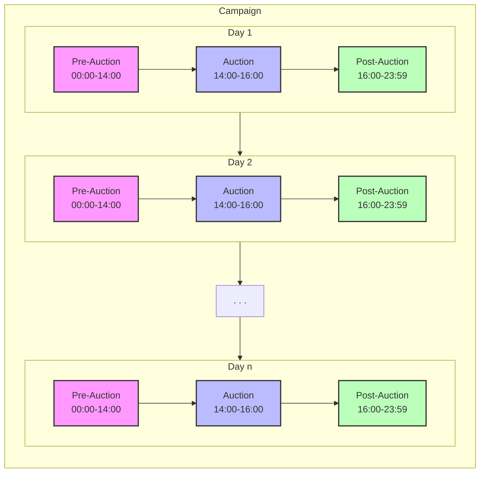
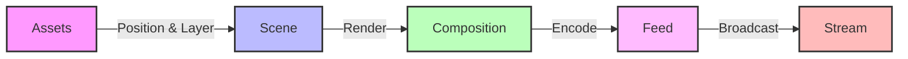

# Requirements

## 1. Introduction/Overview
### 1.1. Purpose and Scope

#### 1.1.1. Purpose

SothebAIs is a system that allows users to socially interact with NFT auctions and follow them in real-time on twitter/X.

#### 1.1.2. Scope

The system will be a collection of services that can be hosted on hardware powerful enough to handle livestreaming. Should be something relatively simple. 

### 1.2. Definitions

#### 1.2.1. Entities

Entities are the main elements and participants in the auction, the characters in the stream and the people behind the auction.
- **Viewer**: A twitter/X account that is watching the livestream.
- **Bidder**: A twitter/X account with an assocated wallet address and at least one bid.
- **Auction Host**: The twitter/X account and associated character that is hosting the auction.
- **Campaign**: A series of regularly scheduled Auctions to sell a collection of art items.
- **Project**: The group behind/associated with the art items to be auctioned.
- **Collection**: The set/collection of art items to be auctioned.
- **Artwork**: A single item from the collection that is being auctioned.
- **Admin**: A user with privileged access to manage auctions, streams, and system configuration.

#### 1.2.2. Events

Events detail the different phases of the campaign and auction. Includes the parameters associated with them.

- **Campaign**
    - A series of regularly scheduled Auctions.

    | Parameters    | Example                |
    |:-------------|:--------------------|
    | Name         | Summer NFT Series   |
    | Start Date   | 2024-06-01         |
    | End Date     | 2024-08-31         |
    | Duration     | 60 days            |
    | Auction Interval | 2 hours        |
    | Project      | Yuga Labs          |
    | Collection   | CryptoPunks        |
- **Pre-Auction**
    - Section of the campaign that occurs before the auction starts.
    - Used to send announcements and publicize the auction.
    - Begins at 12:00 AM EST on the day of the auction.

    | Parameters    | Example                |
    |:-------------|:--------------------|
    | Start Time   | 2024-06-01 00:00 EST|
    | End Time     | 2024-06-01 14:00 EST|
- **Auction**
    - A timed-event held on a livestream that at least one art items that are being auctioned.
    
    | Parameters     | Example                |
    |:--------------|:--------------------|
    | Name          | Genesis #1          |
    | Start Time    | 2024-06-01 14:00 EST|
    | End Time      | 2024-06-01 16:00 EST|
    | Art Item      | CryptoPunk #1234    |
    | Starting Price| 1 ETH               |
    | Current Price | 2.5 ETH             |
    | Highest Bidder| @crypto_collector   |

- **Post-Auction**
    - Section of the campaign that occurs after the auction ends.
    - Settle the winning bid and transfer the NFT to the winner.
    - Send notifications to the winner and the runner up.
    - Announce the end of the auction.
    - Ends at 11:59 PM EST on the day of the auction.

    | Parameters    | Example                |
    |:-------------|:--------------------|
    | Start Time   | 2024-06-01 16:00 EST|
    | End Time     | 2024-06-01 23:59 EST|

- **Livestream**
    - A livestream that is being hosted on X/Twitter.
    
    | Parameters    | Example                |
    |:-------------|:--------------------|
    | Name         | Genesis Auction #1   |
    | Start Time   | 2024-06-01 13:45 EST|
    | End Time     | 2024-06-01 16:15 EST|
    | Auction      | Genesis #1          |

#### 1.2.3. Visual Components
- **Assets**
    - Static assets stored locally or remotely that are used in the the Scene/Render.
- **Scene**
    - High level description of elements.
    - Background, Quadrant, Overlay layers.
    - Quadrant-based scene composition.
    - Assets positioned relative to quadrant bounds.
    - Z-index ordering within quadrants.

- **Composition**
    - Takes the scene data and renders it to an image.
    - Internal data representation to image.
- **Feed**
    - The stream that is generated from the ffmpeg process.
    - Image to Video.
- **Stream**
    - The stream that is send from the RTMP server to X/Twitter.

## 2. Functional Requirements
What the system should do.

### 2.1. User Features
Features that users directly interact with or experience.

#### 2.1.1. Livestream Viewing
- Watch the livestream on twitter/X
- See and hear the auction host
- See basic auction info progress live
- View the art item being auctioned
- See current bid amount, highest bidder, and time remaining

#### 2.1.2. Bidding & Participation
- Deposit crypto into an escrow wallet
- Place bids via tweet with transaction/wallet address
- Verify bid reception and processing
- Receive notifications for:
  - Bid acceptance
  - Being outbid
  - Winning an auction
- View personal bidding history
- Set up alerts for upcoming auctions

#### 2.1.3. Social Interaction
The idea is that an agent is behind the twitter account and the auction. The agent is also the one hosting the livestream. It will interact in the form of tweets and the livestream. We will split up the interaction into the places it occurs:
- **Livestream:**
    - The Auction Host will interact with the viewers.
    - The Auction Host will react to the state of the stream and auction.
- **Twitter:**
    - The Auction Host will make tweets prior, during and after the auction.
    - The Auction Host will react to the state of the stream and auction.

At the same time, the agent is supposed to be consistent, persist beyond the livestream/auction and follow the progress of the campaign. .It should be aware of the following:
- The campaign details.
- The current day
- The daily auction details

#### 2.1.4. Admin Features
- **Stream Preview & Control**
  - Real-time preview of stream composition
  - Live WebSocket connection to stream manager
  - Scene layout configuration
  - Asset placement and management
  - Stream quality monitoring
  - Test overlays and transitions
  - Audio level monitoring
- **Auction Management**
  - Configure auction parameters
  - Monitor bidding activity
  - Override auction state if needed
  - Emergency stream controls
  - Asset upload and management
- **System Monitoring**
  - View service health status
  - Monitor resource usage
  - Analyze stream performance

### 2.2. System Functions
Core system capabilities and backend functionality.

#### 2.2.1. Identity & Authentication
- Associate Twitter handles with wallet addresses
- Manage user identity verification
- Handle wallet signature verification
- Maintain secure identity associations

#### 2.2.2. Auction Engine
- Process and validate bids
- Enforce auction rules:
  - Minimum bid increments
  - Reserve prices
  - Time extensions
  - Winner determination
- Manage concurrent auctions
- Schedule and queue upcoming auctions
- Handle campaign scheduling

#### 2.2.3. Blockchain Operations
- Integrate with third-party blockchain data providers (e.g., Alchemy, Infura)
- Monitor wallet addresses and transactions
- Verify transaction authenticity and finality through API calls
- Track NFT ownership and transfers
- Maintain low-latency blockchain data access
- Cache frequently accessed blockchain data

#### 2.2.4. State Management
- Keep track of users tweets, bids, and other interactions.
- Keep track of the auction state.
- Keep track of the stream state.
- Keep track of the campaign state.

#### 2.2.5. Stream Technical Management
- Control stream quality and performance
- Handle auction transitions
- Manage dynamic overlay updates
- Maintain stream stability

### 2.3. Data Management
Data storage, persistence, and analytics functionality.

#### 2.3.1. Auction Data
- Store and manage:
  - Bid records (amount, bidder, timestamp, tx hash, status)
  - Auction metadata
  - Start/end times
  - Item information
  - Winning bids
  - Participation statistics

#### 2.3.2. User Data
- Maintain user records:
  - Authentication information
  - Bidding history
  - Notification preferences
  - Wallet addresses
  - Twitter handles
- Ensure data privacy and security

#### 2.3.3. Analytics & Reporting
- Track and store:
  - Viewer statistics
  - Bidding patterns
  - Auction performance metrics
  - User engagement data
- Generate reports for:
  - Daily auction summaries
  - Campaign performance
  - User activity
  - Financial transactions

#### 2.3.4. State Management
- **Campaign State**
  | Component | Storage | Example |
  |:----------|:--------|:---------|
  | Campaign ID | Redis | `campaign:123` |
  | Start Date | Redis | `2024-06-01` |
  | End Date | Redis | `2024-08-31` |
  | Status | Redis | `ACTIVE` |
  | Current Day | Redis | `15` |
  | Project Info | PostgreSQL | `{ name: "Yuga Labs", ... }` |
  | Collection Info | PostgreSQL | `{ name: "CryptoPunks", ... }` |

- **Auction State**
  | Component | Storage | Example |
  |:----------|:--------|:---------|
  | Auction ID | Redis | `auction:123` |
  | Status | Redis | `ACTIVE` |
  | Current Price | Redis | `2.5 ETH` |
  | Highest Bid | Redis | `{ amount: 2.5, bidder: "@user", timestamp: "..." }` |
  | Start Time | Redis | `2024-06-01 14:00 EST` |
  | End Time | Redis | `2024-06-01 16:00 EST` |
  | Art Item | PostgreSQL | `{ id: "CP1234", metadata: {...} }` |
  | Bid History | PostgreSQL | `[{ amount: 2.5, bidder: "@user", timestamp: "..." }, ...]` |

- **Stream State**
  | Component | Storage | Example |
  |:----------|:--------|:---------|
  | Stream ID | Redis | `stream:123` |
  | Status | Redis | `LIVE` |
  | Scene Layout | Redis | `{ quadrants: [...], overlays: [...] }` |
  | Viewer Count | Redis | `1234` |
  | Quality Metrics | Redis | `{ fps: 30, bitrate: 4000 }` |
  | Assets | MinIO/S3 | `backgrounds/, overlays/, nfts/` |

- **User State**
  | Component | Storage | Example |
  |:----------|:--------|:---------|
  | User ID | PostgreSQL | `user:123` |
  | Twitter Handle | PostgreSQL | `@crypto_collector` |
  | Wallet Address | PostgreSQL | `0x123...` |
  | Bid History | PostgreSQL | `[{ auctionId: "123", amount: 2.5, ... }, ...]` |
  | Preferences | PostgreSQL | `{ notifications: true, ... }` |

- **Agent State**
  | Component | Storage | Example |
  |:----------|:--------|:---------|
  | Character ID | Redis | `character:123` |
  | Mood | Redis | `EXCITED` |
  | Context | Redis | `{ lastInteraction: "...", topic: "..." }` |
  | Active Scene | Redis | `{ background: "...", expression: "..." }` |
  | Memory | PostgreSQL | `{ pastInteractions: [...], preferences: {...} }` |

### 2.4. Scene Management
Visual composition and real-time rendering capabilities.

#### 2.4.1. Layout Management
- Implement quadrant-based composition:
  - 4 fixed quadrants
  - Defined bounds and padding
  - Relative asset positioning
  - Z-index ordering

#### 2.4.2. Asset Management
- Handle multiple asset types:
  - Background elements
  - Quadrant content
  - Overlay elements
- Manage asset loading and caching
- Support dynamic asset updates

#### 2.4.3. Rendering Pipeline
- Maintain consistent frame rate
- Handle scene transitions
- Support real-time updates
- Ensure visual quality standards

## 3. Non-functional Requirements
How the system should perform.

### 3.1. Performance
- Stream Performance
    - Resolution: 1280x720p minimum
    - Frame Rate: 30fps minimum
    - Bitrate: 4-6k kbps
    - Latency: < 10 seconds end-to-end
    - Buffer: < 5 seconds

- System Response Times
    - Bid Processing: < 2 seconds
    - Scene Updates: < 100ms
    - User Interface Updates: < 500ms
    - Notification Delivery: < 5 seconds

- Time Management
    - All internal event scheduling uses EST (Eastern Standard Time)
    - System must handle daylight savings transitions gracefully
    - All timestamps must be stored with timezone information
    - User-facing times should be converted to local timezone when displayed

- Concurrent Users
    - Support minimum 1000 simultaneous viewers
    - Handle 100 active bidders per auction
    - Process up to 10 bids per minute

### 3.2. Security
- Authentication & Authorization
    - Secure wallet signature verification
    - Two-factor authentication for admin access
    - Rate limiting on bid submissions
    - IP-based request throttling

- Data Protection
    - Encryption at rest for user data
    - Secure communication channels (HTTPS/WSS)
    - Compliance with crypto wallet standards

- Access Control
    - Role-based access control
    - Admin-only auction controls
    - Audit logging of all system actions
    - Session management and timeout

### 3.3. Reliability
- System Uptime
    - 99.9% uptime during active auctions
    - Automated recovery from common failures
    - Graceful degradation under load
    - No single point of failure

- Data Integrity
    - Regular data backups
    - Transaction atomicity
    - Bid verification redundancy
    - State consistency checks

- Error Handling
    - Graceful error recovery
    - User-friendly error messages
    - Automated error reporting
    - System state monitoring

### 3.4. Usability
- Admin Interface
    - Intuitive control panel
    - Real-time monitoring dashboard
    - Quick access to common functions
    - Clear status indicators

- User Experience
    - Clear bid feedback
    - Easily readable stream overlay
    - Consistent visual design
    - Mobile-friendly viewing

### 3.5. Maintainability
- Code Quality
    - Documented codebase
    - Modular architecture
    - Version control
    - Testing coverage

- Deployment
    - Automated deployment process
    - Configuration management
    - Environment separation
    - Rollback capability

### 3.6. Scalability
- User Scaling
    - Support for 1000+ concurrent viewers
    - Handle 100+ simultaneous active bidders
    - Process up to 10 bids per second
    - Efficient bid validation and processing
    - Optimized database operations for concurrent users

- Resource Management
    - Efficient memory usage for single stream
    - Asset caching optimization
    - CPU/GPU utilization monitoring for encoding
    - Database connection pooling for concurrent users
    - Redis caching for high-concurrency bid processing

## 4. System Overview

### 4.1. System Requirements

#### 4.1.1. Core System Capabilities
- System must support concurrent auctions
- System must handle real-time bidding
- System must manage livestream composition and delivery
- System must provide administrative controls
- System must maintain data consistency across operations
- System must support character-driven interactions

#### 4.1.2. Integration Requirements
- Must integrate with Twitter/X API for:
  - Bid monitoring
  - Stream delivery
  - User interactions
- Must integrate with blockchain data providers for:
  - Transaction monitoring
  - NFT ownership verification
  - Wallet balance checks
  - Historical data access
- Must support asset management for:
  - NFT artwork
  - Stream overlays
  - Character assets

#### 4.1.3. Scalability Requirements
- Must handle multiple concurrent bidders
- Must process bids in real-time with low latency
- Must maintain stream stability under viewer load
- Must scale storage based on asset requirements
- Must handle multiple daily auctions in sequence

#### 4.1.4. Operational Requirements
- Must provide real-time monitoring capabilities
- Must support automated recovery from failures
- Must maintain audit logs of all transactions
- Must allow administrative intervention when needed
- Must support configuration changes without downtime

### 4.2. Component Requirements

#### 4.2.1. Auction System
- Must track auction state and timing
- Must validate and process bids
- Must handle auction scheduling
- Must maintain bid history
- Must enforce auction rules
- Must handle concurrent bidders

#### 4.2.2. Stream System
- Must compose visual elements in real-time
- Must maintain consistent frame rate
- Must handle multiple asset types
- Must support scene transitions
- Must deliver high-quality output
- Must support preview capabilities

#### 4.2.3. Administrative System
- Must provide service monitoring
- Must allow manual intervention
- Must support configuration management
- Must provide audit capabilities
- Must handle user management

#### 4.2.4. Storage System
- Must persist auction data
- Must handle asset management
- Must maintain user records
- Must support data backup
- Must provide fast access to active data

## 5. Constraints
### 5.1. Technical
- The hardware in use is my laptop as a server and my m4 mac mini as a client. 
    - Laptop:
        - CPU: Intel(R) Core(TM) i7-10750H CPU @ 2.60GHz
        - GPU: NVIDIA GeForce RTX 2070 Super with Max-Q Design
        - RAM: 32GB
    - Mac Mini:
        - CPU: Apple M4 (Base)
        - RAM: 16GB

### 5.2. Budget
#### 5.2.1. Cloud/Rental Hardware Option
- X/Twitter Premium Subscription: $10/month
- Cloud Server Requirements (Monthly Estimates):
    - High-Performance Instance with GPU: $500-800
    - Data Transfer Costs (streaming): $200-400
    - Storage (100GB SSD): $20-40
    - Load Balancer: $30-50
    - Total Monthly: **$760-1,300**

#### 5.2.2. Dedicated Hardware Option
- One-time Costs:
    - PC Hardware: $1,500
        - Link: https://pcpartpicker.com/list/K9QtLc
    - Network Equipment: $500
    - UPS System: $250
    - **Total: $2,250**
- Recurring Costs:
    - X/Twitter Premium Subscription: $10/month
    - Power Consumption: $50-100/month
    - Internet (Business Class): $100-200/month
    - Total Monthly: **$160-310**

### 5.3. Time
- Project timeline has exceeded initial estimation of 2-4 weeks
- Development is ongoing with no fixed completion date
- Critical features need to be prioritized for initial release
- Subsequent features can be implemented in future iterations
- Time allocation must account for:
    - Development and testing
    - Infrastructure setup
    - Documentation
    - Security auditing
    - Performance optimization

### 5.4. Personnel
- Single developer handling all aspects:
    - Development
    - Testing
    - Documentation
    - Deployment
    - Maintenance
- Limited capacity for parallel development
- Need to prioritize tasks effectively
- No immediate backup for critical issues
- Knowledge concentration risk

### 5.5. Operational
- Limited redundancy due to single-person operation
- Maintenance windows need careful planning
- No 24/7 support availability
- Incident response limited by single-person coverage
- Need for automated monitoring and alerting systems
- Backup and recovery procedures must be automated

## 6. Assumptions & Dependencies

### 6.1 Assumptions
Livestream will be hosted on X/Twitter.

### 6.2 Dependencies
Tech Stack
#### 6.2.1 Hardware
- Using either rented hardware or a custom server.
- Use of NVIDIA GPU with NVENC for encoding.

#### 6.2.2 Software
- Use of ffmpeg for encoding.
- Use of RTMP for streaming.
- Use of PostgreSQL for database.
- Use of Redis for caching.

#### 6.2.3 APIs
- Third party API to access the X/Twitter API.
    - TODO: Find 3rd party API to access the X/Twitter API.
- Third party API to access the blockchain data.
    - TODO: Find 3rd party API to access the blockchain data.

## 7. Acceptance Criteria
### 7.1. Success Metrics

### 7.2. Testing Strategy

Before the first campaign or livestream marathon. 

Test-Run
- Livestream should run for 24 hours straight.
- Take 5 different bids.

## 8. Risks & Mitigation

### 8.1. Technical Risks
- The hardware may break or become unavailable.
- Power may go out locally.

## 9. Testing & Validation

### 9.1 Debugging

- The system should be debugged using the logs and the monitoring tools.
## 10. Deployment & Maintenance Plan

### 10.1. Deployment Strategy

Testing is being done locally on my own hardware. It probably is enough to test the system before deploying to rented hardware or a custom server.

- #### Rented Hardware

    Streaming isnt something that is done usually on rented hardware. While the cpus, gpus, and other hardware are available, the issue become the network quota. The virtual machines usually have a low cap on how much data they can send/receive. Streaming being a very high bandwidth activity, it would be difficult to get a machine that can handle the stream.

- #### Custom Server

    Buying a custom server would be the best option. The hardware would be powerful enough to handle the stream and the network would not be an issue. The only issue would be the up front cost of the server, its maintainence and reliable deployment.

### 10.2. Maintenance Plan

