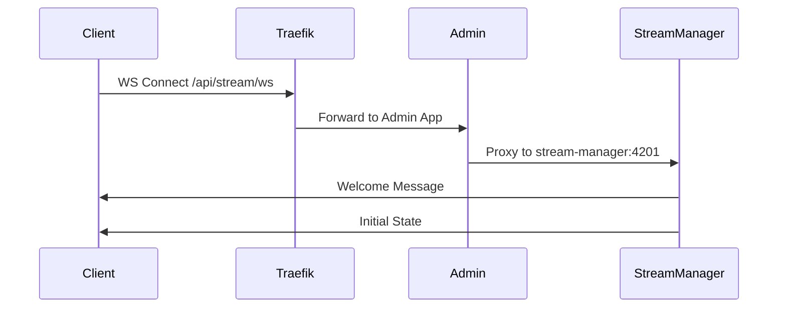

# Stream Manager WebSocket Architecture

## Overview

The Stream Manager service implements a WebSocket-based real-time communication system for delivering stream state updates and preview frames to connected clients. The architecture follows a proxy pattern where all external WebSocket connections are routed through Traefik to the admin app, which then forwards them to the Stream Manager service.

## Network Architecture

### API Layer
- REST endpoints for control and configuration
- WebSocket for real-time updates
- Rate limiting implementation
- Authentication and authorization

### WebSocket Channels
- State updates channel (`/api/stream/ws?target=state`)
  - Stream status updates
  - Performance metrics
  - Error notifications
- Preview channel (`/api/stream/ws?target=preview`)
  - Frame updates
  - Quality control
  - Performance data
- Layer updates channel (planned)
  - Layer visibility changes
  - Content updates
  - Transform updates
- Chat channel (planned)
  - Chat messages
  - User presence
  - Moderation events

### Metrics Collection
- Prometheus integration
- Custom metrics endpoints
- Real-time performance data
- Resource usage tracking
- Error rate monitoring

## Architecture Components

### 1. Frontend Clients
- React components connect via WebSocket to `/api/stream/ws`
- Two main client types:
  - State subscribers (stream control state)
  - Preview subscribers (frame updates)

### 2. Admin App WebSocket Proxy
- Located at `/api/stream/ws/route.ts`
- Acts as a reverse proxy for WebSocket connections
- Handles WebSocket upgrade protocol
- Forwards connections to `stream-manager:4201`

### 3. Stream Manager WebSocket Service
- Singleton WebSocket server instance
- Handles all WebSocket connections
- Manages state broadcasting
- Located at `apps/stream-manager/src/server/websocket.ts`

## Connection Flow



## Message Types

### 1. State Updates
```typescript
interface StateUpdate {
  type: 'stateUpdate';
  payload: {
    stream: {
      isLive: boolean;
      isPaused: boolean;
      fps: number;
      targetFPS: number;
      frameCount: number;
      droppedFrames: number;
      averageRenderTime: number;
      startTime?: number;
      error?: string;
    }
  }
}
```

### 2. Welcome Message
```typescript
interface WelcomeMessage {
  type: 'welcome';
  message: string;
  timestamp: number;
}
```

## Implementation Details

### 1. WebSocket Service (`websocket.ts`)
```typescript
class WebSocketService {
  private wss: WebSocketServer | null = null;
  
  initialize() {
    this.wss = new WebSocketServer({ port: 4201 });
    // Handle connections, errors, etc.
  }
  
  broadcastStateUpdate(state: any) {
    // Broadcast state updates to all connected clients
  }
}
```

### 2. State Management Integration
```typescript
class StateManagerImpl {
  async updateStreamState(update: Partial<StreamState>) {
    // Update state
    this.state.stream = { ...this.state.stream, ...update };
    
    // Persist to Redis
    await redisService.saveStreamState(this.state.stream);
    
    // Broadcast via WebSocket
    webSocketService.broadcastStateUpdate(this.state.stream);
  }
}
```

### 3. Frontend Integration
```typescript
function useStreamState() {
  useEffect(() => {
    const ws = new WebSocket(`${protocol}//${host}/api/stream/ws`);
    
    ws.onmessage = (event) => {
      const message = JSON.parse(event.data);
      if (message.type === 'stateUpdate') {
        // Update local state
      }
    };
  }, []);
}
```

## Error Handling

1. **Connection Errors**
   - Automatic reconnection with exponential backoff
   - Error logging and monitoring
   - Fallback to polling if WebSocket fails

2. **State Sync**
   - Redis persistence for recovery
   - Initial state sent on connection
   - State version tracking

3. **Network Issues**
   - Heartbeat/ping mechanism
   - Connection timeout handling
   - Automatic cleanup of stale connections

## Security Considerations

1. **Transport Security**
   - All WebSocket connections are proxied through Traefik
   - TLS termination at Traefik
   - No direct external access to WebSocket server

2. **Message Validation**
   - Type checking on messages
   - Payload validation
   - Rate limiting

## Monitoring

1. **Metrics**
   - Connected clients count
   - Message throughput
   - Error rates
   - Latency measurements

2. **Logging**
   - Connection events
   - State updates
   - Error conditions
   - Performance metrics

## Best Practices

1. **Connection Management**
   - Single WebSocket server instance
   - Proper cleanup on shutdown
   - Resource limit enforcement

2. **State Management**
   - Atomic state updates
   - Persistent storage in Redis
   - Broadcast on changes

3. **Error Recovery**
   - Automatic reconnection
   - State rehydration
   - Graceful degradation

## Configuration

The WebSocket service is configured through environment variables:

```env
PORT=4200              # Main HTTP port
WS_PORT=4201          # WebSocket port
METRICS_PORT=4290     # Metrics port
HEALTH_PORT=4291      # Health check port
```

## Development Guidelines

1. **Adding New Message Types**
   ```typescript
   interface NewMessageType {
     type: 'newType';
     payload: {
       // Type-specific data
     }
   }
   ```

2. **Handling New Message Types**
   ```typescript
   ws.on('message', (data) => {
     switch (data.type) {
       case 'newType':
         // Handle new message type
         break;
     }
   });
   ```

3. **Testing WebSocket Connections**
   - Use the `TestWebSocket` component
   - Monitor logs for connection issues
   - Verify message flow

## Deployment Notes

1. **Docker Configuration**
   - WebSocket port exposed internally only
   - Traefik handles external routing
   - Health checks include WebSocket endpoint

2. **Scaling Considerations**
   - Single instance per deployment
   - Redis for state persistence
   - Load balancing through Traefik

3. **Monitoring Setup**
   - Prometheus metrics
   - Grafana dashboards
   - Log aggregation

## Troubleshooting

1. **Connection Issues**
   - Check Traefik logs
   - Verify WebSocket service initialization
   - Check network connectivity

2. **State Sync Problems**
   - Verify Redis connection
   - Check state update logs
   - Monitor broadcast events

3. **Performance Issues**
   - Monitor message queue size
   - Check client connection count
   - Review resource usage 